# MIMO-OFDM无线通信技术及MATLAB实现

作者：洋盘男人

> 《MIMO-OFDM无线通信技术及MATLAB实现》书籍笔记及代码

> 代码链接：[Code_Link](https://github.com/yangpannanren/Book_Code/tree/main/MIMO-OFDM-Wireless-Communication)

[TOC]

# OFDM概述
## OFDM基本原理
### 频域注水算法

对于具有较大（或较小）SNR的子载波，注水算法为其分配更多（或更少）的比特和功率，由此实现信道容量的最大化。

注水算法要求发射机能够完全知道每个子载波的信道状态信息，发射机和接收机必须通过反馈回路交换信道质量信息。然而，这些通常很难做到，尤其是在时变的移动环境中。

## 编码OFDM

为了解决在多载波情况下由于深度衰落引起的随机差错，使用前向纠错（Forward Error Correction, FEC）编码是很有必要的。换句话说，除非OFDM系统有着FEC编码保护，否则必须将所需的SNR设置得很低，系统的总速率不可避免会降低。因此，大部分实际的OFDM系统都是编码OFDM系统。在编码OFDM中，常用的FEC编码有Reed\-Solomon（RS）码、卷积码、网格编码调制（TCM）、级联码、Turbo码、LDPC码。但是，对于突发式的符号差错，FEC编码不起作用。在实际中，通常用交织把突发差错转换为随机差错。有两种类型的交织：块交织和卷积交织。块交织可以在比特级、数据符号级或OFDM符号级执行。交织类型和交织尺寸（深度）由三个方面的因素决定：FEC编码的类型，时间和频率衰落的程度，由于交织而产生的时延。

## OFDM的多址扩展

OFDM本身不是多址接入技术，但可以使用多址接入技术\[如时分多址（Time Division Multiple Access, TDMA）、频分多址（Frequency Division Multiple Access, FDMA）、码分多址（Code Division Multiple Access, CDMA）\]。OFDMA(OFDM\-FDMA)是蜂窝移动系统中最有用的方法之一，为每个用户分配一组子载波。

为了简化OFDMA中资源分配的基本单位，将一组子载波定义为一个子信道。可以将资源分配方法分为块状类型、梳状类型和随机类型。

双工方式是指将通信链路分为上行链路和下行链路的机制。在蜂窝系统中主要使用两种双工方式：频分双工（FDD）和时分双工（TDD）。还有其他变体如Zipper和混合双工（HDD）。Zipper是一种实现上行和下行同时传输的数字双工技术。HDD是一种能够在统一的帧结构中使用FDD和TDD的技术，它继承了TDD和FDD各自的优点。

# OFDM同步技术
STO（Symbol Time Offset）、CFO（Carrier Frequency Offset）

令 $\delta$ 和 $\epsilon$ 分别表示归一化的STO和CFO，则基带接收信号可以表示为

 $$ y_l [n]={\mathrm{IDFT}}\lbrace Y_l [k]\rbrace ={\mathrm{IDFT}}\lbrace H_l [k]X_l [k]+Z_l [k]\rbrace =\frac{1}{N}\sum_{k=0}^{N-1} H_l [k]X_l [k]e^{j2\pi (k+\epsilon )(n+\delta )/N} +z_l [n] $$ 

其中， $z_l [n]={\mathrm{IDFT}}\lbrace Z_l [k]\rbrace$ 。

## STO的影响

为了检测每一个（去CP后的）OFDM符号的起点，必须执行符号定时同步，有助于获得精确的采样。

时域上 $\delta$ 大小的STO会引起频域上 $2\pi k\delta /N$ 大小的相位偏差，相位偏差与子载波编号k和 $\delta$ 成比例。

根据对OFDM符号起始点估计的位置不同，STO具有不同的影响。

1.  CaseⅠ：估计的OFDM符号起始点与精确的定时一致，因此能够保持子载波频率分量之间的正交性。在这种情况下，可以完美地恢复 OFDM符号，而且没有任何干扰。
2. CaseⅡ：估计的OFDM符号起始点在精确的定时点之前，但处在前一个OFDM 符号信道响应的末端之后。在这种情况下，第l个符号与第l\-1个符号不会重叠，即不存在由前一个符号引起的ISI。这种情况下仍可以保持子载波频率分量间的正交性，但是接收信号中存在相位偏差。
3. CascⅢ：估计的OFDM 符号起始点早于前一个OFDM 符号信道响应的末端，因此符号定时太早而无法避免ISI。这种情况下，子载波之间的正交性被(来自前一个符号的)ISI破坏，同时出现了ICI。
4. CaseⅣ：估计的 OFDM 符号起始点滞后于精确的定时点。在这种情况下,在FFT间隔Tsub内,信号由当前的 OFDM 符号 $x_l[n]$ 的一部分和下一个 OFDM 符号 $x_{l+1}[n]$ 的一部分组成。出现了ISI、ICI。

## CFO的影响

由于多普勒频移 $f_d$ 而引起的CFO。令 $f_c$ 和 $f_c^{^{\prime } }$ 分别表示发射机和接收机的载波频率； $f_{offset}$ 表示二者之间的差值，即 $f_{offset} =f_c -f_c^{^{\prime } }$ 。

定义归一化的CFO为CFO与子载波间隔的比值： $\epsilon =\frac{f_{offset} }{\Delta f}$ 。

对于时域信号x\[n\]， $\epsilon$ 大小的CFO会引起 $2\pi n\epsilon$ 大小的相位偏差，且相位偏差与 $\epsilon$ 和n成正比，相当于在频域信号X\[k\]上产生了\- $\epsilon$ 的频差。

归一化的CFO可以分解为两部分：整数载波频率偏差（Integer Carrier Frequency Offset, IFO）和小数载波频率偏差（Fractional Carrier Frequency Offset, FFO）。

## STO估计技术

### 时域STO估计技术：

1.  基于CP的STO估计技术：CP是OFDM符号中的一部分数据的一个副本，这意味着CP和相应的数据部分是相同的，而这种相同之处可以用于对STO的估计。利用两个采样块相隔 $N_{sub}$ 个采样，搜索两个块之间的相似度，通过其达到最大时识别STO。
2. 基于训练符号的STO估计技术：通过发射训练符号，可以在接收机实现符号同步。这种方法带来更多的负荷，但不受多径信道影响。

### 频域STO估计技术：

由于接收信号因为STO而产生相位旋转，相位旋转又与子载波的频率成正比，故可以用频域接收信号中相邻子载波的相位差来估计STO。

## CFO估计技术

### 时域CFO估计技术：

1.  基于CP的CFO估计技术：当符号同步完美时，大小为ε的CFO会引起接收信号 $2\pi n\epsilon /N$ 大小的相位旋转。因此，在假设信道影响可以忽略不计的情况下，CFO会引起CP和相应的OFDM 符号后部(相隔N个采样点)之间存在大小为 $2\pi N\epsilon /N=2\pi \epsilon$ 的相位差。然后，可以根据二者相乘之后的相角找出CFO。如 $\hat{\epsilon} =\frac{1}{2\pi }arg\lbrace y_l^* [n]y_l [n+N]\rbrace ，n=-1,-2,\ldots,-N_G$ ，其中arg（z）表示z辐角主值。为了减小噪声的影响，可以对一个CP间隔内的采样取平均： $\hat{\epsilon} =\frac{1}{2\pi }arg\lbrace \sum_{n=-N_G }^{-1} y_l^* [n]y_l [n+N]\rbrace$ 。由于 $tan^{-1} ()$ 来实现arg()，所以上式的CFO估计的范围是 $[-\pi ,+\pi )/2\pi =[-0.5,+0.5)$ ，从而 $|\hat{\epsilon} |<0.5$ ，因此该技术不能用于估计整数CFO。
2. 基于训练符号的CFO估计技术：由于在同步的初始阶段 CFO会很大，所以需要能够对更大范围的CFO 进行估计的技术。缩小用于相关性计算所需的采样块之间的距离，能够增大CFO的估计范围。将训练符号在更短时间内进行重复可以实现这一目的。令D为OFDM 符号长度与重复样式长度之比，它是一个整数，发射机在时域以重复样式D发射训练符号，最终估计出的CFO范围是 $|\hat{\epsilon} |<D/2$ ，用于计算相关性的采样数减少到了原来的1/D，这导致MSE下降。即以牺牲MSE性能为代价来换取估计范围的增大。

### 频域CFO估计技术：

1.  Moose方法。要求发射两个相同的训练符号，且这个两个训练符号中不能传输数据符号。
2. Classen方法。在频域插入导频，并且在每个OFDM符号中发射，从而追踪CFO。

## 采样时钟偏差的影响

采样时钟的相位偏差可以看做符号定时误差，当发射机和接收机中的采样速率或频率完全一致时，会产生相位偏差。接收机的采样时刻与最佳的采样时刻有固定的相位差，相位偏差导致频域的相位旋转，且相位旋转的多少与子载波编号k成正比。采样时钟对相位偏差的影响通常较小，所以仅把它当做STO的一部分，不需要额外的补偿器。

发射机和接收机之间的振荡器不匹配或者存在多普勒频移，会引起发射机和接收机之间的采样时钟频率偏差(Sampling clockFrequency Ofset，SFO)。

## 对采样时钟偏差的补偿

同步采样方案：通过压控晶体振荡器（VCXO）和数字锁相环（DPLL）控制模拟域的采样时刻。

非同步采样方案：XO和FIR差值滤波器。

## 蜂窝系统的同步

蜂窝系统中基站（BS）和移动台（MS）之间的同步。在TDD系统中，通过下行链路获得的同步和信道估计信息可以应用于上行链路,因为上行信道和下行信道是趋于对称的。然而，在 FDD蜂窝系统中，上行链路和下行链路在不同的频带运行，因此它们的同步和信道估计是分别执行的。

### 下行同步

基于OFDM的通信和广播系统可以采用基于前导或者基于导频的下行同步方式。在地面数字电视广播(Digital Video Broadcasting\-Terrestrial, DVB\-T)和手持数字电视广播(Digital Video Broadcasting\-Handheld, DVB\-H)系统中，使用导频来实现同步和信道估计。同时，IEEE802.11a无线局域网(Wireless LocalArea Network，WLAN)采用突发形式的OFDM调制，使用短/长前导进行同步和信道估计。一旦在发射的开始阶段执行了同步和信道估计，在突发传输的过程中就能使用这些估计得到的参数。与WLAN不同，蜂窝系统除了需要同步和信道估计之外，还需要一个对小区进行搜索的过程。在初始同步之后，MS在众多相邻的BS中选择具有最好链路连接的目标BS，并且继续搜索用于切换。根据蜂窝系统标准的不同，小区搜索和下行同步略有不同：在移动WiMAX系统中采用前导，在3GPP\-LTE系统中采用主同步信号(Primary Synchronization Signal,PSS)和辅助同步信号 (Secondary Synchronization Signal, SSS)。

在前导的设计中，必须考虑以下几点。蜂窝系统中的前导序列应该有较低的PAPR、良好的低的)互相关性和（类似脉冲的）自相关特性。用于蜂窝系统的前导序列包括PN序列、Gold序列和CAZAC序列。并且，前导的周期取决于CFO的估计范围。

以LTE系统为例：一个10ms的帧包含10个子帧、20个时隙。根据使用常规CP 或者扩展CP，一个0.5ms的时隙包含6或7个OFDM符号。在时隙0和时隙10中，符号6中的子载波子集被设计为主同步信道(P\-SCH)。在时隙0和时隙10中，符号5中的子载波子集分别被设计为辅助同步信道 1(S\-SCH1) )和辅助同步信道2(S\-SCH2)。P\-SCH和S\-SCH分别用来传输PSS和SSS。不论采用哪一种可扩展传输带宽(1.25MHz、2.5MHz、5MHz、10MHz、 15MHz和20MHz),PPS和SSS都在中心1.08MHz带宽上传输，中心带宽由72个子载波（子载波间隔为15kHz)组成，其中包括保护带宽。在3GPP\-LTE系统中，将3个物理层小区识别码（由 PSS提供)和168个物理层小区识别组（由SSS提供）组合，用以区分504个小区。 

在3GPP\-LTE系统中，作为下行同步的第一步，MS使用PSS估计符号定时和CFO，PSS的周期为5ms,在一帧中传输两次。PSS也可以用于检测物理层小区识别码。作为下行同步的第二 步，SSS用于检测物理层小区ID组和帧定时。将S\-SCH1中的SSS1和S\-SCH2 中的SSS2组合，可以确定物理层小区ID组。 

### 上行同步

在下行传输中，MS以一种开环控制机制实现与BS的同步。与下行同步不同的是，对于蜂窝系统，上行同步需要在一种闭环控制机制下进行。由于MS不能估计下行前导的传播时延，所以MS向BS发送一个随机接入前导。一旦接收到接入前导，BS就可以通过使用前面频域STO估计技术的方法估计出往返的传播时延。然后，BS向MS返回一个测距响应，指出定时提前(TA)量。在3GPP\-LTE系统中，采用几种不同格式的随机接入前导来支持不同范围的小区覆盖。

当MS从睡眠模式醒来或者执行从一个小区到另一个小区的切换时，MS需要通过下行前导获得下行同步。一旦下行同步完成，MS就从BS接收传播时延为的发射信号。MS还会接收来自BS的广播控制信道，从而获得小区和特定的系统信息。这些信息包括传输带宽、发射天线的端口个数、循环前缀的长度和随机接入特定的参数。MS考虑资源的可利用性，以及哪些资源（时间、频率、编码）可以用于发送随机接入前导。由于MS与BS在上行没有同步，所以在传输实际数据之前将采用随机接入机制。然后，MS发送随机接入前导，BS就可以估计与MS有关的TA、功率和CFO信息。这里表示估计的符号定时偏差。同时，通过匹配随机接入前导数（匹配过程可以在MS执行），BS可以确定随机接入尝试是否成功。如果BS成功接收随机接入前导，那么它将向MS发送允许接入消息和TA信息。最后，在利用BS发送的TA信息补偿上行定时之后，MS发送数据突发。

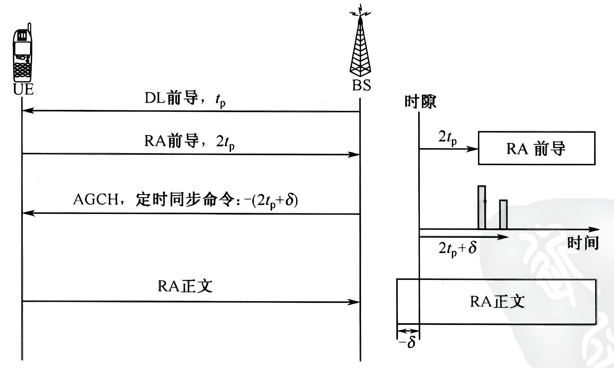

# 信道估计

为了恢复发送的比特信息，在接收机必须对信道的影响进行估计和补偿。可以使用发射机和接收机都已知的前导(Preamble)或者导频(Pilot) 符号进行信道估计，并且可以利用不同的插值技术来估计导频之间的子载波上的信道响应。通常， 数据信号、训练信号或者二者都能用于信道估计。

## 导频结构
根据导频排列的不同，导频结构可以分为三种：块状类型、梳状类型和格状类型。

1.  块状类型：在这种类型中，周期性地发射OFDM符号（此处称为导频符号)以进行信道估计，其中每个导频符号上的所有子载波都用做导频。利用这些导频进行时域插值，沿时间轴估计信道。令St表示导频符号的周期。为了跟踪时变信道的特性，放置导频信号的频率必须与相干时间保持一致。由于信道的相干时间与多普勒频率fDoppler成反比，所以导频符号的周期必须满足： $S_t \le \frac{1}{f_{\mathrm{Doppler}} }$ 。由于导频是周期性地插入导频符号的所有子载波中的，所以块状导频的排列适用于频率选择性信道。然而，对于快衰落信道，通过缩短导频符号的周期来跟踪信道变化会引起太大的负荷。
2. 梳状类型：在这种类型中，在每个OFDM符号的子载波上周期性地放置导频信号，然后利用这些导频信号进行频域插值，沿频率轴进行信道估计。令Sf为导频在频率上的周期。为了跟踪频率选择性信道的特性，放置导频符号的频率必须与相干带宽保持一致。因为相干带宽由最大时延扩展σmax的倒数决定，所以导频符号的周期必须满足下面的不等式： $S_f \le \frac{1}{\sigma_{\mathrm{max}} }$ 。与块状类型的导频排列不同，梳状类型的导频排列适用于快衰落信道，而不是频率选择性信道。
3. 格状类型：在这种类型中，以给定的周期沿时间轴和频率轴两个方向插入导频。导频分散在时间和频率轴上，使信道估计在时/频域上插值更为便利。令St和Sf分别表示导频符号在时间和频率上的周期。为了跟踪信道的时变和频率选择特性，导频符号的排列必须同时满足： $S_t \le \frac{1}{f_{\mathrm{Doppler}} }$ 和 $S_f \le \frac{1}{\sigma_{\mathrm{max}} }$ 。

## 基于训练符号的信道估计

训练符号可以用于信道估计，通常能够提供较好的性能。然而，除了发射数据符号外，还需要发射前导或导频信号，由此产生的负荷会降低传输效率。

为了得到信道估计 $Y=XH+Z$ ，式中，X为N个子载波的训练符号，Y为接收到的训练符号，H为信道，Z为噪声向量，方差为 $\sigma_z^2$ 。

1.  LS信道估计。最小化下面的代价函数： 

$$J(\hat{H} )=\|Y-X\hat{H} {\|}^2 =(Y-X\hat{H} )^{{\mathrm{H}}} (Y-X\hat{H} )=Y^{{\mathrm{H}}} Y-Y^{{\mathrm{H}}} X\hat{H} -{\hat{H} }^{{\mathrm{H}}} X^{{\mathrm{H}}} Y+{\hat{H} }^{{\mathrm{H}}} X^{{\mathrm{H}}} X\hat{H}$$

令上面的代价函数关于的偏导数等于0，得到LS信道估计的解为： ${\hat{H} }_{\mathrm{LS}} =(X^{{\mathrm{H}}} X)^{-1} X^{{\mathrm{H}}} Y=X^{-1} Y$ 。LS信道估计的均方误差（MSE）为： ${\mathrm{MSE}}_{\mathrm{LS}} =\frac{\sigma_z^2 }{\sigma_x^2 }$ 。MSE与信噪比 $\frac{\sigma_z^2 }{\sigma_x^2 }$ ,成反比，这意味着LS估计增强了噪声，在信道处于深度衰落时更是如此。
2. MMSE信道估计。根据LS解 ${\hat{H} }_{\mathrm{LS}} =X^{-1} Y\triangleq \tilde{H}$ 。利用加权矩阵W，定义MMSE估计为 $\hat{H} \triangleq W\tilde{H}$ ，则MMSE信道估计的MSE为： $J(\hat{H} )=E\lbrace \|e{\|}^2 \rbrace =E\lbrace \|H-\hat{H} {\|}^2 \rbrace$ ，在MMSE信道估计中，通过选择W最小化上式， 可以证明估计误差向量 $e$ 与 $\tilde{H}$ 正交，则得到 $W=R_{H{\tilde{H} }^{{\mathrm{H}}} } R_{\tilde{H} \tilde{H} }^{-1}$ ，式中R为相关矩阵， $R_{\tilde{H} \tilde{H} }$ 是 $\tilde{H}$ 的自相关矩阵， $R_{H\tilde{H} }$ 是频域上真实信道向量和临时信道估计向量之间的互相关矩阵。则MMSE信道估计为： $\hat{H} =W\tilde{H} =R_{H\tilde{H} } R_{\tilde{H} \tilde{H} }^{-1} \tilde{H} =R_{H\tilde{H} } {\left(R_{HH} +\frac{\sigma_z^2 }{\sigma_x^2 }I\right)}^{-1} \tilde{H}$ 。

为了估计承载数据符号的信道，必须对导频子载波进行插值，如线性插值、二次多项式插值、三次样条插值等。

## 基于DFT的信道估计

基于DFT的信道估计技术能够提高LS或MMSE信道估计的性能。这种技术通过消除(最大的信道时延以外的)噪声来实现性能的提高。令 $\hat{H} [k]$ 表示由LS或MMSE信道估计方法得到的第k个子载波的信道增益。对估计的信道 ${\left\lbrace \hat{H} [k]\right\rbrace }_{k=0}^{N-1}$ 取IDFT，得:

 $$ {\mathrm{IDFT}}\lbrace \hat{H} [k]\rbrace \triangleq h[n]+z[n]=\hat{h} [n],~~n=0,1,\cdots ,N-1 $$ 

其中，z\[n\]表示时域噪声。对于最大的信道时延L，忽略仅包含噪声的信道系数 $\lbrace \hat{h} [n]\rbrace$ ，定义信道系数：

 $$ {\hat{h} }_{\mathrm{DFT}} [n]= \begin{cases} h[n]+z[n], & n=0,1,2,\cdots ,L-1\\ 0, & \textrm{其他} \end{cases} $$ 

然后，将剩余的L个信道系数再变换到频域：

 $$ {\hat{H} }_{\mathrm{DFT}} [k]={\mathrm{DFT}}\lbrace {\hat{h} }_{\mathrm{D}\mathrm{F}\mathrm{T}} [n]\rbrace $$ 

下图显示了在给定LS信道估计的情况下基于DFT的信道估计的框图。注意，必须事先知道最大的信道时延L。

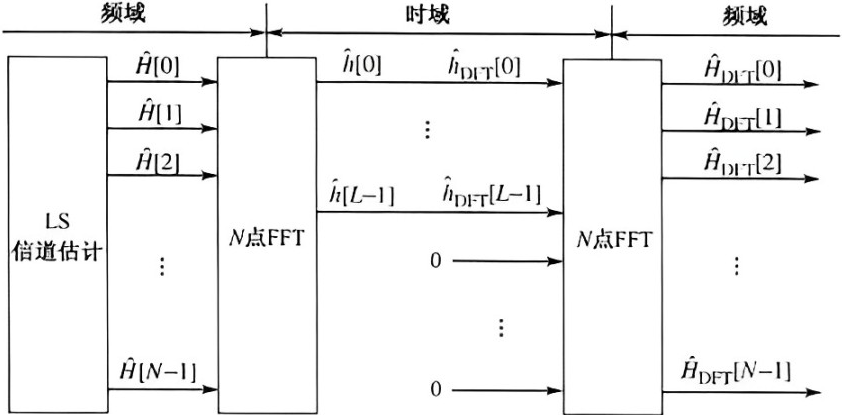

## 判决反馈信道估计

一旦通过前导或导频进行了初始信道估计，就可以采用判决反馈(DecisionDirected，DD)信道估计方法来更新信道系数，这种方法不需要使用前导或导频。如图所示，DD技术利用已判决的反馈信号来跟踪时变信道，之后，利用估计的信道来判决接收信号。

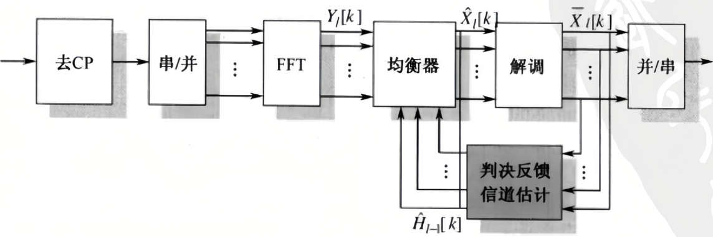

令 $\hat{H} _l [k]$ 表示通过使用第l个OFDM符号得到的信道估计。由 $\hat{H} _{l-1} [k]$ 补偿接收的第l个OFDM符号 $Y_l [k]$ ，其中户 $\hat{H} _{l-1} [k]$ 是由接收的第l\-1个OFDM 符号估计得到的。也就是说，步骤1： $\hat{X} _l [k]=\frac{Y_l [k]}{ \hat{H} _{l-1[k]} }$ 。令 $\bar{X} _l [k]$ 表示 $\hat{X} _l [k]$ 的硬判决值，那么信道估计 $\hat{H} _l [k]$ 可以由下式给出，步骤2： $\hat{H} _l [k]=\frac{Y_l [k]}{\bar{X} _l [k]}$ 。

由于在步骤1的符号判决之后执行步骤2，所以将这个特殊的方法称为判决反馈信道估计技术。在判决反馈过程中，符号检测中的任何差错都会发生传播，从而降低了估计的性能。当信道的变化比OFDM符号周期更快时，估计的性能会因快衰落而进一步降低。在这种情况下，通过对相邻子载波或连续OFDM符号的信道估计值加权平均，信道性能的下降将得到一定程度的缓解。

## 先进的信道估计技术
### 基于叠加信号的信道估计
### 快速时变信道的信道估计
### 基于EM算法的信道估计
### 盲信道估计

# PAPR减小

在OFDM系统中，经IFFT运算之后所有的子载波相加，所以时域的发射信号会有很高的峰值。因此，与单载波系统相比，OFDM系统有很高的峰值\-平均功率比(Peak to Average Power Ratio,PAPR)。事实上，高PAPR既降低了发射机功率放大器的效率，也降低了数/模转换器(Analog to Digital Converter，ADC)和模/数转换器(Digital to Analog Converter，DAC)的信号量化噪声比(Signal to Quantization Noise Ratio，SQNR)，所以它是OFDM系统中最不利的因素之一。功率放大器的效率对于电池功率有限的移动终端来说非常关键,因此上行链路中的PAPR问题更加重要。

## PAPR的介绍

峰值\-平均功率比(PAPR)是复通频带信号s(t)的最大功率与最小功率之比：

 $$ {\mathrm{PAPR}}\lbrace \tilde{s} (t)\rbrace =\frac{\max |{\mathrm{Re}}(\tilde{s} (t){{\mathrm{e}}}^{{\mathrm{j}}2\pi f_c t} )|^2 }{E\lbrace |{\mathrm{Re}}(\tilde{s} (t){{\mathrm{e}}}^{{\mathrm{j}}2\pi f_c t} )|^2 \rbrace }=\frac{\max |s(t)|^2 }{E\lbrace |s(t)|^2 \rbrace } $$ 

在具有N个子载波的PSK/OFDM系统中，当N个子载波都以相同的相位相加时，信号出现最大功率。假设 $E\lbrace |s(t)|^2 \rbrace =1$ ，这时PAPR=N，即最大功率等于N倍的平均功率。当M>4时，M\-QAM比M\-PSK的PAPR大。此外，当N增大时，信号出现最大功率的可能性降低。例如，在MPSK/OFDM系统中，假设 $M^N$ 个OFDM信号中有 $M^2$ 个具有最的大功率，那么最大PAPR出现的可能性为 $M^2 /M^N =M^{2-N}$ 。因此，在N=64的QPSKIOFDM系统中，最大PAPR出现的可能性为 $4.7\times {10}^{-38}$ 。换句话说，很少出现最大的 PAPR。当N足够大时，时域复OFDM信号的实部和虚部都渐进服从高斯分布，其幅度服从瑞丽分布。

在发射机，对于已调的PSK或QAM数据符号序列(X\[k\]}，经IFFT的离散时间信号{x\[n\]}可以表示为： $x[n]=\frac{1}{N}\sum_{k=0}^{N-1} X[k]{{\mathrm{e}}}^{{\mathrm{j}}\frac{2\pi }{N}kn}$ 。换句话说，将N个离散时间信号 $\lbrace e^{j2\pi kn/N} \rbrace$ 相加得到{x\[n\]}，其中的每一个信号对应不同的正交子载波，第k个子载波被数据符号X\[k\]调制。

总的来说，当N增大时，PAPR变得更加明显。

PAPR和过采样：由于 $f_c$ 通常远大于1/T，因此符号周期为T的连续时间基带OFDM信号x(t)和相应的载波频率为 $f_c$ 的通频带信号 $\tilde{x} (t)$ 具有相同的 PAPR。然而，离散时间基带信号x\[n\]与连续时间基带信号x(t)的PAPR 有可能不相等。实际上，x\[n\]的PAPR小于x(t)的PAPR，因为x\[n\]不会取到x(t)的所有峰值。在实际中，只有硬件实现(包括数/模转换)之后才能测量连续时间基带信号的PAPR。换句话说，不能直接测量连续时间信号的PAPR。因此，必须有一些能够从离散时间信号x\[n\]估计出PAPR 的方法。幸运的是，如果对x(t)进行L倍(L≥4)的插值(过采样)，那么x\[n\]与x(t)具有相同的 PAPR。

如下图所示为L倍插值器的框图。在x\[n\]之间插入L\-1个零，得到输出w\[m\]：

 $$ w[m]= \begin{cases} x[m/L], & m=0,\pm L,\pm 2L,\cdots \\ 0, & \textrm{其他} \end{cases} $$ 

利用一个低通滤波器(LPF)由w\[m\]构建经L倍插值的x\[n\]。对于脉冲响应为h\[m\]的LPF，经L倍插值的输出y\[m\]可以表示为：

 $$ y[m]=\sum_{k=-\infty }^{\infty } h[k]w[m-k] $$ 

则OFDM符号调制中IFFT输出信号x\[n\]可以用L倍插值的形式表示：

 $$ x^{\prime } [m]=\frac{1}{\sqrt{L\cdot N}}\sum_{k=0}^{L\cdot N-1} X^{\prime } [k]\cdot {{\mathrm{e}}}^{{\mathrm{j}}2\pi m\Delta fk/L\cdot N} ,m=0,1,\cdots ,NL-1 $$ 

其中， $X^{\prime } [k]= \begin{cases} X[k], & 0\le k<N/2,NL-N/2<k<NL\\ 0, & \textrm{其他} \end{cases}$ ，N、Δf和X\[k\]分别表示FFT的大小(或子载波总数)、子载波间隔和子载波k上的复符号。

对于L倍的插值信号，重新定义其PAPR为：

 $$ {\mathrm{PAPR}}=\frac{\max_{m=0,1,\cdots ,NL} |x^{\prime } [m]|^2 }{E\lbrace |x^{\prime } [m]|^2 \rbrace } $$ 

由于前导码存在放大功率的问题，因此最初设计的这些前导码具有低的PAPR。这就是为什么不同的采样速率并没有使这些序列的 PAPR 明显不同。然而，对于Chu序列，采样速率的不同通常导致PAPR的明显变化。注意，仿真针对基带信号。

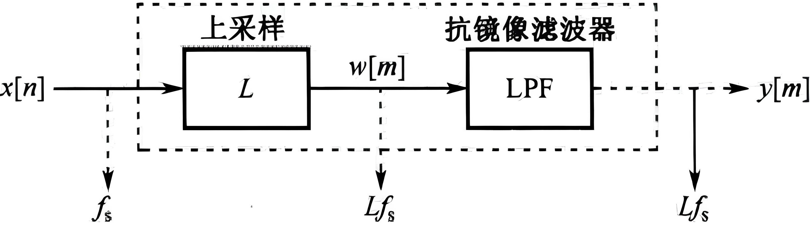

限幅和SQNR：对于具有N个子载波的OFDM符号，当每个子载波分量具有相同的相位，且恰好出现最大幅度时，OFDM信号具有最大功率。最大功率随着N的增大而增大，而且出现最大功率的概率随着N的增大而降低（幅度服从瑞丽分布）。减小PAPR的一个最简单的方法是将信号的幅度限制在一个固定值。将这个伪最大幅度称为限幅电平，记为μ。换句话说，任何幅度超过μ的信号都被限制到μ。限幅方法在减小 PAPR的同时有助于提高模/数转换器(ADC)的信号与量化噪声比(SQNR)。在选择限幅电平和量化比特数时，应该考虑限幅失真和量化噪声之间的折中关系。

## PAPR减小技术

分为：限幅技术、编码技术、加扰技术、自适应预失真技术和DFT扩频技术。

-  限幅技术在峰值附近采用限幅或非线性饱和来减少PAPR。限幅技术实现起来很简单，但它可能会引起带内和带外干扰，同时会破坏子载波之间的正交性。这种特殊的方法包括块放缩(Block\-scaling)技术、削波和滤波技术、峰值加窗技术、峰值删除技术、傅里叶映射技术、以及判决辅助重建技术。 
-  编码技术是选择那些能够使PAPR最小或PAPR减小的码字。编码技术不会引起失真，并且不产生带外辐射，但是当编码速率下降时，存在带宽利用率的问题。此外，由于需要查找最佳码字和存储大量用于编码及解码的查询表，这种技术存在复杂度高的问题，特别是当子载波数目较大时。在编码技术中可以使用Golay互补序列、Reed Muller 码、M 序列和Hadamard码。 
-  加扰技术对输入的OFDM 数据块进行加扰，并发射具有最小PAPR的数据块，从而降低了出现高PAPR的概率。尽管这种技术不存在带外功率的问题，但当子载波数目增加时其频谱效率降低、复杂度升高。此外，加扰技术不能保证PAPR低于规定的水平。加扰技术包括选择性映射(SeLective Mapping，SLM)技术、部分传输序列(Partial TransmitSequence，PTS)技术、音频保留(Tone Reservation，TR)技术和音频注入(Tone Injection，TI)技术。 
-  自适应预失真技术可以补偿OFDM系统中高功率放大器(HPA)的非线性效应。它能够以最低的硬件要求(RAM和存储器查找编码器)，通过自动修改输入星座图，适应非线性 HPA的时间变化。通过广播技术和设计适当的训练信号，可以降低自适应性预失真器的收敛时间和MSE。 
-  DFT扩频技术是利用DFT/IFFT技术扩展输入信号。DFT扩频技术可以将OFDM信号的PAPR 降低到单载波传输的水平，对于上行传输中的移动终端特别有用。这种技术被称为单载波FDMA(Single Carrier\-FDMA，SC\-FDMA)，在3GPP\-LTE标准中被用于上行传输。 

DFT扩频：在OFDMA 系统中，子载波被划分并分配给多个移动终端(用户)。与下行传输不同，在上行中的每一个用户使用一组子载波来发射各自的数据，对不发射数据的剩余子载波填充零。假设为每一个用户分配的子载波数为M。在DFT扩频技术中,将M点DFT用于扩频，并将 DFT的输出分配给IFFT的载波。PAPR减小的效果依赖于为每一个用户分配子载波的方式。有两种为用户分配子载波的方法：分布式FDMA(Distributed FDMA，DFDMA)和集中式FDMA(Localized FDMA，LFDMA)。DFDMA在整个频带(共有N个子载波)内分配M点DFT的输出，同时对没有使用的N\-M个子载波全部填充零。LFDMA将DFT的输出分配给(在N个子载波中)M个连续的子载波。当以 $N/M=S$ 的距离等间隔分配DFT的输出时，DFDMA 被称为交织 FDMA(Interleaved FDMA，IFDMA)，其中S称为带宽扩频因子。

时域LFDMA信号变成在时域S倍位置处的输入序列乘以1/S。以不同的加权因子对所有输入序列加权求和得到两点间的中间值。

IFDMA和LFDMA与没有进行DF扩频的OFDMA相比，PAPR降低。

随着IFFT变换后升余弦（RC）滤波器的滚降系数α从0变到1时IFDMA的PAPR性能显著提升。而LFDMA受脉冲成形的影响没有那么大。由于滚降系数增大时剩余带宽增加，IFDMA可以在剩余带宽和PAPR性能之间进行折中。

滚降系数 $α=0.4$ 的LFDMA中DFT扩频技术的PAPR性能随着子载波数M的增大而降低。此处，256点FFT的SC\-FDMA系统使用64\-QAM。

总之，采用IFDMA和LFDMA的SC\-FDMA系统比OFDMA系统具有更高的PAPR性能。3GPP\-LTE 已演进成ITU\-R中IMT\-Advanced 标准的一个候选的无线接口技术，在其上行传输中已经采纳了 SC\-FDMA。尽管IFDMA 比LFDMA具有更低的PAPR性能，但是LFDMA通常更容易实现。这是因为IFDMA 需要额外的资源(如保护带宽和导频)，在整个频带内等距离的子载波分配(IFDMA)不容易实现。

# 小区间干扰抑制技术

包括小区间干扰协调技术、小区干扰随机化技术和小区间干扰消除技术

## 小区间干扰协调技术
### 部分频率复用

下图给出了OFDMA蜂窝系统中采用不同频率复用因子(Frequency Reuse Factor，FRF)的基本频率复用方案，其中K表示频率复用因子。FRF定义为不能使用同频信道的相邻小区的个数。1/K相当于网络中使用同频信道的速率。换句话说，1/K是表明蜂窝系统中如何有效使用带宽的一个因子。如图(a)所示，当 $K=1$ 时，用于传输的整个带宽在所有小区内使用。在这种情况下，由于来自相邻小区的路径损耗大，小区中心附近的用户的 SINR 较高。小区边缘用户的SINR较低会提高小区边缘的中断率。为了降低小区边缘的中断率，同时提高整个小区覆盖区域的SINR，可以将整个带宽分为3个信道\[图(b)\]或3个子带\[图(c)\]，以正交方式分配给相邻的小区，其中子带是一组子载波。这种方法通过减少每个小区的可用带宽(相当于 $K=3$ )，达到减少小区间干扰的目的，因此小区边缘用户的SINR较高。图(b)和图(c)都采用 $K=3$ ，但图(b)中每个信道由所有的子载波组成，在图(c)中将1个信道分成3个子带后分配给每个小区。

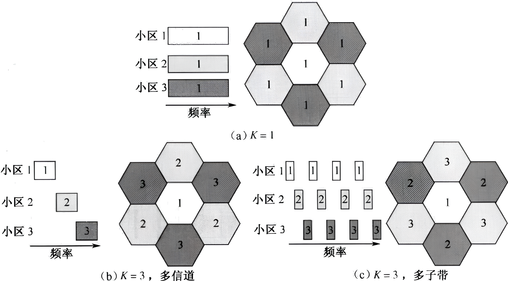

为了提高小区边缘的性能，在 OFDMA蜂窝系统中提出了部分频率复用(Fractional Frequency Reuse，FFR)的概念。根据定义，FFR是一种只对整个带宽的一部分进行分配的子载波复用方案，也就是说，只给每个小区分配一组子载波以满足复用数1<K<3。在FFR方案中，将整个带宽分为多个子带，然后分配到小区内的不同位置。例如对于 $K=3/2$ 的FFR方案，在规划子带从而避免相邻小区干扰的过程中，这个方案给每个小区分配3个子带中的2个。与 $K=1$ 的完全复用情形相比，它的效率降低为2/3，但任何的两个相邻边界的子带仍能保持正交。实际上，对于六边形的蜂窝小区， $K=7/6$ 这种方案达到了最佳的频率效率。

还有另外一种FFR方案。在这种方案中，根据在小区中的位置使用不用的频率复用因子。小区中心附近的用户的 SINR 较高，因此小区中心的复用因子为 $K=1$ 。为了避免干扰，小区边缘需要使用较大的频率复用因子。 $K=1$ 和 $K=3$ 分别用于内部和边界区域。在这种情况下，整个带宽被分为4个不同的子带，其中子带0用于所有的小区(即 $K=1$ )，而其他3个子带以正交方式分配给不同的小区使用(即 $K=3$ )。这种想法也可以扩展到不同的配置情况，如 $K=1$ 用于内部区域(中心)， $K=3/2$ 用于外部区域(边界)。通常使用3个以上的频率复用因子。

### 软频率复用

在减少 OFDMA 蜂窝系统中的小区间干扰时，为了提高FFR方案的频带效率并且仍然可以实现K=1，可以根据用户的位置给不同的子带分配不同的功率。为小区边缘用户的子带分配较大的功率，为小区中心用户的子带分配较小的功率，同时按照FFR方案为相邻小区的边界分配正交的子带。这一概念被称为软频率复用(Soft Frequency Reuse，SFR)，可以由下图(a)中的例子说明，其中整个带宽被分为3个子带。在下图(a)中，与上图(b)中的分配方法一样，为每个小区的边界用户只分配1个子带，而将另外2个子带分配给每个小区的中心用户。为了对相邻小区的边界用户不产生明显的干扰，在中心区域的用户必须以较小的功率使用这两个子带。与上图(b)中的方案不同的是，整个频带可以在所有小区中实现完全复用，即 $K=1$ 。事实上，通过为所有的中心用户分配较小的功率，可以实现完全的频率复用。例如，下图(a)和下图(b)分别使用了上图(b)和不同FRF的部分频率使用的软频率复用方案。在OFDMA蜂窝系统中，软频率复用方案的本质就是在减少边缘用户的小区间干扰的同时获得完全的频率复用(K=1)。

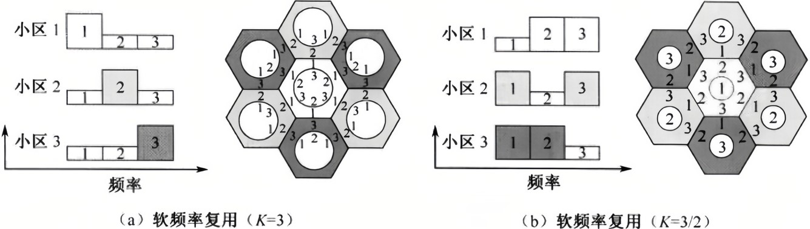

### 灵活的部分频率复用

假设以连续或分散的方式将整个频带分成许多子带，每个子带主要分配给一个相邻的小区。换句话说，整个频带被分为多个组，每一组主要为一个相邻的小区预留。根据每个小区的业务需求，每个小区可以从相邻小区借一些为其预留的子信道。在相邻小区的资源分配信息完全已知的情况下，可以立刻借用原小区中没有使用的子信道。而且，可以将这些借来的子信道分配给信道条件更好的用户，因为这些用户能够使用更小的发射功率以减少小区间干扰。通过减小为相邻小区边界用户分配的子信道的功率，可以在每个小区中实现整个频带的完全复用。这种方法与SFR方案相似，但比 FFR和SFR方案灵活，因此被称为灵活的FFR。然而，在这个方法中，为了资源借用和功率分配，必须已知用户的信道质量指示(Channel Quality Indication，CQI)信息和相邻小区的资源分配信息。事实上，通过在相邻基站的特定接口(3GPP\-LTE标准中称为X接口)间的信息共享，已经实现了支持小区间的干扰协调(Inter\-Cell Interference Coordination, ICIC)。

### 动态信道分配

总的来说，为每个小区分配的信道数量是固定的。根据业务负载和时变的信道环境，可以由动态信道分配(Dyamic Channel Allocation，DCA)改变为每个小区分配的信道数。在时变信道环境下，对于轻度到中度的业务负载，DCA的性能更好。然而，DCA的实现成本更高，因为DCA会在基站间产生较高的信令负荷和很大的计算工作量。DCA 方案可以分为两类集中式DCA和分布式DCA。虽然集中式 DCA 能提供更优的性能，但基站间大量的通信会导致很大的系统时延，这是不切实际的。分布式 DCA方案，依靠基站间共享有限的信息，根据信号强度或信比分配信道。

在基于OFDM的蜂窝系统中，DCA可以更加有效地提高频谱效率。需要注意的是，在DCA方案中需要宽带信道估计和快速的信道重分配。在OFDM系统中，由于可以很容易地测量到每个子载波上的信道信息和信号干扰水平，因此DCA方案能够有效应用于OFDM 蜂窝系统。基于测量的DCA方案应用于OFDMA的蜂窝系统，被称为先进的移动互联网服务(Advanced CellularInternet Service，ACIS)。在这个系统中，MS和BS都执行干扰感知，以避免选择在相邻小区中已经使用了的信道。而且，为了避免快速改变干扰，使用快速信道重分配。

另一个小区间干扰协调的技术就是混合双工(HDD)方案。通过利用TDD和FDD的优势，HDD方案在提供非对称数据服务和管理小区间干扰方面更加灵活和有效。与FDD系统一样，HDD方案有一对频带，在其中一个频带上执行TDD操作，这样HDD允许同时执行FDD和TDD操作。

## 小区间干扰随机化技术
### 小区特定加扰

使用小区特定的扰码和小区特定的交织器来随机化干扰信号。

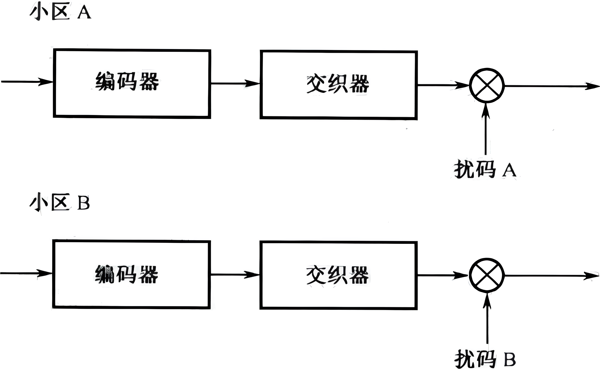

### 小区特定交织

通常被称为交织多址接入(Interleaved Division MultipleAccess，IDMA)技术。IDMA技术与单用户检测条件下的小区特定加扰技术相似，因为它白化了相邻小区的干扰。IDMA 技术通过在每个小区使用一个特定的交织器把小区间的干扰白化处理，而小区特定的加扰技术是通过特定的扰码来完成这个工作的。特别地，当在IDMA中采用多用户检测技术时，IDMA通过多用户检测器迭代消除干扰，与小区特定的加扰技术相比，能够更有效地减少小区间干扰。

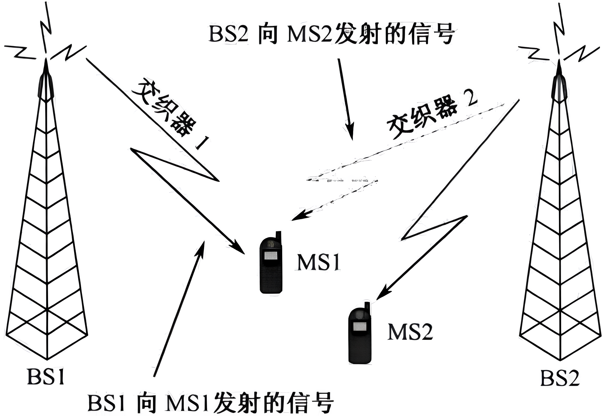

### 跳频OFDMA

使用一个子带在多个时隙上发射一个数据突发。子带被定义为OFDMA系统中的一组连续子载波。在不同的时隙使用不同的子带发送相同的数据突发，这样可以避免突发错误，或者在频率选择性衰落信道中能够获得频率分集。在OFDMA跳频(Frequency Hopping，FH)技术中，频域中的子带根据一个预先定义的跳频图案跳变。在OFDMA蜂窝系统中，当每个小区使用不同的跳频图案时，跳频是一种平均小区间干扰的有效技术。换句话说，它可以随机化所有相邻小区之间各子频带的碰撞。因此，它被称为跳频OFDMA(FH\-OFDMA)技术。从实现的观点考虑，FH\-OFDMA技术通常需要大的内存，因为需要缓存在跳频图案一个周期内的所有数据，用于接收机的解码。

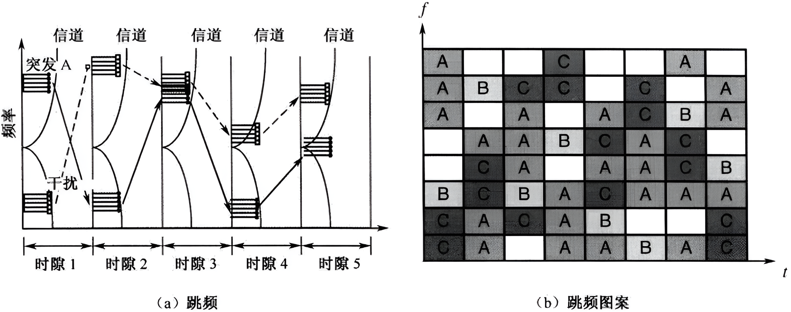

### 随机子载波分配

在随机子载波分配技术中，定义子信道为随机分布于整个频带内的一组子载波。在每个子信道中随机分配子载波能够获得分集增益。以随机方式分配子载波可以使相邻小区间的子载波发生碰撞的概率最低，即随机化了OFDMA系统中的小区间干扰。下图中，碰撞只发生在8个小区中任意的两个相邻小区的一个子载波上。只有少数子载波出现小区间的碰撞(小区1和小区4、小区0和小区2、小区3和小区6等)。与FH\-OFDMA 技术相比，随机子载波分配技术显示出了类似的性能，只要随机分配技术中的子载波总数与 FH技术中在一个跳频图案周期内使用的子载波数相同。因为接收机的 OFDM 符号单元可以对数据解码，所以随机子载波分配技术不需要大的用于缓存数据的存储器。移动 WiMAX 系统的子信道化是随机子载波分配的一个具体示例。

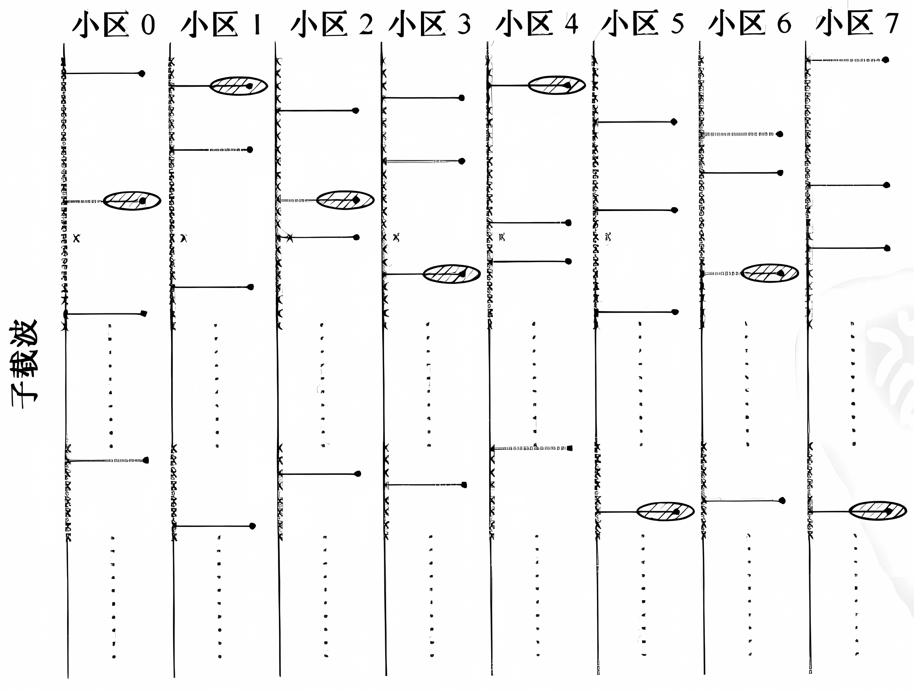

## 小区间干扰消除技术
### 干扰抑制合并技术

为了消除相邻小区的干扰，首先需要检测干扰信号，然后将其从接收信号中删除。在实际中，通常很难检测来自相邻小区的干扰信号。然而，在接收机使用多天线时，可以利用空间特征来抑制干扰。干扰抑制合并(Interference Rejection Combining，IRC)技术就是一个例子，该技术利用在多根接收天线处的干扰统计特性(同信道干扰的相关特性)。IRC技术可以被看做最大比合并(Maximum Ratio Combining，MRC)技术的一个推广，它将接收信号的空间特性应用于接收机的干扰抑制合并。

### IDMA多用户检测

在采用多用户接收机的IDMA 技术中，通过解调干扰信号和期望信号，以及用后验概率译码器迭代译码，可以提高性能。下图显示了OFDM\-IDMA接收机中的迭代多用户检测器的框图。在发射端，编码后的信号首先被小区特定的交织器 $\pi_m$ 交织，然后通过 IFFT 被调制在子载波上。在接收端，接收信号y通过FFT模块，进入多用户解调器。在多用户解调器中，计算每个用户的软输出、信道信息和外部信息。然后通过用户解码模块，判决发送的比特。外部信息和判决的比特被反馈到多用户解调器。小区特定的交织器 $\pi_m$ (与发射机的一样)和相应的解交织器 $\pi_m^{-1}$ 用来降低多用户的解调器和用户解码块的相关性。随着迭代次数的增加，解码变得更加可靠。

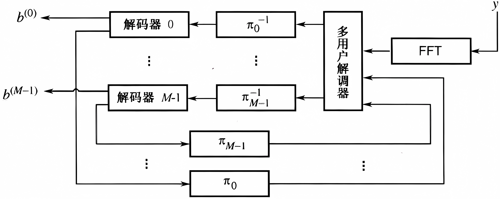

# MIMO信道容量

与传统的单天线系统相比，在不需要额外的发射功率或频带的情况下，多天线系统容量以 $\min (N_{\mathrm{T}\mathrm{x}} ,N_{\mathrm{R}\mathrm{x}} )$ 因子增加，其中 $N_{\mathrm{T}\mathrm{x}}$ 为发射天线数， $N_{\mathrm{R}\mathrm{x}}$ 为接收天线数。多天线技术可以分为两类：分级技术和空间复用技术。

## 确定性MIMO信道容量

对于 $N_{\mathrm{Tx}}$ 根发射天线和 $N_{\mathrm{Rx}}$ 根接收天线的MIMO 系统，时不变窄带无线信道可以表示成 $N_{\mathrm{Rx}}$ x $N_{\mathrm{Tx}}$ 的确定性矩阵 $H\in {\mathbb{C}}^{N_{\mathrm{Rx}} \times N_{\mathrm{Tx}} }$ 。对于由 $N_{{\mathrm{T}\mathrm{x}}}$ 个独立符号 $x_1 ,x_1 ,\cdots ,x_{N_{{\mathrm{T}\mathrm{x}}} }$ 构成的发射符号向量 $x\in {\mathbb{C}}^{N_{{\mathrm{T}\mathrm{x}}} \times 1}$ ，接收信号 $y\in {\mathbb{C}}^{N_{{\mathrm{R}\mathrm{x}}} \times 1}$ 可以表示为：

 $$ y=\sqrt{\frac{E_x }{N_{{\mathrm{T}\mathrm{x}}} }}Hx+z $$ 

其中， $z=(z_1 ,z_1 ,\cdots ,z_{N_{{\mathrm{R}\mathrm{x}}} } )^{{\mathrm{T}}} \in {\mathbb{C}}^{N_{Rx} \times 1}$ 是噪声向量，假设服从零均值循环对称复高斯(Zero Mean Circular Symmetric Complex Gaussian，ZMCSCG)分布。对于任意的θ，当 $e^{j\theta } z$ 与z具有相同的分布时，向量z被称为是循环对称的。发送信号向量的自相关矩阵定义为：

 $$ R_{xx} =E\lbrace xx^{{\mathrm{H}}} \rbrace $$ 

当假设每一根发射天线的发射功率为1时，有 ${\mathrm{T}\mathrm{r}}(R_{xx} )=N_{{\mathrm{T}\mathrm{x}}}$ 。

### 发射端已知CSI时的信道容量

确定性信道的容量被定义为：

 $$ C=\max_{f(x)} I(x;y)\textrm{bit/channel}\;\textrm{use} $$ 

其中，f(x)为发射信号向量x的PDF，I(x;y)为随机向量x和y的互信息。通过改变发射信号向量 PDF得到的最大互信息就是信道容量。

确定性 MIMO 信道的容量可以表示为：

 $$ C=\max_{{\mathrm{T}\mathrm{r}}(R_{xx} )=N_{{\mathrm{T}\mathrm{x}}} } \log_2 \det (I_{N_{{\mathrm{R}\mathrm{x}}} } +\frac{E_x }{N_{{\mathrm{T}\mathrm{x}}} N_0 }HR_{xx} H^{{\mathrm{H}}} )~{\mathrm{b}\mathrm{p}\mathrm{s}/\mathrm{H}\mathrm{z}} $$ 

其中， $E_x$ 为发射信号的能量， $N_0$ 为加性噪声的功率谱密度。

当发射端已知信道状态信息(Channel State Information，CSI)时，通过求解下面的功率分配问题，能够得到最大容量：

 $$ \begin{array}{l} C=\max_{\lbrace \gamma_i \rbrace } \sum_{i=1}^r \log_2 (1+\frac{E_x \gamma_i }{N_{{\mathrm{T}\mathrm{x}}} N_0 }\lambda_i )\\ {\mathrm{s}.\mathrm{t}.}\sum_{i=1}^r \gamma_i =N_{{\mathrm{T}\mathrm{x}}}  \end{array} $$ 

可通过注水功率算法求解，注水算法给更高的 SNR 模式分配更多的功率。但是若模式的 SNR 低于给定门限μ，则该模式不能被使用，即不给该模式分配功率。

### 发射端未知CSI时的信道容量

当发射机未知H时，在所有发射天线上平均分配功率。也就是说，发射信号向量x的自相关函数为 $R_{xx} =I_{N_{{\mathrm{T}\mathrm{x}}} }$ ，在这种情况下，信道容量可以表示为：

 $$ C=\log_2 \det (I_{N_{{\mathrm{R}\mathrm{x}}} } +\frac{E_x }{N_{{\mathrm{T}\mathrm{x}}} N_0 }HH^{{\mathrm{H}}} ) $$ 

化简为： $\textrm{C}=\log_2 \det \biggl(I_{N_{{\mathrm{R}\mathrm{x}}} } +\frac{E_x }{N_{{\mathrm{T}\mathrm{x}}} N_0 }Q\Lambda Q^{{\mathrm{H}}} \biggr)=\log_2 \det \biggl(I_{N_{{\mathrm{R}\mathrm{x}}} } +\frac{E_x }{N_{{\mathrm{T}\mathrm{x}}} N_0 }A\biggr)=\sum_{i=1}^r \log_2 (1+\frac{E_x }{N_{{\mathrm{T}\mathrm{x}}} N_0 }\lambda_i )$ 

其中，r为H的秩，即 $r=N_{{\mathrm{m}\mathrm{i}\mathrm{n}}} \triangleq \min (N_{{\mathrm{T}\mathrm{x}}} ,N_{{\mathrm{R}\mathrm{x}}} )$ 。从上式可以看出，MIMO 信道转换为r个虚拟的 SISO信道，每个信道的发射功率为 $\frac{E_x }{N_{\textrm{Tx}} }$ ，并且第i个SISO信道的增益为 $\lambda_i$ 。当发射机不能获得CSI时，总功率平均分配给所有的发射天线。

### SIMO和MISO信道容量

对于具有一根发射天线、 $N_{{\mathrm{R}\mathrm{x}}}$ 根接收天线的 SIMO 信道，信道增益为 $h\in {\mathbb{C}}^{N_{{\mathrm{R}\mathrm{x}}} \times 1}$ ，因此r=1， $\lambda_1 ={\left\|h\right\|}_{{\mathrm{F}}}^2$ 。不论发射机已知或者未知 CSI，信道容量都为：

 $$ C_{{\mathrm{S}\mathrm{I}\mathrm{M}\mathrm{O}}} =\log_2 (1+\frac{E_x }{N_0 }\|h{\|}_{{\mathrm{F}}}^2 ) $$ 

可以看出，信道容量随天线数量对数增加；此外，只能发射一个数据流，且发射机对CSI的获取根本不能改善信道容量。

在 MISO 信道下，信道增益为 $h\in {\mathbb{C}}^{1\times N_{{\mathrm{T}\mathrm{x}}} }$ ，因此r=1， $\lambda_1 ={\left\|h\right\|}_{{\mathrm{F}}}^2$ 。当发射机未知 CSI时，信道容量为：

 $$ C_{{\mathrm{M}\mathrm{I}\mathrm{S}\mathrm{O}}} =\log_2 (1+\frac{E_x }{N_{Tx} N_0 }\|h{\|}_{{\mathrm{F}}}^2 ) $$ 

可以看出，MISO信道容量与SISO信道容量相同。人们可能会问:当与单发射天线系统的容量相同时，多发射天线系统的优势是什么?尽管两个系统能够获得相同的最大传输速率，但是有多种方法利用多天线。例如，空时编码技术可以提高传输的可靠性，这将在下一章中进行讨论。

当发射机可以获得CSI(h已知)时，可以把发射功率集中于当前信道的某个特定模式。换句话说，发射 $(h^{{\mathrm{H}}} /\|h\|)x$ 而不是直接发射x。接收信号可以表示为：

 $$ y=\sqrt{E_x }h\cdot \frac{h^{{\mathrm{H}}} }{\|h\|}x+z=\sqrt{E_x }\|h\|x+z $$ 

上式中接收信号的功率提高了NTx倍，因此信道容量为：

 $$ C_{{\mathrm{M}\mathrm{I}\mathrm{S}\mathrm{O}}} =\log_2 (1+\frac{E_x }{N_0 }\|h{\|}_{{\mathrm{F}}}^2 )=\log_2 (1+\frac{E_x }{N_0 }N_{{\mathrm{T}\mathrm{x}}} ) $$ 

## 随机MIMO信道容量

MIMO 信道通常是随机变化的，因此H是随机矩阵，这意味着 MIMO 信道的容量也是随机时变的。换句话说，MIMO 信道的容量可以通过它的时间平均给出。在实际中，假设随机信道是遍历过程。然后，考虑MIMO信道容量的统计概念：

 $$ \overline{C} =E\lbrace C(H)\rbrace =E\lbrace \max_{{\mathrm{T}\mathrm{r}}(R_{{\mathrm{x}\mathrm{x}}} )=N_{{\mathrm{T}\mathrm{x}}} } \log_2 \det (I_{N_{{\mathrm{R}\mathrm{x}}} } +\frac{E_{{\mathrm{x}}} }{N_{{\mathrm{T}\mathrm{x}}} N_0 }{HR}_{{\mathrm{x}\mathrm{x}}} H^{{\mathrm{H}}} )\rbrace $$ 

 $\bar{C}$ 通常被称为遍历信道容量。

信道容量的另一个统计概念是信道的中断容量。中断概率定义为：

 $$ P_{{\mathrm{o}\mathrm{u}\mathrm{t}}} (R)=\Pr (C\left(H\right)<R) $$ 

换句话说，如果对传输速率为R bps/Hz的数据，不能实现任意小的译码差错概率，那么这个系统就处于中断状态。信道的ε中断容量定义为：使上式的中断概率小于ε的可能的最大数据速率。换句话说，信道的中断容量就是满足 $P(C(H)≤C\epsilon)=\epsilon$ 所对应的Cε。

# 天线分集与空\-时编码技术

对于 AWGN 信道，当 SNR 很大时，BER 曲线的斜率趋近于无穷大。也就是说，当 SNR 增大时，信道呈现一种落水式的BER性能。对于瑞利衰落信道，相应的曲线斜率在对数\-对数坐标下是线性的。这说明即使在高信噪比情况下，通过瑞利衰落信道后传输性能也会显著下降。天线分集技术的主要目的是将不稳定的无线时变衰落信道转变成像AWGN 信道一样没有显著瞬时衰落的稳定信道。

在不同形式的分集技术中，发射分集由于可以有效降低接收设备的复杂度而被广泛应用。而且，发射分集只需要在发射机安装多根天线。本章将重点研究能够获得天线分集增益的空\-时编码技术。

## 天线分集

分集技术用来缓解由无线信道的不稳定衰落(如多径衰落)造成的差错性能的下降。数据传输中的分集主要基于以下思想：多个统计独立的衰落信道同时处于深度衰落的概率非常低。实现分集增益的方式有以下几种。

-  空间分集:用间隔足够大(大于10λ)的多根天线实现独立的无线信道。 
-  极化分集:利用垂直极化和水平极化的两条路径相互独立的事实来实现独立的信道 
-  时间分集:相同的信息在足够大的时间间隔(大于相干时间)重复发送。 
-  频率分集:相同的信息在足够大的频率间隔(大于相干带宽)重复发送。 
-  角度分集:具有不同方向的多根接收天线从不同角度接收承载同一信息的信号。 

时间分集和频率分集技术分别需要额外的时间资源和频率资源。而空间(天线)分集技术不需要额外的时间或频率资源。

### 接收分集

对于一个具有 $N_{\textrm{Rx}}$ 根接收天线的接收分集系统，可以通过多种技术合并不同天线上的接收信号，包括选择合并(SelectionCombining，SC)、最大比合并(MaximalRatioCombing，MRC)和等增益合并(Equal Gain Combining，EGC)。

在MRC中，各支路的加权系数必须与各自的信道匹配。EGC是MRC的一种特殊情况，所有支路的信号以相同的加权值进行合并。事实上，MRC获得了最佳性能，使合并后的SNR达到最大。

### 发射分集

接收分集的缺点是接收端的计算负荷很高，可能导致下行链路中的移动台的功率消耗很大。在发射端使用空\-时编码(Space\-Time Coding，STC)同样可以获得分集增益，而且在接收端解码时只需要简单的线性处理。为了进一步降低移动台的计算复杂度，可以采用不需要在接收端估计CSI的差分空\-时码。

## 空\-时编码概述
## 空\-时块码
## 空\-时格码

# 空间复用MIMO系统的信号检测

与上一章中使用天线分集技术的MIMO系统相比，空间复用MIMO(SM(spatial modulation)\-MIMO)系统能够以更高的速率发送数据。对于SM\-MIMO系统，接收机的空间解复用或信号检测是一项具有挑战的任务。在这一章中,我们讨论SM\-MIMO系统的信号检测技术。考虑下图中的 $N_{\textrm{Rx}} \times N_{\textrm{Tx}}$ MIMO系统。令H表示一个信道矩阵，其中第(j,i)个元素hji表示第i根发射天线和第j根接收天线之间的信道增益， $j=1,2,\cdots,N_{\textrm{Rx}}，i=1,2,\cdots,N_{\textrm{Tx}}$ 。将空间复用的用户数据和相应的接收信号分别表示为 $\mathit{\mathbf{x}}={\left\lbrack x_1 ,x_2 ,\cdots ,x_{{\mathrm{N}}_{\mathrm{Tx}} } \right\rbrack }^T$ 和 $\mathit{\mathbf{y}}={\left\lbrack y_1 ,y_2 ,\cdots ,y_{{\mathrm{N}}_{\textrm{Rx}} } \right\rbrack }^T$ ，其中 $x_i$ 和 $y_j$ 为分别表示第i根发射天线的发射信号和第j根接收天线的接收信号。令 $z_j$ 表示第j根接收天线的加性高斯白噪声，方差为 $\sigma_z^2$ 。令 $h_i$ 表示信道矩阵H的第i个列向量，那么 $N_{\textrm{Rx}} \times N_{\textrm{Tx}}$ 的MIMO系统可以表示为：

 $$ y=Hx+z=h_1 x_1 +h_2 x_2 +\cdots +h_{N_{{\mathrm{T}\mathrm{x}}} } x_{N_{{\mathrm{T}\mathrm{x}}} } +z $$ 

其中， $\mathit{\mathbf{z}}={\left\lbrack z_1 ,z_2 ,\cdots ,z_{{\mathrm{N}}_{\textrm{Rx}} } \right\rbrack }^T$ 。

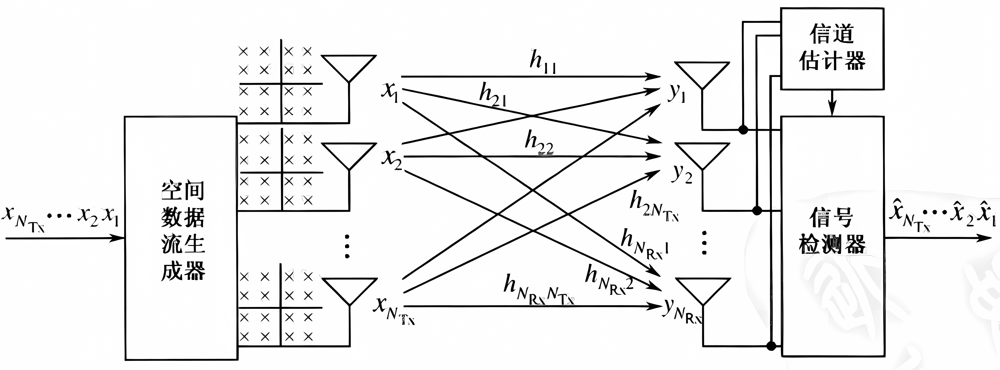

## 线性信号检测

线性信号检测方法将来自目标发射天线的期望信息流当做有用信息，同时把其他发射信号当做干扰。因此，在检测来自目标发射天线的期望信号的过程中，要最小化或消除来自其他发送天线的干扰信号。为了检测来自每根天线的期望信号，利用一个加权矩阵实现逆转信道的作用：

 $$ \tilde{x} =[{\tilde{x} }_1 ~{\tilde{x} }_2 ~\cdots ~{\tilde{x} }_{N_T } ]^{{\mathrm{T}}} =Wy $$ 

也就是说，由接收信号的一个线性组合完成对每个符号的检测。基本的线性检测方法包括迫零(ZF)技术和最小均方误差(MMSE)技术。

### ZF信号检测

ZF 技术使用下面的加权矩阵消除干扰（相当于逆转信道）：

 $$ W_{{\mathrm{Z}\mathrm{F}}} ={\left(H^{{\mathrm{H}}} H\right)}^{-1} H^{{\mathrm{H}}} $$ 

检测后的噪声功率的期望值为：

 $$ E\lbrace \|{\tilde{z} }_{{\mathrm{Z}\mathrm{F}}} {\|}_2^2 \rbrace =\sum_{i=1}^{N_{{\mathrm{T}\mathrm{x}}} } \frac{\sigma_z^2 }{\sigma_i^2 } $$ 

其中， $\sigma_i$ 为矩阵 ${\tilde{z} }_{\textrm{ZF}}$ 的奇异值。

### MMSE信号检测

MMSE能够最大化检测后的SINR，其加权矩阵为：

 $$ W_{{\mathrm{M}\mathrm{M}\mathrm{S}\mathrm{E}}} =(H^{{\mathrm{H}}} H+\sigma_z^2 I)^{-1} H^{{\mathrm{H}}} $$ 

注意MMSE接收机需要噪声的统计信息 $\sigma_z^2$ 。检测后的噪声功率的期望值为：

 $$ E\lbrace \|{\tilde{z} }_{{\mathrm{M}\mathrm{M}\mathrm{S}\mathrm{E}}} {\|}_2^2 \rbrace =\sum_{i=1}^{N_{{\mathrm{T}\mathrm{x}}} } \frac{\sigma_z^2 \sigma_i^2 }{(\sigma_i^2 +\sigma_z^2 )^2 } $$ 

其中， $\sigma_i$ 为矩阵 ${\tilde{z} }_{\textrm{MMSE}}$ 的奇异值。

当信道矩阵的条件数很大，即最小的奇异值非常小时，在线性滤波的过程中噪声增强的影响将会更加显著。对于ZF和MMSE线性检测器，由最小奇异值引起噪声增强的影响分别为：

 $$ E\lbrace \|{\tilde{z} }_{{\mathrm{Z}\mathrm{F}}} {\|}_2^2 \rbrace =\sum_{i=1}^{N_{{\mathrm{T}\mathrm{x}}} } \frac{\sigma_z^2 }{\sigma_i^2 }\approx \frac{\sigma_z^2 }{\sigma_{{\mathrm{m}\mathrm{i}\mathrm{n}}}^2 },{\mathrm{Z}\mathrm{F}} $$ 

 $$ E\lbrace \|{\tilde{z} }_{{\mathrm{M}\mathrm{M}\mathrm{S}\mathrm{E}}} {\|}_2^2 \rbrace =\sum_{i=1}^{N_{{\mathrm{T}\mathrm{x}}} } \frac{\sigma_z^2 \sigma_i^2 }{{\left(\sigma_i^2 +\sigma_z^2 \right)}^2 }\approx \frac{\sigma_z^2 \sigma_{{\mathrm{m}\mathrm{i}\mathrm{n}}}^2 }{{\left(\sigma_{{\mathrm{m}\mathrm{i}\mathrm{n}}}^2 +\sigma_z^2 \right)}^2 },{\mathrm{M}\mathrm{M}\mathrm{S}\mathrm{E}} $$ 

其中， $\sigma_{\min }^2 =\min \left\lbrace \sigma_1^2 ,\sigma_2^2 ,\cdots ,\sigma_{N_{{\mathrm{T}\mathrm{x}}} }^2 \right\rbrace$ 。观察上面两式，很明显噪声增强的影响在ZF滤波中比在MMSE滤波中更加显著。如果 $\sigma_{\min }^2 \gg \sigma_z^2$ ，那么 $\sigma_{\min }^2 +\sigma_z^2 \approx \sigma_{\min }^2$ ，所以在两种线性滤波中噪声增强的影响是相同的。由于ZF技术实现的分集阶数为N\-N+1,在单发射天线和多接收天线的情况下，ZF接收机相当于一个最大比合并(MRC)接收机，可以实现的分集阶数为Nx。

## OSIC信号检测

在一般情况下，线性检测方法的性能比非线性检测方法要差。然而，线性检测方法的硬件实现复杂度更低。通过排序的连续干扰消除(Ordered Successive Interference Cancellation，OSIC)方法可以改善线性检测方法的性能，而不会显著提高复杂度。它采用一组线性接收机，每个接收机检测并行数据流中的一个，在每个阶段能够成功地从接收信号中删除检测出的信号成分。更具体地说，在每个阶段将检测出来的信号从接收信号中减去，使得用于后续阶段的剩余信号具有更少的干扰。下图为用于4个空间数据流的OSIC信号检测示意图。

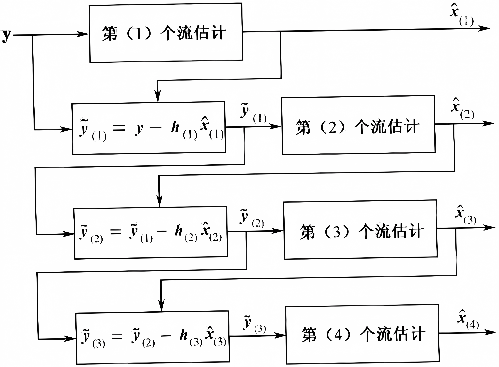

连续干扰消除相当于按照一定的检测顺序对没有过数据流进行估计，然后从接收信号中减去各检测阶段的估计信号从而构成剩余信号。显然，由于前一阶段的错误判决会引起剩余信号的差错，从而影响后续信号检测即误差传播，因此检测顺序会明显影响OSIC检测的整体性能。有以下检测排序方法：

1.  基于SINR的排序：首先检测具有最大检测后SINR的信号。
2. 基于SNR的排序：首先检测具有最大检测后SNR的信号。
3. 基于列范数的排序：方法1和方法2在进行信号检测时分别涉及了大量复杂的SINR和SNR计算。为了降低排序的复杂度，我们使用信道矩阵的列向量范数。从接收信号表达式可以看出第i个发射信号的接收强度与信道矩阵的第i个列范数成正比。因此，我们可以利用范数的排序检测信号。复杂度显著降低。
4. 基于接收信号的排序：方法1、2、3中利用信道增益和噪声特性确定检测顺序，然而也可以使用接收信号确定检测顺序。与上述三种方法相比，方法4的性能更好，但复杂度最高，因为每接收一个信号就需要进行一次检测排序。

在OSIC方法中所有符号的分集阶数都能大于 $N_{\textrm{Rx}}$ \- $N_{\textrm{Tx}}$ +1。由于排序，第一个检测符号的分集阶数也大于 $N_{\textrm{Rx}}$ \- $N_{\textrm{Tx}}$ +1。然而，其余符号的分集阶数取决于先前的符号是否能够被正确检测。如果前面的检测都是正确的，那么第i个检测符号的分集阶数为 $N_{\textrm{Rx}}-N_{\textrm{Tx}}+i$ 。

## ML信号检测

最大似然(Maximum likelihood，ML)检测计算接收信号向量和所有可能的后处理向量(所有可能的发射信号向量和给定信道H的乘积)之间的欧氏距离，并找到一个最小的距离。令C和 $N_{\textrm{Tx}}$ 分别表示信号的星座集和发射天线数。ML检测将发射的信号向量x估计为：

 $$ {\hat{x} }_{{\mathrm{M}\mathrm{L}}} =\arg \min_{x\in C^{N_{{\mathrm{T}\mathrm{x}}} } } \|y-Hx{\|}^2 $$ 

其中， $\|y-Hx{\|}^2$ 是ML的度量。当所有的发射向量等可能时，ML方法达到最大后验概率(MAP)检测的最佳性能。然而它的复杂度随调制阶数和/或发射天线数量的增加而上升，总共需要计算 $|C|^{N_{\mathrm{T}\mathrm{x}} }$ 个ML度量，呈指数上升。

## 球形译码

球形译码(Sphere Decoding，SD)方法试图寻找具有最小ML度量的发射信号向量，也就是想要找到 ML的解向量。然而，它只在一个给定球体内寻找，而不是在所有可能的发射信号向量中寻找。SD调整球体半径直到其内部存在一个 ML解向量。当球体内部不存在解向量时增大半径，当球体内存在许多解向量时减小半径。

## QRM\-MLD法

相当于 $N_{\textrm{Tx}} =N_{\textrm{Rx}} =4$ 的球形译码。

## 格基规约辅助检测

总的来说，线性检测方法和 OSIC方法在线性滤波的过程中可能会增强噪声，从而降低性能。当信道矩阵的条件数较大时，这种噪声增强更加严重。格基规约方法对减少信道矩阵的条件数非常有用。可以使用Lenstra\-Lenstra\-Lovasz(LLL)算法减少三角矩阵的条件数。

格基规约可以与各种信号检测方法相结合。如果将线性信号检测方法与格基规约结合，那么可以消除噪声的增强，特别是当初始条件数太大时。如果对SD应用格基规约,那么最初的猜测很可能是ML解,从而可以提供一个更小的球体半径。

## MIMO系统的软判决

前面讨论的全部是硬判决检测技术。通过采用软判决，可以进一步提高检测技术的性能。如果使用软输入软输出信道解码器，那么信号检测器的输出必须由软判决值(通过对数似然比LLR)给出。

# 在发射端利用信道状态信息

在第10章和第11章中，我们假设只有接收机能够跟踪信道。在这一章中，我们将讨论利用发射端信道状态信息(CSI)的发射技术。发射机可以获得部分或者全部CSI。利用信道状态信息可以提高信道容量，改善误码率，同时可以降低硬件复杂度。例如，在4x2MIMO系统中，利用完全的CSI可以将系统容量提高1.5bps/Hz。然而，由于反馈负荷和反馈时延，在实际中难以直接获取完全的CSI。特别地，发射机无法跟踪时变信道的CSI，因此只能利用部分信息(如统计信息)。在这一章中，我们首先讨论如何获得信道信息:然后，重点考虑预编码技术和天线选择技术，它们是在发射端利用 CSI的两种典型方法。

## 发射端的信道估计

一般来说，发射机无法直接获取自己的信道状态信息。因此，发射机只能采取一些间接的方法。在时分双工(TDD)系统中，我们可以利用上行和下行信道的互惠（互易）性。基于上行方向的接收信号，进行下行信道估计;反之亦然。在频分双工(FDD)系统中，由于两个信道之间没有互惠性，所以发射机只能依靠来自接收机的信道反馈信息。这意味着必须在接收机估计出CSI，然后反馈给发射机。

### 利用信道的互惠性

只要两个方向的信道增益高度相关(即信道是互惠的， $H_{A\to B} \approx H_{B\to A}$ )，一个方向的信道条件就可以简单地由另一个方向的信道获知。在TDD系统中，前向信道和反向信道趋向于互惠。一般上、下行发射存在一个时间差。如果这个时间差小于相干时间，那么互惠就是一种可以被利用的有用特性。然而，在FDD系统中，因为两个信道使用不同的发射频率，因此不存在这种互惠性。无线信道的实际影响还应该包含无线射频(RF)单元的特性。通常，前向信道的RF特性不同于反向信道。在利用信道互惠优势的过程中，必须以某种方式补偿这种差异。

### CSI反馈

在发射机获得信道增益的另一种途径是直接利用接收机的反馈。与利用互惠性不同，这种方法不需要补偿上、下行RF的差异。然而，为了保证能够获得及时的信道信息，反馈时延 $\Delta_t$ 必须小于相干时间 $T_c$ ：

 $$ \Delta_t \le T_c $$ 

这种方法的主要缺点是需要额外的资源来传输反馈信息，而且反馈信息量随着天线数目的增加而增加。因此，对于多天线系统来说，这个问题变得尤为突出。当遇到快衰落信道时，相干时间非常小，这就需要更频繁的反馈来满足式(12.1)中的约束。可以对接收机估计出的CSI进行压缩，以便减小反馈负荷。一种特定的方法是量化信道增益。令 $Q_{\textrm{quan}} \left(H\right)$ 表示信道增益H的量化函数。可以量化信道增益使得均方误差 $E{\left\{{{\|H-Q_{\mathrm{q}\mathrm{u}\mathrm{a}\mathrm{n}} {(H)}\|}}^2 \right\}}$ 最小。另一种方法是使用在发射机和接收机之间共享的码本。码本是码字的集合；码字是量化后的向量，用来表示信道的状态。在这种方法中，接收机首先估计出信道增益。然后，选择一个适当的码字编号来表示估计出的信道增益。仅向发射端反馈相应的编号，而不是全部CSI。

## 采用预编码的OSTBC

考虑一个具有 $N_{\textrm{Tx}}$ 根天线的MISO系统，即 $h\in {\mathbb{C}}^{1\times N_{\textrm{Tx}} }$ 。令 $C\in {\mathbb{C}}^{M\times T}$ 表示一个长度为M的空\-时码字： $C={[c_1  , c_2 ,  \cdots ,c_T  ]}$ 。其中， $c_k ={{[ c_{k,1}  , c_{k,2}  , \cdots c_{k,M}  ]}}^{\mathrm{T}} ,k=1,2,\cdots T,M\le N_{\textrm{Tx}}$ 。在采用预编码的OSTBC系统中，从码本 $F={\{ W_1 ,W_2 ,W_3 ,\cdots ,W_L  \}}$ 中选择一个预编码矩阵 $W\in {\mathbb{C}}^{N_{\mathrm{T}\mathrm{x}} \times M}$ ，然后与空\-时码字C相乘。通过选择适合的码字来改善系统的整体性能，如信道容量或误码率等。

## 采用预编码的空间复用系统

正如上面讨论的，不仅OSTBC系统可以在发射端利用CSI，而且 $N_{\mathrm{R}\mathrm{x}} ⩾N_{\mathrm{T}\mathrm{x}}$ 的空间复用MIMO系统也可以在发射端利用CSI。在发射端利用CSI的一个明显方法就是在前文中提到的模式分解(图9.2)。对于模式分解，必须将式(9.20)中的 $V\in {\mathbb{C}}^{N_{\mathrm{T}\mathrm{x}} \times N_{\mathrm{T}\mathrm{x}} }$ 用做发射端的预编码矩阵。然后得到无干扰的模式。在使用CSI的众多方法中，我们重点考虑预均衡方法。如下图所示，在发射端的预均衡等价于12.2节中的预编码。

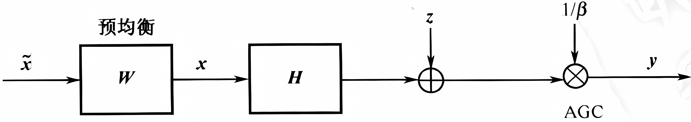

## 天线选择技术

MIMO系统的优点是在不增加额外发射功率和频谱资源的前提下，可以获得更好的性能。然而，MIMO系统的主要缺点是当使用多天线时需要额外的高成本的射频(RF)模块。通常，RF模块包含低噪放大器(LNA)、下变频器和模/数转换器(ADC)。为了降低多RF模块的成本，可以应用天线选择技术，使用比发射天线数少的RF模块。下图给出了天线选择的点对点配置，其中只使用Q个RF模块支持 $N_{\textrm{Tx}}$ 根发射天线( ${Q<N}_{\textrm{Tx}}$ )。需要将Q个RF模块有选择地映射到 $N_{\textrm{Tx}}$ 根天线中的Q根天线。此时系统容量取决于选择哪些发射天线和选择的发射天线数量。

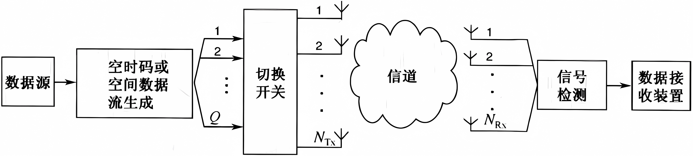

### 最优天线选择技术

从 $N_{\textrm{Tx}}$ 根发射天线中选取Q根天线以便使信道容量最大。当限定总的发射功率为P时，Q根选定发射天线的信道容量为：

 $$ C=\max_{R_{{\mathrm{x}\mathrm{x}}} ,\lbrace p_1 ,p_2 ,\cdots ,p_Q \rbrace } \log_2 \det (I_{N_{{\mathrm{g}\mathrm{x}}} } +\frac{E_{{\mathrm{x}}} }{QN_0 }H_{\lbrace p_1 ,p_2 ,\cdots ,p_Q \rbrace } R_{{\mathrm{x}\mathrm{x}}} H_{\lbrace p_1 ,p_2 ,\cdots ,p_Q \rbrace }^{{\mathrm{H}}} ){\mathrm{b}\mathrm{p}\mathrm{s}/\mathrm{H}\mathrm{z}} $$ 

其中，Rxx为QxQ的协方差矩阵。如果对所有选定的发射天线等分功率， $R_{\textrm{xx}} =I_Q$ ，那么对于给定的 $\lbrace p_i \rbrace_{i=1}^Q$ ，得到的信道容量为：

 $$ C_{\lbrace p_1 ,p_2 ,\cdots ,p_Q \rbrace } \triangleq \log_2 \det \biggl(I_{N_{{\mathrm{R}\mathrm{x}}} } +\frac{E_x }{QN_0 }H_{\lbrace p_1 ,p_2 ,\cdots ,p_Q \rbrace } H_{\lbrace p_1 ,p_2 ,\cdots ,p_Q \rbrace }^{{\mathrm{H}}} \biggr){\mathrm{b}\mathrm{p}\mathrm{s}/\mathrm{H}\mathrm{z}} $$ 

对所有可能的天线组合计算上式，可以实现Q根天线的最优选择。为了最大化系统容，必须选择具有最大容量的天线，即：

 $$ \lbrace p_1^{{\mathrm{o}\mathrm{p}\mathrm{t}}} ,p_1^{{\mathrm{o}\mathrm{p}\mathrm{t}}} ,\cdots ,p_Q^{{\mathrm{o}\mathrm{p}\mathrm{t}}} \rbrace =\underset{\lbrace p_1 ,p_2 ,\cdots ,p_Q \rbrace \in A_Q }{\arg \max } C_{\lbrace p_1 ,p_2 ,\cdots ,p_Q \rbrace } $$ 

其中， $A_Q$ 表示由Q根选定天线所有可能的组合形成的集合。注意 $|A_Q |={\left(\begin{array}{c} N_{\mathrm{T}\mathrm{x}} \\ Q \end{array}\right)}$ ，考虑上式中所有可能的天线组合涉及极高的复杂度，特别是当 $N_{\textrm{Tx}}$ 很大时。因此，需要设计一些能够降低复杂度的方法。

### 复杂度降低的天线选择技术

正如上节中提到的，最优天线选择的复杂度太高，其复杂度依赖于可以获得的发射天线的总数。为了降低复杂度，我们需要借助次优的方案。例如，按照信道容量增加的升序排列，选择额外的天线。具体地，首先选择一根具有最大信道容量的天线；给定第一根选择的天线后，选择第二根天线使得信道容量最大；n次迭代，直到Q根天线都被选定为止。此外，按照信道容量减小的降序排列，删除容量减小最少的天线，同样可以实现上述过程。 

注意，采取降序选择方法的复杂度比采取升序选择方法的复杂度高。然而，从性能角度看，当 $1<Q<N_{\textrm{Tx}}$ ，时，降序选择方法要优于升序选择方法。这主要因为降序选择方法在删除第一根天线之前，考虑了原信道增益矩阵的所有列向量之间的相关性。当 $Q=N_{\textrm{Tx}}-1$ 时，降序选择方法可以得到与最优天线选择方法相同的天线集合。然而，当 $Q=1$ 时，升序选择方法可以得到与最优天线选择方法相同的天线集合，并且获得了比其他选择方法更好的性能。然而，除了上面两种特殊情况之外，这些方法通常都是次优的。

### OSTBC的天线选择

在上节中，将信道容量作为天线选择的设计准则。也可以将差错性能作为设计准则。换句话说，选择发射天线以使差错概率最小。令 $\mathrm{Pr}\left(C_i \to C_j \right|H_{\lbrace p_1 ,p_2 ,\cdots ,p_Q \rbrace } )$ 表示在给定信道的条件下，发射空\-时码字为 $C_i$ ,而解码为 $C_j$ 的成对差错概率。对于一个由H的Q列组成的有效信道 $H_{\lbrace p_1 ,p_2 ,\cdots ,p_Q \rbrace }$ ，OSTBC的成对差错概率的上限为：

 $$ {\mathrm{P}\mathrm{r}}\biggl(C_i \to C_j \bigg|H_{\lbrace p_1 ,p_2 ,\cdots ,p_Q \rbrace } \biggr)=Q\left(\sqrt{\frac{\rho {\|H_{\lbrace p_1 ,p_2 ,\cdots ,p_Q \rbrace } E_{i,j} \|}_{{\mathrm{F}}}^2 }{2N_{{\mathrm{T}\mathrm{x}}} }}\right)\le \exp \left(-\frac{\rho {\|H_{\lbrace p_1 ,p_2 ,\cdots ,p_Q \rbrace } E_{i,j} \|}_{{\mathrm{F}}}^2 }{4N_{{\mathrm{T}\mathrm{x}}} }\right) $$ 

选择Q根发射天线，使上式中的上限最小，或等价于：

 $$ \left\lbrace p_1^{{\mathrm{o}\mathrm{p}\mathrm{t}}} ,p_2^{{\mathrm{o}\mathrm{p}\mathrm{t}}} ,\cdots ,p_Q^{{\mathrm{o}\mathrm{p}\mathrm{t}}} \right\rbrace =\arg \max_{\left\lbrace p_1 ,p_2 ,\cdots ,p_Q \right\rbrace \in A_Q } {\left\|H_{\left\lbrace p_1 ,p_2 ,\cdots ,p_Q \right\rbrace } E_{i,j} \right\|}_{{\mathrm{F}}}^2 =\arg \max_{\left\lbrace p_1 ,p_2 ,\cdots ,p_Q \right\rbrace \in A_Q } {\left\|H_{\left\lbrace p_1 ,p_2 ,\cdots ,p_Q \right\rbrace } \right\|}_{{\mathrm{F}}}^2 $$ 

在的推导过程中使用了误差矩阵 $E_{i,j}$ ，的性质： $E_{i,j} E_{i,j}^{\mathrm{H}} =aI$ ，其中a是常数。从上式可以看出，为了最小化差错概率，选择最高列范数对应的天线。在接收端，选择的Q根天线 $\lbrace p_i \rbrace_{i=1}^Q$ 的平均SNR为：

 $$ \eta_{\lbrace p_1 ,p_2 ,\cdots ,p_Q \rbrace } =\frac{\rho }{Q}\|H_{\lbrace p_1 ,p_2 ,\cdots ,p_Q \rbrace } {\|}_{{\mathrm{F}}}^2  $$ 

可以看出一定要选择接收SNR最大的天线。

# 多用户MIMO

在第9章中，我们已经证明了 $N_{\mathrm{R}\mathrm{x}} \times N_{\mathrm{T}\mathrm{x}}$ 单用户MIMO 系统的信道容量与 $N_{\mathrm{m}\mathrm{i}\mathrm{n}} =\min {\left(N_{\mathrm{T}\mathrm{x}} ,N_{\mathrm{R}\mathrm{x}} \right)}$ 成正比。事实上，在高信噪比情况下，MIMO技术是一种增加容量的必要方法，它能够提供最多 $N_{\mathrm{m}\mathrm{i}\mathrm{n}}$ 个空间自由度。在单用户MIMO系统中，空间复用技术能够支持高数据速率的点对点传输，同时还能提供空间分集增益。然而，大多数的通信系统需要处理共享相同无线资源的多个用户。下图显示了一个典型的多用户通信环境:在蜂窝系统中，一个基站(BS)同时服务多个移动台(MS)。在图中，从四个用户中选择三个，并为他们分配通信资源，如时间、频率和空间流。假设BS和每个MS分别有 $N_B$ 和 $N_M$ 根天线。因为K个独立的用户可以形成一个 $K\cdot N_M$ 的虚天线集，当与一个具有 $N_B$ 根天线的BS通信时，这种端到端配置可以被认为是一个 ${\left(K\cdot N_{\mathrm{M}} \right)}\times N_{\mathrm{B}}$ 的MIMO下行系统,或者被认为是一个 $N_{\mathrm{B}} \times {\left(K\cdot N_{\mathrm{M}} \right)}$ 的MIMO上行系统。在这个多用户通信系统中，多天线允许独立的用户在上行链路(多对一)同时发送各自的数据流，或者BS在下行链路(一对多)向多个用户发送数据流，其中每个用户独立解码。这归因于多天线增加了自由度，如同在单用户 MIMO 系统中一样。

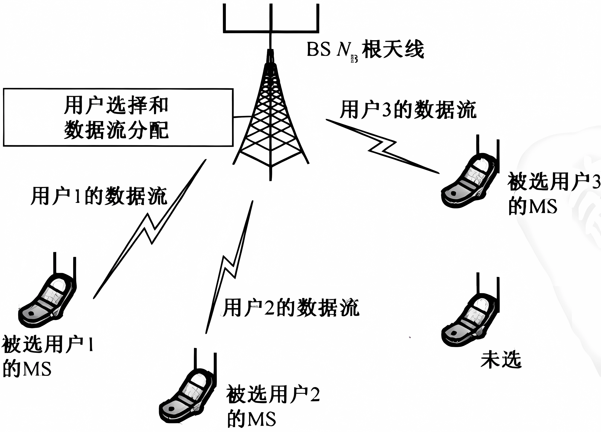

在多用户 MIMO 系统中，下行和上行信道分别被称为广播信道(Broadcast Channel，BC)和多址接入信道(Multiple Access Channel，MAC)。在MAC中，基站的接收机可以获得K个独立用户的所有数据流，此时多用户MIMO 系统相当于一个 ${\left(K\cdot N_{\mathrm{M}} \right)}\times N_{\mathrm{B}}$ 的上行单用户 MIMO 系统。因此，与单用户 MIMO 系统类似，可以证明多用户MIMO 系统的上行容量与 $\min {\left(N_B ,K\cdot N_M \right)}$ 成正比。本章首先讨论多用户MIMO系统的数学模型和容量。然后，给出预编码传输方案，它是实现下行多用户 MIMO 系统的一个具体方法。

## 多用户MIMO系统的数学模型

考虑有K个独立用户的多用户 MIMO 系统。假设 BS和每个 MS 分别配置 $N_{\mathrm{B}}$ 和 $N_{\mathrm{M}}$ 根天线。在上行信道中，令 $x_u \in {\mathbb{C}}^{N_{\mathrm{M}} \times 1} ,~~u=1,\cdots ,K$ ，表示来自第u个用户的发送信号； $y_{\mathrm{M}\mathrm{A}\mathrm{C}} \in {\mathbb{C}}^{N_{\mathrm{B}} \times 1}$ 表示BS的接收信号； $H_u^{\mathrm{U}\mathrm{L}} \in {\mathbb{C}}^{N_{\mathrm{B}} \times N_{\mathrm{M}} } ,u=1,\cdots ,K$ ，表示第u个用户和基站之间的信道增益。那么，接收信号可以表示为：

 $$ y_{MAC} =H_1^{{\mathrm{U}\mathrm{L}}} x_1 +H_2^{{\mathrm{U}\mathrm{L}}} x_2 +\cdots +H_K^{{\mathrm{U}\mathrm{L}}} x_K +z\left.=\underset{H^{{\mathrm{U}\mathrm{L}}} }{\underbrace{\left\lbrack H_1^{{\mathrm{U}\mathrm{L}}} H_2^{{\mathrm{U}\mathrm{L}}} \cdots H_K^{{\mathrm{U}\mathrm{L}}} \right\rbrack } } \left\lbrack \begin{array}{c} x_1 \newline \vdots \\ x_K  \end{array}\right.\right\rbrack +z=H^{{\mathrm{U}\mathrm{L}}} \left\lbrack \begin{array}{c} x_1 \\ \vdots \\ x_K  \end{array}\right\rbrack +z $$ 

其中， $z\in {\mathbb{C}}^{N_{\mathrm{B}} \times 1}$ 为接收机的加性噪声，将其建模为一个ZMCSCG随机向量。

在下行信道中，为 $x\in {\mathbb{C}}^{N_{\mathrm{B}} \times 1}$ 为BS的发射信号， $y_u \in {\mathbb{C}}^{N_{\mathrm{M}} \times 1}$ 为第u个用户的接收信号， $u=1,2,\cdots ,K$ 。令 $H_u^{\mathrm{D}\mathrm{L}} \in {\mathbb{C}}^{N_{\mathrm{M}} \times N_{\mathrm{B}} }$ 表示 BS 和第u个用户之间的信道增益。在 BC中，第u个用户的接收信号可以表示为：

 $$ y_u =H_u^{{\mathrm{D}\mathrm{L}}} x+z_u ,u=1,2,\cdots ,K $$ 

其中， $z\in {\mathbb{C}}^{N_M \times 1}$ 为第u个用户的加性ZMCSCG噪声。用单个向量表示所有用户的信号，则整个系统可以表示为：

 $$ \underset{y_{\mathrm{B}\mathrm{C}} }{\underbrace{{\left[\begin{array}{c} y_1 \newline y_2 \newline \vdots \newline y_K  \end{array}\right]}} } =\underset{H_{\mathrm{D}\mathrm{L}} }{\underbrace{{\left[\begin{array}{c} H_1^{\mathrm{D}\mathrm{L}} \newline H_2^{\mathrm{D}\mathrm{L}} \newline \vdots \newline H_K^{\textrm{DL}}  \end{array}\right]}} } x+\underset{z}{\underbrace{{\left[\begin{array}{c} z_1 \newline z_2 \newline \vdots \newline z_K  \end{array}\right]}} } $$ 

## 多用户MIMO系统的信道容量
### MAC容量

MAC的总速率容量与 $\min (N_{\mathrm{B}} ,K\cdot N_{\mathrm{M}} )$ 成正比。

### BC容量

高斯广播信道的容量区域仍然是一个没有解决的问题。利用上下行的对偶性可以获得到广播信道的容量。已经证明使用脏纸编码(DirtyPaper Coding，DPC)的下行信道容量与多址接入信道的容量相同。已经证明了下行广播信道的总速率容量与 $\min (N_{\mathrm{B}} ,K\cdot N_{\mathrm{M}} )$ 成正比，其中 $N_{\mathrm{B}}$ 为BS的天线数， $N_{\mathrm{M}}$ 为MS的天线数，K为用户数。

## 广播信道的传输方式

在 BC中，数据传输的主要困难是不能在接收机间直接进行协同信号检测，因此需要在BS消除数据间干扰。本节将考虑四种不同的传输方式：信道反转、块对角化(Block Diagonalization，BD)、脏纸编码和 Tomlinson\-Harashima 预编码(Tomlinson\-Harashima Precoding，THP)。

-  信道反转：在多用户MIMO方案中，信道反转过程与第12章中讨论的 ZF预均衡相同。唯一不同的是将式(12.16)中的H替换为 $H^{\textrm{DL}}$ 。与单用户 MIMO 的情形一样，使用 MMSE 准则可以减轻噪声增强的影响，也需要将式(12.19)中的H替换为 $H^{\textrm{DL}}$ ，此时在多用户MIMO中将其称为规则化信道反转。 
-  块对角化：BD方法在预编码的过程中只消除来自其他用户的信号干扰。对于每一个用户的天线间干扰，可以通过第11章中提到的各种信号检测方法消除。 
-  脏纸编码：理论上，当发射端完全知道信道增益时可以实现 DPC。DPC是一种预编码方法，能够将发射机已知的一些干扰删除。更具体地说，对第k个用户的信号进行预编码时，能够删除第一个到第k\-1个用户信号所造成的干扰。 
-  Tomlinson\-Harashima 预编码 
