# 全面详解LTE：MATLAB建模、仿真与实现 / Houman Zarrinkoub

作者：洋盘男人

> 《全面详解LTE：MATLAB建模、仿真与实现》代码

> 代码地址：[Code_Link](https://github.com/yangpannanren/Book_Code/tree/main/全面详解LTE：MATLAB建模、仿真与实现)

[TOC]

# 导论

LTE（Long Term Evolution，长期演进）和LTE-Advance（高级LTE）标准，迎合了时代需求，实现了全球基带移动通信的愿景。有低延迟，低运营成本，多路天线支持，以及互联网与现存移动通信系统的无缝继承特点。

## 无线通信标准速览

2G-TDMA:GSM(Global System for Mobile Communications，全球移动通信系统)、北美IS-54;
3G-CDMA:北美IS-95、3GPP;
无线本地网络（Wireless Local Area Network，WLAN）、无线城域网（Wireless Metropolitan Area Network，WMAN）;
WiFi协议系列、WiMAX协议;
4G。

20年以来无线通信标准的演进如下图：

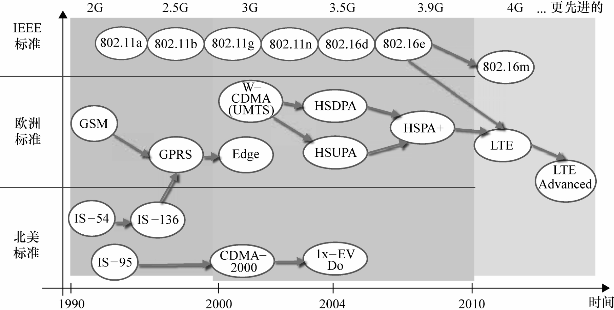

## 数据速率的历史

下表为过去20年间推出的各个无线协议的峰值通信速率：
|          技术          | 理论峰值数据速率（在低移动率状态下） |
|:----------------------:|:------------------------------------:|
|           GSM          |               9.6kbit/s              |
|          IS-95         |              14.4kbit/s              |
|          GPRS          |              171.2kbit/s             |
|          EDGE          |               473kbit/s              |
|   CDMA-2000( 1xRTT )   |               307kbit/s              |
|      WCDMA( UMTS )     |              1.92Mbit/s              |
|     HSDPA( Rel 5 )     |               14Mbit/s               |
|  CDMA-2000( 1x-EV-DO ) |               3.1Mbit/s              |
|     HSPA+( Rel 6 )     |               84Mbit/s               |
|    WiMAX( 802.16e )    |               26Mbit/s               |
|      LTE( Rel 8 )      |               300Mbit/s              |
|    WiMAX( 802.16m )    |               303Mbit/s              |
| LTE-Advanced( Rel 10 ) |               1Gbit/ s               |

## IMT-Advanced要求

国际电信联盟(International Telecommunication Unio，ITU)发布了一系列移动系统设计要求。IMT-Advanced 一个标志性的特性，是针对高级服务与应用峰值强化提升数据速率（高移动率100Mbit/s；低移动率1Gbit/s）。这些要求为研究提供方向。3GPP开发的LTE-Advanced标准和IEEE的移动WiMAX标准就是满足IMT-Advanced规范要求的两个代表。

## 3GPP和LTE标准化

LTE 和LTE-Advanced 标准由3GPP 开发。LTE-Advanced 的进步表现在谱效率、峰值数据速率以及用户体验相关方面。随着峰值数据速率达到1Gbit/s，LTE-Advanced 被 ITU 认可并作为 IMT-Advanced 技术。

## LTE要求

LTE 的各个要求涵盖了演进的通用移动通讯系统（Universal Mobile Telecommunications System，UMTS）系统架构的两个基本组件：UMTS陆基接入演进（E-UTRAN），核心分组网演进（EPC）。整个系统的目标包括：
1. 系统容量和覆盖扩展；
2. 高峰值数据传输率；
3. 低延迟（用户平台和控制平台）
4. 成本节约；
5. 多天线支持；
6. 可变带宽操作；
7. 无缝兼容现有设备（UMTS，WiFi等）。

## 理论策略

ShannOn 关于信道容量状态的基础工作告诉我们数据速率永远受限于可接收到的信号功率（或接收信号信噪功率比）。在接收端使用多路天线是一个比增加整体功率更好的办法。这就是我们说的接收分集。多路天线也可以在发送端使用，这就是我们说的发送分集。发送分集的方法基于波束形成，使用多路发送天线聚焦发送功率直接指向接收端。这个技术可以成指数增长接收信号功率从而达到更高数据传输速率。不过，应用发送分集或接收分集以提高数据速率只能在特定的点有效。超过这个点，增加数据速率会造成饱和。一个替代方案是同时应用多路天线在发送端
和接收端，即MIMO。LTE标准中包括不同类型的MIMO技术，包括开环和闭环空域复用。

除了接收信号强度之外，另一个参数也直接影响无线通信系统可达到的数据速率。它就是传输带宽。更高传输速率通常需要提供更宽的带宽。一个与宽带传送有关的重要的设计挑战就是无线信道的多径衰落效应。多径衰落是一个传输信号在到达接收端之前由于通过不同路径造成不同版本传播的现象。这些不同版本的信号叠加导致变化的信号功率特点和时延或相移。其结果是，接收端收到的信号会被调制成一个被信道脉冲响应滤波的样子。在频域上看，多径衰减信道表现为随时间变化的信道频率响应。信道频率响应不可避免地混杂在原始信号的频率特性中，从而对数据速率产生消极影响。为了调整信道频率选择性和得到满意的性能，我们必须在增加传输功率的同时，降低我们对数据速率的预期，或者用信道平衡补偿频域特性的畸变。

很多信道平衡技术都可以克服多径衰落效应。有两个办法可以适用于宽带传输中：
1. 使用多载波传输方案：宽带信号可以处理成多路窄带正交信号的和。应用于LTE标准中多载波传输的例子就是OFDM传输。
2. 使用单载波传输方案：OFDM可以提供一个简单得多的频域平衡方法，不需要要求高传输功率起落。一个在LTE标准中的例子被称为单载波频分复用，应用于上行链路传输。

不仅如此，对在给定带宽实现更高数据速率有更大作用的办法是使用高阶调制。使用高阶调制允许我们在单调制符上搭载更多比特，提高带宽利用率。当然，高的带宽利用率也伴随着代价：减小了调制符之间的最小距离，因而对噪声和干扰变得更敏感。因此，在低或高阶调制中使用自适应调制和编码以及其他链路自适应策略是明智的办法。通过使用自适应方法，我们可以本质上提升通信链路的通过率和可实现的数据速率。

## LTE关键技术

LTE 以及其演进标准中诸关键技术包括了OFDM，MIMO，Turbo编码和动态链路自适应技术。

### OFDM

LTE 选择OFDM 以及其单载波版本的单载波频分复用（Single-Carrier Frequency Division Multiplexing，SC-FDM）作为基本传输方案内容如下：针对多径衰减的可靠性高、频谱效率高、配置复杂度低、可支持可变传输带宽和如频率选择分配这样的高级功能、MIMO传输和干扰协调。

### SC-FDM

OFDM 多载波传输的一个缺点是瞬态发送功率的大范围波动。这对功率放大器产生消极影响而使移动终端基站负担较高的功率消耗。在上行两路传输中，设计一个复杂的功率放大器特别具有挑战性。因而，OFDM传输的一个变体，就是我们所知的SC-FDM被引入LTE标准使用在上行链路传送。SC-FDM一般和标准OFDM系统集成配置，并使用离散傅里叶变换（DFT）预编码。通过使用DFT预编码，SC-FDM根本上减小了发送功率波动的不利影响。因此，上行
链路传输架构可以得到OFDM带来的更多好处，如低复杂度的频域平衡器和频域分配，而不需要对功率放大器设计提出那么硬性的要求。

### MIMO

MIMO 方法对移动通信的贡献体现在两个不同方面：提高总数据速率和提升通信链路的可靠性。应用于LTE标准的MIMO算法可分为4类：接受分集、发送分集，波束形成和空域复用。LTE标准在下行链路协议中提供了4径天线多路传送配置，已实现MIMO。LTE-Advance在下行链路上则允许使用最多8径发送天线。

### Turbo信道编码

Turbo编码进化自卷积码。在LTE标准中，与以往不同，Turbo编码作为了信道编码机制的唯一方案，用于
处理用户数据。Turbo编码近乎理想的性能被LTE采用源自他的复杂度可计算和执行。LTE中的Turbo编码为了有效的执行进行了很多改进。比如，通过附加CRC（循环冗余检查）以检查Turbo 编码器的输入，LTE Turbo解码器可以在编码质量可以接受的情况下实现早期终止机制。这样，不用反复检查追踪解码的整个过程，解码器就能在CRC检查无误的情况下早一些停止。这一简单的解决方案带来了LTE Turbo解码器有可计算复杂度减小，避免了不少性能上的损失。

### 链路自适应

链路自适应的定义是：一种可以调整和适应移动通信系统传输参数以更好响应通信信道的动态性的技术。根据信道质量不同，我们可以使用不同的调制和编码技术（适应性调制和编码），调整几个发送或接受天线（适应性MIMO），甚至调整传输带宽（适应性波长）。

## LTE物理层建模

物理层建模包括所有数据比特从更高层传输到物理层的处理。它表现为一些列传输信道如何映射到物理信道，信号处理如何在每一个物理信道工作，以及数据如何最终被传送到天线而被发送。

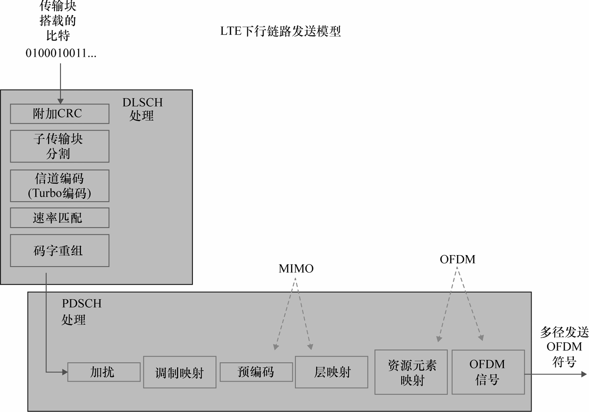

如上图所示，这是一个LTE下行链路传输的物理模型。首先，数据被阶梯化多路编码，也就是我们说的下行链路信道共享处理（DLSCH）。DLSCH处理包括附加CRC编码用于检差误码，对用户数据进行TurbO编码，进行比特率匹配操作选择几个输出比特去表示编码率，以及最后把码组重组和为码字。下一步就是所谓下行物理链路信道共享处理（PDSCH）。在这一步，对码字首先进行绕码操作，然后进行调制映射以形成调制过的符号流。再下一步包括LTE MIMO或多径天线处理，调制过的符号信号流被分为指定的多路子信号流通过多径天线传输。MIMO操作可以表示为两个步骤：预编码和层映射。预编码组织符号分配到每一个子数据流，层映射选择和路由数据到子数据流，配置成MIMO下行链路传输中9种不同模式中的一个。所有MIMO在下行链路中都以传输分集，空域复用和波束形成实现。最后工作是和多载波传输相关的一些列处理。在下行链路中，多载波操作基于OFDM传输方案。OFDM传输也包括两个步骤：首先，使用时域-频域资源网格，把资源元素映射到每一层的调制符号上。在调制网格的频轴上，数据和子载波的频域相关。在OFDM信号生成阶段，应用反傅里叶变换生成一系列的OFDM符号，以及时计算发送数据并传输到每个天线。

## LTE（R8 版和R9版）

LTE 标准的第一个版本（3GPP，R8版）发布于2OO8年12月。R9版发布于2OO9年12月；它的内容相应地反映了
一些最新技术进展如支持多媒体广播/组播服务（MBMS），定位服务和提供基站支持多种协议。

## LTE-AdVanced（R10版）

LTE-AdVanced 发布于2O1O 年12 月。LTE-AdVanced 是原始 LTE 标准的演进，并不表示一个最新技术的出现。一些列技术被LTE吸收最终使LTE-Advanced成为包括载波聚合，增强型下行链路MIMO/上行链路MIMO和分程传递的标准升级版。

## MATLAB和无线系统设计

## 本书组织结构

理解四个关键技术（OFDMA、MIMO、TurbO编码和链路自适应）。

# LTE物理层概览

LTE 为上行链路（移动端到基站）和下行链路（基站到移动端）定义了数据通信协议。在3GPP 命名习惯上，基站一般命名为eNodeB（enhanced Node Base station，增强型节点基站），移动单元一般命名为UE（User Equipment，用户设备）。

## 空中接口

LTE 的空中接口在下行链路基于OFDM（正交频分复用）多路接入技术，在上行链路基于类似的技术：SC-FDM（单载波频分复用）。OFDM 的时-频分布在传输中同时分配频谱和时间帧方面提供了高度的灵活性。LTE的频谱灵活性不仅表现在频带多样化上，更表现在对带宽可变的设置。LTE 同时支持1OmS的短帧来减少延迟。通过定义短帧大小，LTE可以更好地评估移动端的信道，实时地为基站的链路自适应提供必要的反馈。

## 频带

LTE标准定义了在不同频带上可用的无线电频率位置。LTE标准的一个目标是无缝兼容旧移动系统。因此，过去3GPP标准中已定义使用的频率在LTE开发中依然可以使用。除了这些通用频带，LTE协议也第一次引入了几个新频带。这些新频带随不同国家间管制规定不同而不同。

FDD频带为成对频谱，它可以同时在两个频率上传输：下行链路使用一个，上行链路使用一个。成对频带有足够的间隔以提升接收器性能。TDD频带是非成对频谱，上行链路和下行链路传输共用同一信道和载波频率。这中传输在上行链路和下行链路上是时间复用的。

## 单播和组播服务

对移动通信来说，一般传输模式是我们熟知的单播传输。它只对单一用户传输数据。除了单播模式之外，LTE支持多媒体广播/组播服务（MBMS）的传输模式。MBMS提供如TV和广播以及音频视频流这样高数据速率的多媒体服务。

MBMS拥有一套它自己的专有业务和控制信道，以及基于多校区传输方案而形成的多媒体广播单频网络（MBSFN）。多媒体信号从属于一个指定的MBSFN服务区内多个相邻的小区发送。当一个多播信道内容从不同小区发送，在相同子载波的信号会在UE连贯组合起来。这使得SNR（Signal-tO-NOiSeRatiO，信噪比）和多媒体传输的最大上限数据速率得到本质提升。

## 带宽分配

LTE的频率范围和包括12个子载波的资源块互相关联。这些子载波以15kHZ等分，所以资源块的总带宽是18OkHZ。传输带宽可以在单一频率的载波上配置6到11O个资源块，这样LTE标准的多径传输特性就提供了1.4～2OMHZ每18OkHZ递增的信道带宽，并保证了所要求的频谱灵活性，如下图所示。

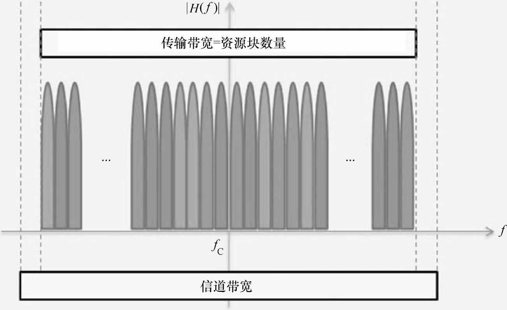

## 时间帧

下图所示为LTE的时域结构。理解LTE传输过程取决于清晰理解数据的时-频分布，映射到资源网格，以及资源网格是如何最终转变成OFDM 符号而传输的。在时域，LTE以1Oms长度的无线电帧序列传输。每一个帧可以细分为1O个长度为1ms的子帧。每一个子帧由两个长度O.5ms的时隙组成。每个时隙包含若干个OFDM符号。这些OFDM符号一般有6个或7个，取决于使用普通循环前缀或是使用扩展循环前缀。

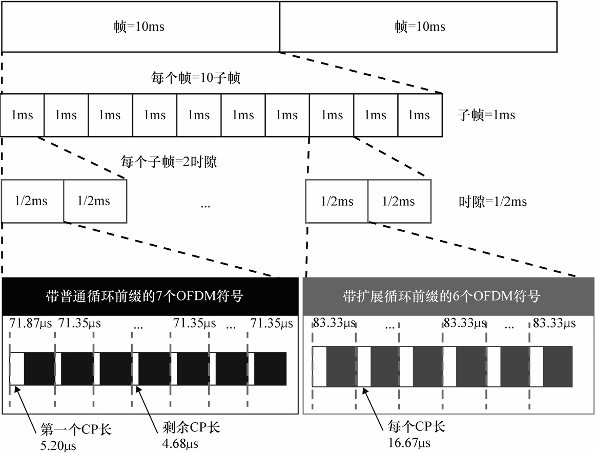

## 时-频分布

OFDM最吸引人的一个特点就是对发送信号明确映射了时-频分布。在编码与调制之后，复调制信号的变体———物理资源元素，被映射到时-频坐标系统———资源网格中。资源网格在x轴方向为时间，在y轴方向为频率。x轴的资源元素是与时间相关的OFDM符号。y轴方向表示与频率相关的OFDM子载波。

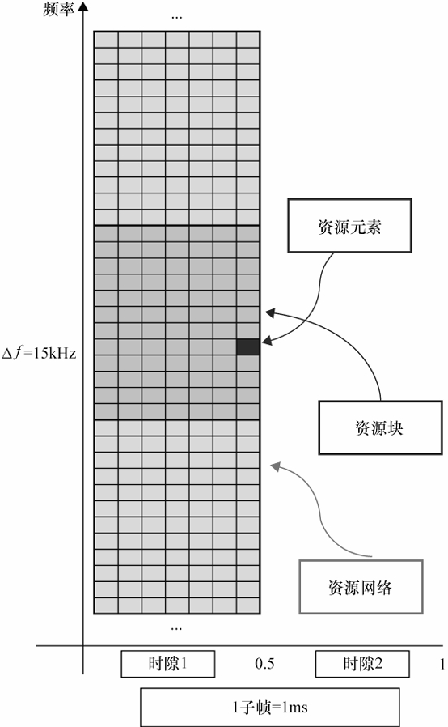

上图所示为使用普通循环前缀的LTE下行链路资源网格。一个OFDM符号和子载波方向的交叉点对应一个资源元素。子载波间隔15kHZ。在使用普通循环前缀的情况下，每一个子帧有14个OFDM符号（每一个时隙有7个符号）。资源块定义为在频域上12个载波或18OkHZ，在时域上一个O.5mS时隙构成的资源元素组。当使用普通循环前缀的情况下，每一个时隙有7个OFDM符号，这样每一个资源块包括了84个资源元素。在使用扩展循环前缀的情况下，每一个时隙有6个OFDM符号，这样每一个资源块包括了72个资源元素。资源元素的定义非常重要，因为它是时域调度的传输最小单元。

下行和上行链路有一点点区别在于子载波的中心频率有所不同。在上行链路中，没有不使用的DC频率成分的子载波，而上行链路载波中心频率定义在两个子载波中间。在下行链路，中心位置频率不使用。下行链路传输中不使用DC子载波是为了避免非比例高串扰出现的概率。

## OFDM多载波传输

在LTE标准中，下行链路传输基于OFDM方案，而上行链路基于与OFDM类似的SC-FDM方案。OFDM是一个多载波传输的方法，表现在它的基带传输带宽是若干个窄带子信道的集合。

OFDM 信号生成过程略

### 循环前缀
### 子载波间隔
### 资源块尺寸

在选择资源块尺寸时，若干个因素需被考虑。首先，它必须足够小以在频率选择性调度中占优（如在良好频率子载波上调度数据传输）。小资源块尺寸保证每个资源块的频率响应较小，而使调度器只分配那些良好的资源块。不过，eNOdeB不清楚哪个资源块处于好的信道条件下，这个信息须由UE反馈。因此，资源块必须足够大以避免过度的反馈开销。当LTE的子帧大小为1mS以保证延迟时，资源块尺寸在频率上应很小，这样可以有效支持小数据包。因此，LTE 选择18OkHZ（12 子载波）作为资源块带宽。

### 频域调度

LTE支持不同系统带宽。OFDM和SC-FDM通过IFFT操作产生发送信号。我们因此可以通过选择不同的FFT长度而得到不同的带宽。忽略被使用的带宽，LTE保持OFDM符号时长一定，为66.7μS。这使相同15kHZ子载波可用于所有带宽。这一设计选择保证了相同频域平衡技术可以应用跨越多个频带。固定的符号时长也意味着在不同频带上有相同的子帧长度，这一特性使传输模型中时间帧定义得到大大简化。即使在实际的FFT在每个带宽上长度并没有标准定义，2OMHZ上FFT长度通常为2O48。其他频带上FFT长度也通常成比例缩小，见下图。

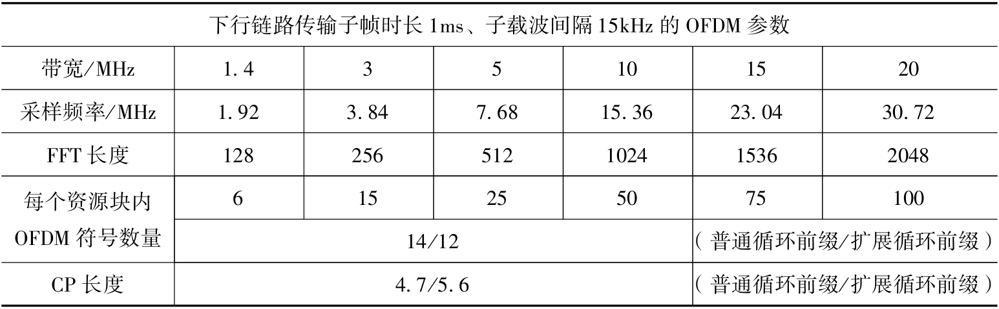

### 接收端典型操作

OFDM接受端反转了OFDM信号生成和发送的过程。首先，我们从接收到的OFDM符号的开始删除循环前缀。随后，通过FFT操作，我们计算接收到的一个OFDM符号内的资源网格元素。在这一步，我们需要在接受到的资源元素上进行平衡操作，来消除信道和码内串扰的影响，以恢复发射资源元素的最好估计。

在资源元素上进行平衡，我们首先需要对所有带宽估计信道频率响应；这一过程针对所有资源元素。引入引导符或小区参考信号（CSR）的重要性是显而易见的。通过在资源网格上多个已知点发送一个已知信号作为引导符，我们可以在相应子信道轻松估计实际的信道响应。这些信道响应可以通过各种方式计算，如通过一个接受信号和发送信号的简单比值。现在我们得到了一些资源网格上标准点的信道响应，接下来可以进行各种平均或插值操作来估计所有资源网格的信道响应。估计资源网格的信道响应之后，我们可以通过把信道响应估计值的倒数乘以接受到的资源资源元素，得到资源元素发送值的最好估计。

## 单载波频分复用

LTE标准中SC-FDM实质上是通过一个带DFT（离散傅里叶变换）预编码器的OFDM调制器执行的。这一技术即离散傅里叶变换扩展正交频分复用（DFTS-OFDM）。与单载波传输的不同之处，在于每个数据符号实质上分散于所有所用带宽上。对比OFDM，每个数据符号只分布在一个子载波上。通过在所有带宽上分散数据功率，SC-FDM减少了传输功率的有效值并保证了传输信号在功率放大器线性区域内的动态范围。SC-FDM同样拥有OFDM所有的优势，包括保证多个上行链路用户的正交性、用频域平衡恢复数据以及克服多径衰落。不过，SCFDM的性能对于同一接收端来说一般弱于OFDM。

## 资源网格的内容

三种类型的信息实际存在于物理资源网格。每个资源元素既包括用户数据的调制符号，也包括参考信号、同步信号和来自更高层信道的控制信息。下图所示为在单播模式下定义的用户数据、控制信息和参考信号在资源网格中的位置。

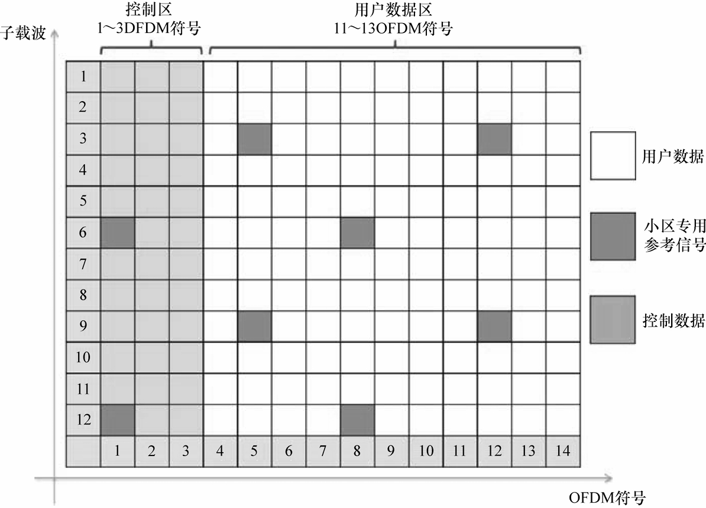

对单模模式，用户数据搭载了每个用户想要通信的信息，它们以传输块方式从MAC（媒体介入控制）层发送到物理层。多种类型的参考和同步信号在基站和移动设备上生成。这些信号用于如信道估计、信道测量，同步这些用途。最后还有各种类型的控制信息，它们通过控制信道携带了接受端需要的用以正确解码信号所需的信息。

## 物理信道

下图所示为无线电接入网络的协议栈和它的层结构。逻辑信道体现了无线电链路控制（RLC）层和MAC层的数据传输和互联。LTE定义了两种逻辑信道：业务信道和控制信道。业务信道传输用户平面数据。传输信道连接MAC层和物理层，物理信道在物理层上由收发端实现。每个物理信道由一组资源元素构成，这些资源元素搭载了用于空中接口上最终传输的上层信道协议栈。在下层或上层链路数据传输分别使用DL-SCH（下行链路公共信道）和UL-SCH（上行链路公共信道）这两种传输信道。。一个物理信道搭载特定传输信道传输使用的时-频资源。每个传输信道映射到相应的物理信道。除此以外，也有物理信道和传输信道没有一一映射的情况。LTE中逻辑信道、传输信道和物理信道在上行链路和下行链路中不同。

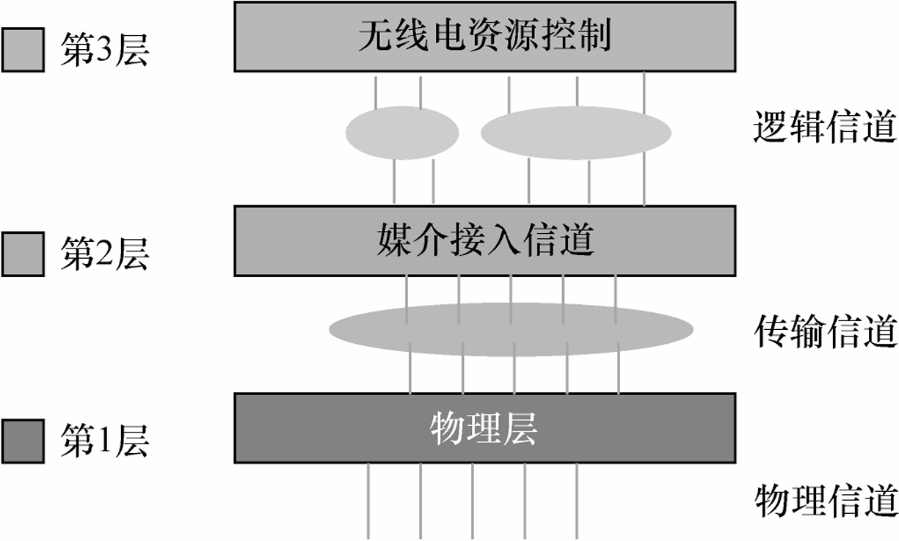

### 下行链路物理信道
### 下行链路信道功能
### 上行链路物理信道
### 上行链路信道功能

## 物理信号

物理信号多种多样，包括参考和同步信号，在公共物理信道内传输。物理信号映射对应PHY特定的资源元素但并不携带上层信息。

### 参考信号

为了表现反映真实信道质量的下行链路调度，移动终端必须为基站提供信道状态信息（CSI）。CSI由测量下行链路中参考信号生成。参考信号由发射端和接收端的同步序列生成器生成。这些信号在时-频网格中被放置于特定的资源元素。

#### 下行链路参考信号

下行链路参考信号提供了信道测量功能，它用于平衡和解调控制信息和数据信息。它们也辅助CSI测量（如RI、CQI和PMI），用于信道质量反馈。LTE定义5种参考信号类型：小区特定参考信号（CSR），解调参考信号（DM-RS以及其他如UE特定参考信号等），信道状态信息参考信号（CSI-RS），MBSFN参考信号和位置参考信号。

#### 上行链路参考信号

LTE 标准定义两种上行链路参考信号：DM-RS和探测参考信号（SRS）。这两种参考信号基于ZadOff-Chu序列。ZadOff-Chu序列用于生成下行链路主同步信号（PSS）和下行链路前导信号。不同UE的参考信号由基本序列的不同循环移位参数区分。

### 同步信号

下行链路同步信号用于多个处理过程中，包括帧边界检测、确定天线数量、初始化小区搜索、相邻小区搜索和
交接。LTE定义了两种同步信号：主同步信号（PSS）和辅助同步信号（SSS）。

PSS和SSS占用DC子波段周围的72个子波段。不过，FDD模式下这些位置不同于TDD模式。在FDD帧中，它们使用子帧O和5，彼此相邻。在TDD帧中，它们并不相邻。SSS信号位于子帧O和5的最后一个符号，PSS位于一个特定帧的第一个OFDM符号。

同步信号与PHY小区识别有关。LTE定义了5O4个小区识别码，分为168个组，每个组包括3个特殊识别码。PSS搭载特殊识别码O、1或2，而SSS搭载组识别码O～167。

## 下行链路帧结构

LTE 定义了两种下行链路帧结构。第一种帧用于FDD，第二种用于TDD。每种帧由1O个子帧组成，每个子帧由时-频资源网格描述。一个资源网格包括三个组成部分：用户数据、控制信道和参考、同步信号。

## 上行链路帧结构
## MIMO

多天线技术依托接收器或发射器使用多个天线传输以及其先进的信号处理技术。虽然多天线技术增加了执行的可计算性复杂度，但它可以达到提升系统性能，包括提升系统容量（换句话说就是一个小区网络容纳更多用户）和提升覆盖率或更大范围小区传输的可能性作用。

### 接收分集

应用于接收分集的常用合并方法：最大比合并（Maximal Ratio Combining，MRC）、选择式合并（Selection Combining，SC）和等增益合并（Equal Gain Combining，EGC)。当使用MRC时，我们合并多路接收信号（平均它们则为等增益合并）找到发射信号的最似然估计。当使用SC时，只有最高SNR的接收信号被采用用以估计发射信号。

### 发射分集

发射分集即在发射端使用多天线通过发射相同信号的随机版本。这一类MIMO技术一般为空-时区块编码（STBC）。使用STBC调制时，符号映射到时域和空域（发射天线）捕捉多发射天线的分集。空-频区块编码（SFBC）是一种和STBC非常相关的技术，它作为发射分集技术引入LTE标准。这两种技术的主要区别在于SFBC在天线（空域）和频域编码而不是在天线（空域）和时域编码，而STBC正相反。发射分集并不会对数据速率有提升作用，它只是增加了对信道衰落影响的可靠性并增加了链路质量。其他MIMO模式—特别是空分复用—则直接增加了数据速率。

### 空分复用

在空分复用情况下，完全独立的数据流在每个发射天线上同时被发射。应用空分复用可使系统与发射天线端口数量等比例的提高数据速率。同时，在同一频率载波上，不同调制符号通过不同天线发射。这意味着空分复用可以直接提升带宽效率，提高系统的带宽利用率。空分复用的这一好处只在多发射天线彼此不相关时才能体现。空分复用可以在通信链路自然存在多路衰落情况下提高性能。因多路衰落可以在每个接收天线端口与接收信号去相关，在多路衰落信道使用空分复用可以事实上提高性能。

### 波束赋形

在波束赋形过程中，发射天线可以形成所有天线发射图形（或波束）来达到在移动终端方向全天线增益最大化。波束赋形构成了下行链路MIMO传输模式7的基础。应用波束赋形技术可以实现信号功率随发射天线数量成比例增长。一般来说，波束赋形依赖最少8个天线构成的天线阵列工作。波束赋形由天线阵列中不同元素应用不同的复变增益（或称权重）执行。所有的传输波束可以指向不同方向，这一过程由在不同天线信号上进行不同的相移完成。

### 循环延迟分集

循环延迟分集（Cyclic Delay Diversity，CDD）是LTE标准中结合开环空分复用的另一种分集形式。CDD对任意给定时刻不同天线上发射信号的向量或块进行循环移位。其效果如同使用一个已知的预编码器。如此，CDD与块传输方案如OFDM和SC-FDM非常匹配。在OFDM传输情况下，比如，时域的循环移位对应频域上频率相关性相移。因相移在频域上———也就是预编码矩阵———可知和可预知，CDD应用于开环空分复用以及在高移动率情况下优化预编码矩阵的闭环反馈无法完成的情况。应用CDD主要作用就是在接收端经验性的引入一个虚拟的频率分隔。

### MIMO模式

下图总结了LTE传输模式以及与其有关的多天线传输方案。模式1使用接收分集，模式2基于发射分集。模式3和4为单用户空分复用，分别基于开环或闭环预编码。模式3也使用CDD。LTE模式5定义了一个非常简单的多用户MIMO，基于模式4并将最大层数设定为1。模式6为模式4的特殊情况，它使用波束赋形，并将最大层数设定为2。LTE 模式7～9 为不使用码书的空分复用，层数分别为1、2，4～8。LTE-AdVanced（第1O发布版）引入模式8和9大大提升了下行链路MU-MIMO性能。如模式9支持8个天线在8个层传输。这些进步也直接来自于引入新的参考信号（CSI-RS和DM-RS），允许无码书的预编码并接收低开销双码书结构。

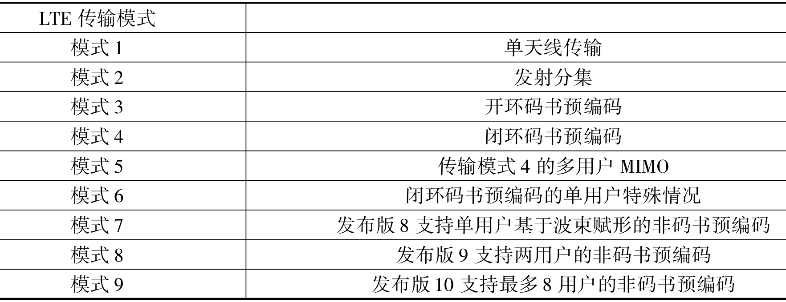

## 物理层数据处理

首先，描述信道编码、绕码，调制以生成调制符号。然后描述调制信号映射到资源网格的每一步，包括映射用户数据、参考信号和控制数据。随后，定义允许多天线传输的MIMO模式。不同的MIMO算法对应指定层的映射，即每个帧使用多少发射天线，以及调制字节映射到所有发射天线资源网格之前，如何使用预编码传输。

## 下行链路数据处理

发射端一系列信号处理操作可以分为传输块处理与物理信道处理。3GPP完整定义了复用和信道编码，以及物理信道和调制的处理栈。基带信号处理链可归纳为DLSCH和PDSCH的组合，整个流程图在[LTE物理层建模](#lte物理层建模)一节中已给出过，具体的步骤如下所示：

- 添加传输块CRC(循环冗余检查);
- 码块分割和码块CRC添加;
- 1/3码率的Turbo编码;
- 以要求的编码率进行速率匹配;
- 链接码块生成码字;
- 对每个码字的位进行绕码并在物理信道发送;
- 调制绕码位生成复调制符号;
- 映射复调制符号到一个或多个传输层;
- 为了在天线端口传输，在每个传输层上对复调制符号进行预编码;
- 映射复调制符号到每个天线端口的资源元素;
- 在每个天线端口上生成复时域OFDM 信号。

## 上行链路数据处理

上行链路信号处理过程整个流程图和下行类似，区别在于分为ULSCH和PUSCH和在调制映射后、预编码前进行DFT操作，具体步骤如下：

- 添加传输块CRC;
- 码块分割和码块CRC添加:
- 1/3码率的 Turbo 编码;
- 以要求的编码率进行速率匹配;
- 链接码块生成码字;
- 绕码;
- 调制绕码字位成复调制符号;
- 映射复调制符号到一个或多个传输层;
- 对复符号进行 DCT传输预编码;
- 对复调制符号进行预编码;
- 映射复调制符号到资源元素;
- 在每个天线端口上生成复时域SC-FDM 信号。

### SC-FDM

在LTE中，在调制符号上使用的是一种基于DFT应用的特殊预编码，用于在频域生成SC-FDM信号。注意SC-FDM信号生成过程与OFDM相同，除了引入附加的M点DFT之外。通常，DFT计算的计算效率小于FFT。不过我们可以找到高效执行素数长度DFT运算的方法。这就是为什么LTE定义M点DFT的原因，其长度可以为1、3或5（它们都是素数）

### MU-MIMO

在移动系统中，移动终端的接收天线数量N常常小于基站发射天线数M。因MIMO系统的容量增益由参数min（M，N）约束，SU-MIMO的容量增益被接收端接收天线数量N所限制。在下行链路传输中，这个问题由MU-MIMO处理，即传输模式7～9。在上行链路，LTE第8发布版本只支持在移动端以此只是用一个发射天线，即使多天线存在。减小费用、功耗和移动终端硬件复杂度的需求决定了这一选择。天线选择可以一次从多个发射天线中选择一个天线。这种情况下，移动终端的发射天线选择既由基站支配也受移动终端本地管理。当不同用户在各自的移动单元天线上发送信号时，上行链路MU-MIMO可以看成是不同用户在同一个资源块传输数据的MIMO系统。

# MATLAB通信系统设计

# 调制和编码

LTE（长期演进）下行链路PHY（物理）层处理链可以认为是下行链路公共信道（DLSCH）和物理下行链路公共信道（PDSCH）处理的组合。DLSCH即下行链路传输信道（TrCH）。它包括循环冗余检查（CRC）码添加、数据子块处理、信道TurbO编码、速率匹配、混合自动重传请求和码字重组这几个步骤。码字是PDSCH处理的输入，该处理包括绕码、调制、多天线多输入多输出（MI|MO）、时-频资源映射和正交频分复用（OFDM）传输。

在本章中，我们考察LTE标准中的调制和编码方案。它们包括所有DLSCH和PDSCH处理步骤，但不包括MIMO和OFDM操作。接着，我们会考察TrCH处理，比较一系列映射逻辑信道和用户数据到码字的操作，而码字是共享物理信道的输入。

## LTE调制方案

LTE使用的调制方案包括QPSK（正交相移键控）、16QAM（正交幅度调制），和64QAM。LTE比特到符号的映射既不基于一般的二进制又不基于格雷码方案。而且，LTE定义了一种习惯性星座映射。LTE也定义调制符号的平均信号功率在一定程度上归一化。

### MATLAB实例
### BER测量
## 比特级绕码

在LTE下行链路中，信道编码操作生成的码字比特由比特级绕码序列绕码。相邻小区使用不同的绕码序列以保证干扰随机，且来自不同小区传输在解码之前被分开。为了达到这些目标，各个小区序列绕码的数据比特唯一，小区的绕码序列由PHY小区识别码生成。比特级绕码应用于所有LTETrCH和下行链路控制信道。

绕码由两部分构成：伪随机序列生成和比特相乘。伪随机序列由长度31的GOld序列生成。输出序列定义为两个序列进行异或操作的输出。两个序列的生成多项式为：

$$ p_1(x)=x^{31} +x^3 +1 \\ p_2(x)=x^{31} +x^3 +x^2 +x +1 $$

第一个序列的初始值定义为长度31的单位冲击函数。第二个随机序列的初始值取决于小区识别码、码字数量，和子帧索引。最后，比特相乘是对输入比特和GOld多项式比特进行异或运算。绕码其的输出的向量长度与输入码字长度一致。

在接收端，去绕操作为绕码器的反向过程。它使用相同的伪随机序列生成器。不过，绕码与去扰有所不同。去扰可以通过两种途径执行。假如，先于去扰操作进行硬判决译码，绕码器输入为比特。在这种情况下，输入比特和GOld序列的异或运算将会直接生成去扰序输出。另一种途径为，假如在去扰之前进行软判决译码，输入信号不为比特而为对数似然值(LLR)。这种情况下，去扰为输入对数似然值与GOld序列比特变换系数值的乘积。一个O值GOld序列比特映射到1，而1值比特映射到-1。

### MATLAB实例
### BER测量
## 信道编码

大部分物理信道使用TurbO编码，除了广播信道（BCH）———它使用卷积码。

## Turbo 编码

TurbO编码器属于并行卷积信道编码算法。正如其名，TurbO编码由两个卷积编码器并联，并由交织器分割。LTE选择TurbO编码基于很多因素。首先，是TurbO编码器近ShannOn极限的性能。在给定足够大TurbO译码迭代次数下，TurbO编码的BER性能远远超过传统的卷积码。不仅如此，它拥有适应性，可用于先进的速率匹配机制中。

### Turbo编码器
### Turbo译码器
### MATLAB实例
### BER测量
## 早期终止机制

Turbo译码器的迭代次数是其译码器主要特性之一。为了TurbO译码器有效执行，我们很明显面对一个折中。一方面，TurbO译码器的精度和性能与迭代次数直接相关，更多次迭代得到更好的精度。另一方面，TurbO译码器可计算复杂度也随着迭代次数增加成指数增长。

LTE标准提供了一个有效的途径，通过引入早期终止机制解决这一折中。该机制集成在TurbO编码器中。通过对TurbO编码器输入添加CRC校验，我们可以在TurbO译码器迭代结束时检出是否存在错误比特。我们可以在CRC校验无错误比特时选择提前终止译码，而不需要完成全部译码迭代。这一简单的方案大幅降低了TurbO译码器的计算复杂度，且不会带来性能的损失。

### MATLAB实例
### BER测量
### 计时测量
## 码率匹配

码率匹配作为现代通信标准的一个重要特征，在适应性编码中应用。它可以帮助提高不同信道条件下的数据吞吐量。在低劣化信道中，我们用近似单位码率编码数据，减小发送前向纠错编码的比特数量。另一方面，在高劣化信道，我们可以使用更小的码率并增加检错比特。

码率匹配包括：

1. 子块交织；
2. 奇偶校验比特隔行；
3. 比特裁剪；
4. 码率比特选择与传输。

码率匹配的第一个操作时子块交织，它使用一个单矩形交织器。通过在码率匹配中使用循环缓冲器，裁剪和重复操作增加或减少码率得到需要的水平可在循环缓冲器中进行比特选择操作简单实现。最后，通过连接码组，编码比特完成并发送至PDSCH处理。

### MATLAB实例
### BER测量
## 码块分段

在LTE中，传输块连接了MAC层和PHY层。传输块一般包括同时传输的大数据比特。对传输块的第一步操作是对其进行信道编码，它对每个码块独立进行。假如输入帧大于TurbO编码器的最大处理长度，我们一般会分割传输块为多个小块，即码块。因为TurbO编码器内部的交织器定义最大处理长度188的输入块，码块的长度需要和TurbO编码器设定的码块长度匹配。随后对每个码块独立进行添加CRC、TurbO编码和码率匹配等操作。

### MATLAB实例
## LTE传输信道处理

下行链路TrCH由五个功能组件构成了传输块处理：

1. 传输块添加CRC；
2. 码块分端和码块CRC添加；
3. 1/3 码率TurbO 编码；
4. 匹配任意所需码率；
5. 码块连接。

### MATLAB实例
### BER测量
# OFDM
## 信道建模

移动信道可以由发射端和接收端之间多路径传播的有效性描述。除了收发端之间的少之又少的直线路径之外，其他路径由反射、折射、散射，或其他传播途径形成。接收端可以同时收到通过不同路径而状态各不相同的传输信号。这些不同状态的信号携带了变化的信号功率以及时延和相延。因为这些接收到的信号与时间相关，AWGN模型不适用于大部分无线连接的信道建模。因此，建立更适合描述无线信道的模型对于设计移动通信系统是很重要的。信道传播通常带来接收信号功率衰减。一般情况下，功率衰减分为两类：

1. 信号幅度衰减或大尺度衰落；
2. 衰落或小尺度衰落。

### 大尺度和小尺度衰落

路径损耗和阴影衰落效应是大部分大尺度衰落效应的主要因素。这些大尺度特征需在设计和小区拓扑中考虑。小尺度衰落包括多径衰落和移动过程带来的时间色散。这些特征为短时并必须做出适应性处理。PHY层设计应该包括有效应对这些信道衰减的技术

### 多径衰落效应

多径衰落可由功率延时描述，它包括两个部分：有关延时的向量和有关平均功率参数的向量。其他有用的可测配置既包括有关延时的一阶矩量平均附加延时或二阶矩量均方根（RMS）延时。多径衰落可以是平坦性或频率选择性的。假如带宽大于延时扩散的倒数，信道频率响应就会导致多径衰落。
在小区通信中，移动终端从基站延直线路径接收信号。有些信号也会被建筑物或其他反射源反射，从而在到达移动终端时出现时延和功率损失。因移动接收器线性合并这些信号，总信号实际为信号和信道冲击响应的卷积。在频域，信道频率响应在不同频率有不同的响应形态；因此出现频率选择性衰落，如下图。
在时间色散信道带有多径传播特性的情况下，子载波不仅仅会出现码内串扰，并会出现载波间串扰。这是因为载波间正交性会因为不同路径下分割码间边界的解码器间隔重叠，而造成部分缺失。因为调制符号在相邻的两个符号间隔上并不相同，用于计算快速傅里叶变换（FFT）的积分区间，并不与一定路径复指数的整数周期一致。

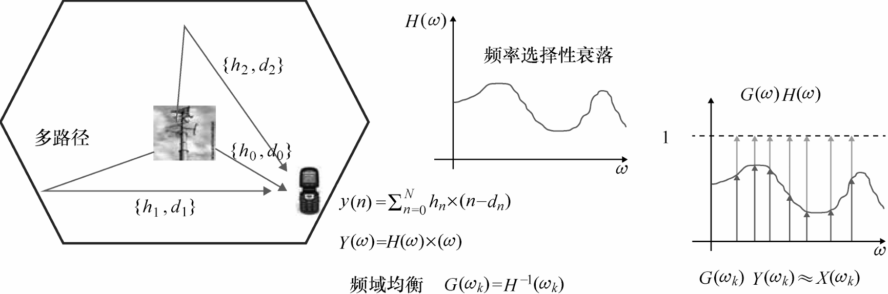

### 多普勒效应

对移动系统基带传输，如LTE，主信道劣化是由于多径传播引起短期衰落造成的。我们需要考虑衰落信道的效应以精确评估LTE系统性能。当移动终端移动时，信道冲击响应会随之变化。快和慢衰落信道反映了移动终端的速度，这就是多普勒相移的表现。

### MATLAB实例
#### 低移动率平坦衰落信道
#### 高移动率平坦衰落信道
#### 低移动率频率选择性信道
#### 高移动率频率选择性信道
## 讨论范围

在本书中，我们关注引导15kHZ子载波间隔特定时间帧（每时隙七个OFDM符号）的普通循环前缀（CP）。MATLAB函数可以通过改变几个参数轻松仿真扩展CP的情况。

## 工作流程

我们从编码、调制，和绕码开始，添加平坦和频率选择性信道模型。在本章中，我们讨论单天线传输（包括单输入单输出（SISO）和单输入多输出（SIMO））。我们关注参考信号生成，定义资源网格，和OFDM传输。最后，我们将下行链路传输的第一个系统模型的测试脚本集合在一起。

## OFDM和多径衰落

OFDM调制信号是对资源元素在不同子载波进行反向傅里叶变换（IFFT）计算得到的。

## OFDM和信道响应估计

每个发射信号成分受到多径衰落信道影响都会在接收端得到一个有损的接受信号。衰减取决于信道噪声。导频或参考信号可以认为是在子载波固定位置存在的信号。我们可以在这些子载波通过划分已知发射信号值的接收结果估计信道响应。
通过若干形式的插值逼近，我们可以估计所有子载波的信道响应，不仅仅是已知子载波。这可以让我们在频域对均衡定义减小衰落信道效应。

## 频域均衡

OFDM最重要的特性之一就是其对多径衰落的稳健性和有效应对多径衰落。OFDM通过频域均衡对衰落效应补偿。不同于在时域对接受信号进行滤波以及对信道冲击响应求反，OFDM首先进行一个频域数据变换然后使用参考信号对信道频率响应求反。
这一过程可分为两个步骤。首先，建立时-频资源网格结构，在时域生成OFDM符号之前，数据在频域上映射到子载波。这一步即资源元素映射。构成LTE下行链路资源网格的信号类型如下：

1. 用户数据(物理下行公共信道，PDSCH);
2. 小区特有参考(CSR)信号(也就是导频信号);
3. 主同步信号(PSS)和辅助同步信号(SSS);
4. 物理广播信道(PBSCH):
5. 物理下行链路控制信道(PDCCH)。

第二步，我们取资源元素向量作为输入并生成OFDM符号。这一处理包括使用IFFT操作生成OFDM调制信号和插入CP。使用CP可以使接收端在一个精确的时域周期采样每个OFDM符号。当信道延迟小于CP长度时，CP可以帮助减轻码间串扰。生成OFDM信号之前，我们需要以类型-1和类型-2帧结构生成资源网格。因为我们在本书中讲解频分双工，故我们会在这里使用类型1帧结构。

## LTE资源网格

资源网格本质上是一个由调制映射器生成调制符号组成的矩阵。在2D映射下，网格的y轴表示子载波对应的频域而x轴表示OFDM符号对应的时域。
资源网格内数据的位置十分重要，体现一些LTE物理层模型的设计参数。比如，导频信号（CSR）延资源网格两轴的位置和解析度确定了时域和频域信道响应估计的精度。同样，PDSCH控制信道信息被安排到每个子载波的初始位置，帮助接收端在开始译码用户数据之前解码重要处理参数（如使用的调制类型和MIMO模式）。
资源网格中每种调制数据类型的位置（用户数据，CSR，DCI，PSS，SSS，和BCH）在时域和频域遵循特定结构。这个结构和三个参数有关：子载波（y轴）指数，OFDM符号（x轴）指数，和1OmS帧内1mS子帧的指数。一个帧中所有子帧包括三种数据类型：用户数据（PDSCH），导频CSR，和下行链路控制数据（PDCCH）。PSS和SSS只在特定子载波索引（围绕资源网格中心的72个子载波）和子帧O和5上特定OFDM符号索引（SSS在第五个符号而PSS在第六个符号）有效。PBCH只位于特定子载波索引（围绕资源网格中心的72个子载波）和子载波O特定OFDM符号索引（从第七个到第十个符号）上。下图表示了不同信号类型调制数据在资源网格上的位置。

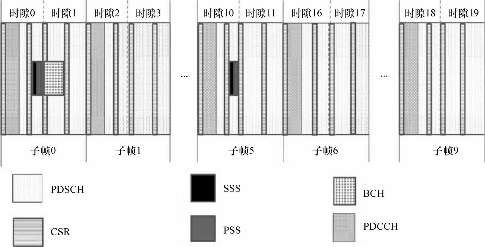

## 配置资源网格

在每个子帧上，资源网格大小（Ntotal=占满网格的全部符号数量）和下面四个参数有关：
Nrb：资源网格上资源块数；Nsc：资源块上子载波数；Nsym：时隙上符号数；Nslot：子帧上时隙数。
整体资源网格大小是行（全部子载波数）和列（每个子帧上全部OFDM符号数）的乘积。全部子载波数是全部资源块（Nrb）和每个资源块上全部子载波数（NSc）的乘积。每个子帧上全部OFDM符号数为每个时隙内符号数（NSym）和一个子帧内时隙数（NSlOt）的乘积。 $N_{\mathrm{total}} = N_{\mathrm{rb}} \cdot N_{\mathrm{sc}} \times N_{\mathrm{sym}} \cdot N_{\mathrm{slot}}$ 。
每个子帧内时隙数（Nslot）恒为2。每个时隙内符号数（Nsym）与CP类型有关。在本书中，我们使用普通CP，所以一个时隙内符号数为7。每个资源块上全部子载波数（Nsc）也与CP类型有关；当我们使用普通CP时，其值为12。因此，资源网格大小完全由资源块数量决定，它直接与带宽相关。
资源元素有6种数据资源：用户数据、CSR、DCI、PSS，SSS和BCH。其中有些类型资源在所有子帧有效（用户数据，CSR，DCI），有些只在子帧O和5有效（PSS和SSS），有些只在子帧O有效（BCH）。因一个资源网格内符号总数为常数，在每个帧上我们必须通过三种不同途径计算用户数据的数量：

1. 对子帧O：可表示所有数据资源
2. 对子帧5：除了用户数据，还可表示CSR、DCI、PSS，和SSS
3. 其他帧{1，2，3，4，6，7，8，9}：除了用户数据，只可以表示CSR和DCI符号

### CSR符号

CSR以特定时频图图形存在于每个子帧的每个资源块。在单天线配置情况下，LTE定义每个子帧上四个OFDM符号{O，5，7，12}的资源块有两个CSR符号。在OFDM符号O和7上，起始索引符为第一个子载波，而在符号5和12上起始索引符为第5个子载波。两个CSR子载波被6个子载波分开。一个资源网格共有Ncsr=8Nrb个CSR符号可用。

### DCI 符号

DCI位于每个子帧第N个OFDM符号上，N为1，2或3。DCI携带了PDSCH、PCFICH（物理控制格式索引信道），和PHICH（物理混合ARQ索引信道）内容，它们在分布于每个子帧上第1个OFDM符号的CSR数据之外，占据了第一个甚至第二个和第三个OFDM符号的全部资源元素。每个子帧的DCI大小为NDCI=Nrb（1O+12（N-1））

### BCH符号

PBCH 位于子帧0并占据从第7到第1O个OFDM符号的6个中心资源块。因第7个OFDM符号包含CSR符号，其BCH大小只有60（72-2X6），而在之后的三个符号中BCH大小为72。所有帧的BCH大小总和为NBCH=6O+3X72=276。

### 同步符号

PSS和SSS位于以DC子载波为中心的6个资源块上。在子帧O和5，PSS占据第6个OFDM符号而SSS占据第5个资源符号。因在这两个符号上没有CSR信号，每个子帧的总同步信号大小为NPSS=NSSS=72，因一个帧包括两个子帧，因此一个帧的同步信号大小为144。

### 用户数据符号

资源网格内数据总量与资源块数量或本质上与带宽有关。资源元素有6种数据资源类型（用户数据、CSR、DCI、PSS，SSS和BCH）。因此，假如单位带宽恒定，则资源网格大小可表示为: $N_{\mathrm{total}} = N_{\mathrm{user~data}} + N_{\mathrm{CSR}} + N_{\mathrm{DCI}} + N_{\mathrm{PSS}} + N_{\mathrm{SSS}} + N_{\mathrm{BCH}}$ 
BCH 或同步信号的存在与否取决于子帧索引。因此，在子帧上的用户数据大小也取决于子帧索引，可如下表示：

1. 对子帧0，可表示所有数据资源： $N_{\mathrm{user~data}} = N_{\mathrm{total}} -( N_{\mathrm{CSR}} + N_{\mathrm{DCI}} + N_{\mathrm{PSS}} + N_{\mathrm{SSS}} + N_{\mathrm{BCH}} )$ 
2. 对子帧5，除了用户数据，还可表示CSR、DCI、PSS，和SSS：$N_{\mathrm{user~data}}=N_{\mathrm{total}}-(\begin{array}{c}N_{\mathrm{CSR}}+N_{\mathrm{DCI}}+N_{\mathrm{PSS}}+N_{\mathrm{SSS}}\end{array})$ 
3. 其他帧{1，2，3，4，6，7，8，9}，除了用户数据，只可以表示CSR和DCI符号： $N_{\mathrm{user~data}} = N_{\mathrm{total}} - ( N_{\mathrm{CSR}} + N_{\mathrm{DCI}} )$ 

## 参考信号生成

为了确保发送端和接收端生成相同的CSR参考序列，LTE定义GOld序列并在收发端出端初始化参数。这些参数包括小区身份数（NcellID）、子帧索引（nS）、时隙索引（i），和时隙内包含CSR的OFDM符号索引（IIdX）。

## 资源元素映射

映射本质上是生成一个资源网格矩阵索引符并将多种信息类型放置入网格的过程。

## OFDM信号生成

OFDM 信号生成在资源网格上进行。这个处理将OFDM符号一个接一个进行IFFT 并附加CP生成OFDM调制信号。

## 信道建模

SISO信道模型、AWGN

## OFDM接收端

OFDM接收端处理视为发射端的反向操作。首先对每个子载波移除CP并进行FFT恢复接受信号和参考信号。根据信道带宽的不同使用不同的FFT长度。通过合并缩放、重组、移除DC子载波，解包，接收的调制符号按发射端资源网格的顺序放置。

## 资源元素反映射

资源元素反映射为资源网格映射的反向操作。

## 信道估计

信道估计即测量参考符号，或在OFDM时-频网格中间隙中插入的导频。使用已知参考符号，接收端可以在发送该参考符号的子载波上进行信道估计。参考符号应该在时域和频域有足够高的密度。如此，通过适当的展宽我们可以得到全部时-频网格的估计。

## 均衡器增益计算

一个频域均衡器对所有每个子载波接收的资源元素计算增益。频域均衡有不同的算法。最简单的为ZF算法，它通过发射资源元素和每个子载波信道估计的比值得到增益。更加复杂一些的算法为MMSE估计，它基于更复杂的信道时/频特性理论计算包含非相关性信道噪声的比值得到增益。当得到均衡器增益之后，通过接收资源元素和均衡器增益的乘积即可得到资源元素的最优估计。

## 信道可视化

可视化各种信号可以帮助我们验证OFDM是否正确传输。在OFDM中，每个调制符号由OFDM符号（时域）的子载波（频域）传输。这使我们可以在通过信道前后直接观察传输的衰落效应。

## 下行链路传输模式1

模式1基于单天线传输。我们会针对这个模式构建两种模型。
1）SISO 模型：收发端皆为单天线配置；
2）SIMO 模型：使用单发射天线和多接收天线，以优化接收分集。

### SISO 模型

信号在发射端的DLSCH和PDSCH处理过程如下：
1）生成单子帧载荷数据（传输块）。
2）DLSCH 处理，包括：传输块添加CRC，码组分割和CRC添加，1/3码率TurbO编码，码率匹配，和码组连接构成PDSCH输入码字。
3）PDSCH 处理，包括：绕码，对绕码后的字节进行调制，映射复调制符号到资源元素在单天线端口形成资源网格，生成OFDM信号。
信道模型为衰落信道和AWGN信道的组合。在接收端，反向PDSCH操作，包括：OFDM信号接收端生成资源网格，资源元素从用户数据反映射CSR，并按CSR 进行信道估计和频域均衡，软判决解调和去绕码。
最后，接收端反向DLSCH，包括：码组分割，码率去匹配，和CRC早期终止机制TurbO译码。接收端输出变量data|Out和发射端输入传输块变量dataIn为函数最先生命的两个输出。除了这两个变量，几个其他输出变量用来提升测试系统任务的性能。

### SIMO 模型

SIMO 模式可以看作是SISO模式的一般情况。LTE传输模式1 一般使用SIMO模式。在这个模式中，信号处理过程和SISO类似，除了使用多路（在我们的函数中为2和4）接收天线。在接收端使用多天线可以发挥接收分集的优势。最大比合并（MRC）接收分集可使系统的BER特性好与SISO。接收分集建模并不需要改变发射端，不过在信道建模和接收端有较大改变。这些改变与多信道处理有关。

# MIMO

在本章中，我们首先回顾LTE四种传输模式中的MIMO算法。这些传输模式体现两种主要MIMO技术：发射分集（如空-频区块编码，SFBC）和使用或不使用延迟分集编码的空分复用。

## MIMO定义

“MIMO天线技术”通常被认为是指所有使用多发射和多接受天线通信的技术。下图所示为发射天线和接收天线的关系，并标注了每一组天线的信道增益。

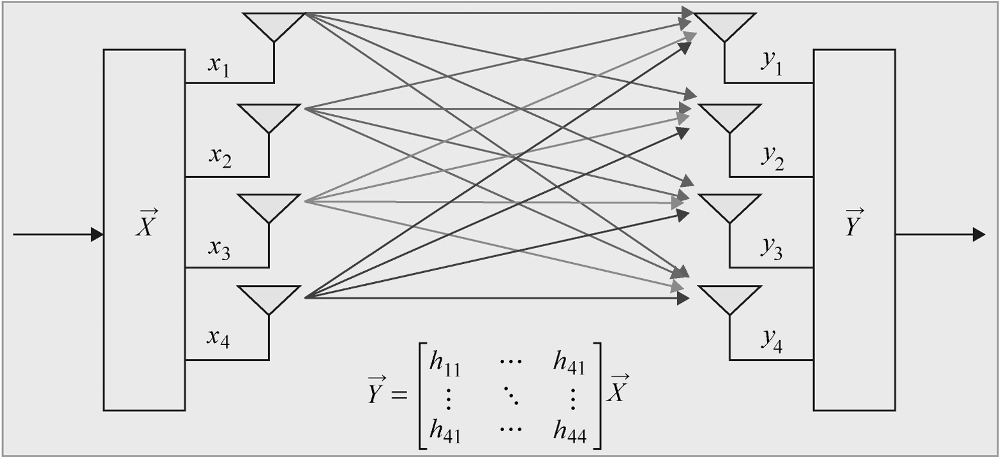

在每个子载波上，不同天线间接收和发射的资源元素的关系由线性方程表示。在这个系统中，接收天线上接收资源元素向量由MIMO信道矩阵和发射天线上发射资源元素矩阵相乘得到。通过MIMO系统方程描述我们可以看到，为了在给定子载波上复原发射资源元素的最好估计，我们不仅需要接收资源元素向量也需要连接每个发射和接收天线的信道响应（或者CSI、信道状态信息）。

## MIMO的动机

理论上，通信链路提升数据速率的最好途径是对给定发射功率情况下提升整体接收功率。有效提升接收功率的办法是在接收端和/或发射端扩增天线。此类技术即多天线或MIMO技术。大幅改进吞吐量和比特误码率（BER）的MIMO技术刺激了多天线无线系统的发展。各种MIMO技术中，空分复用引入多天线方法可以随天线数量线性提升吞吐量。

## MIMO的种类

LTE 使用的MIMO算法可以细分为四类：接收端合并、发射分集、波束赋形和空分复用。

### 接收端合并技术

接收端合并技术在接收端合并不同情况的发射信号以提升性能。接收端可使用两种合并方法：最大比合并（MRC）和选择式合并（SC）。使用MRC情况下，我们合并多路接收信号（通常对它们取平均值）得到发射信号的最大似然估计。在使用SC情况下，不会像MRC那样复杂，我们只使用接收写好和最高SNR（信噪比）进行发射信号估计。

### 发射分集

在发射分集中，冗余信息在每个子载波不同的天线上发射。在此模式下，LTE提高通信链路稳健性但不会提高数据速率。发射分集术语多天线技术中空时编码的范围。空-时码能够实现分集阶数等于接收天线和发射天线数乘积。SFBC，该技术与空-时分组编码（STBC）类似，是一种应用于LTE中的发射分集技术。

### 空分复用

在空分复用中，系统在不同天线上传输独立（非冗余）信息。该MIMO模式可以在给定通信链路上与发射天线数量成比例大幅的提高数据速率。空分复用传输独立数据流的能力伴随着代价。不过，空分复用可以克服MIMO方程矩阵秩不足的问题。LTE空分复用引入多种技术减小秩不足出现的概率以发挥优势。

## MIMO的覆盖范围

在本书中，我们关注MIMO传输前四种模式的信号处理。波束赋形，用于模式6，与多播有关，是协作多点传输的关键。多用户MIMO（MU-MIMO），用于模式5和模式7～9，可以理解为是模式3和模式4单用户配置的扩展。

## MIMO信道

在平坦衰落情况下，一个时间点上任意给定收发天线对之间的关系可以由一个标量增益值，即信道路径增益确定。这些信道增益的集合定义了信道矩阵H。信道矩阵的阶数等于（numTX，numRX）。一个系统的线性方程表述了每个接收天线的接收信号、每个发射天线的发射信号，以及信道矩阵的关系。
在多径衰落情况下，一个时间点上任意给定收发天线对的关系可以由信道-路径增益向量表示。一个时间点上每个接受信号取决于发射信号过去和当前值。另外一个参数需要被引入：路径延迟L。为了计算多径情况下的接收信号，必须对每个路径延迟向量值重复平坦衰落情况下的MIMO处理。

### MATLAB实现
### LTE特征信道模型
### MATLAB实现
### MIMO信道初始化
### 添加AWGN
## MIMO的一般特征
### MIMO资源网格结构

小区专有参考（CSR）信号在频域均衡（见第5章）和MIMO接收器处理（将会在下文介绍）中发挥关键作用。但CSR的在MIMO中因多天线技术的存在有着本质的不同。当一个CSR在任意天线的任意给定子载波上发送时，所有其他天线必须在相同子载波上传输空信号（零值信号）。这就要求在资源网格中设置一个新的组件，它称为频谱零值。多天线情况下CSR信号和频谱零值位置与资源元素映射与反映射有关。

### 资源元素映射

单天线传输，资源元素映射过程实质上是生成指向资源网格矩阵的索引并将多种信息类型放置于网格的过程。
MIMO资源网格的构成与单天线情形类似。但有两个特性：首先，需要实现频谱零值以在频谱估计中减小CSR信号串扰。其次，实现CSR在4X4配置中的特殊位置，即CSR随天线不同而位置不同。

### 资源元素反映射

资源元素反映射是指反向资源网格映射的处理过程。

### 基于CSR的信道估计

系统线性方程描述的MIMO信道可以如下表示：

$$\vec{Y}(n)=\boldsymbol{H}(n)*\vec{X}(n)+\vec{n}$$

对时序n和给定的子载波， $\vec{Y}(n)$ 为接收的信号， $\vec{X}(n)$ 为发射的信号， $\boldsymbol{H}(n)$ 为信道矩阵， $\vec{n}$ 为AWGN向量。当接收端得到接收信号 $\vec{Y}(n)$ 时，我们必须计算信道矩阵 $\boldsymbol{H}(n)$ 和噪声 $\vec{n}$ 的估计以准确估计发射信号 $\vec{X}(n)$ 。假设信道AWGN可估，我们下面将重点讨论估计信道矩阵。
设发射天线数为numTX，接收天线数为numRX。信道矩阵的阶数即（num-RX，num-TX）。对每个子载波和每个OFDM符号，必须估计numRX×numTX的值。如在前章所讨论的，我们用CSR（导频）信号进行信道矩阵估计。让我们观察多天线传输如何影响信道估计的过程。考虑例如一个2X2MIMO信道，在任意给定时序的MIMO系统方程可表示为

$$\begin{bmatrix}y_1(n)\\y_2(n)\end{bmatrix}=\begin{bmatrix}h_{1,1}(n)h_{1,2}(n)\\h_{2,1}(n)h_{2,2}(n)\end{bmatrix}*\begin{bmatrix}x_1(n)\\x_2(n)\end{bmatrix}+\begin{bmatrix}n_1\\n_2\end{bmatrix}$$

注意其中一个接收天线，如y1（n），接收信号的值为两个发射天线被两个信道增益调幅后的和：

$$y_1(n)=h_{1,1}(n)*x_1(n)+h_{1,2}(n)*x_2(n)+n_1$$

因多载波传输允许我们通过离散傅里叶变换在频域进行信道估计，我们可以得到信道增益及收发信号间的关系为

$$y_1(\omega)=h_{1,1}(\omega)*x_1(\omega)+h_{1,2}(\omega)*x_2(\omega)+nVar$$

式中 $y_1(\omega)$ 为时域信号 $y_1(n)$ 进行傅里叶变换得到，即 $y_1(n) \overset{FFT}{\leftrightarrow} y_1(\omega)$ 。nVar给定子载波AWGN信道噪声方差。注意变量 $y_1(\omega)$ ， $x_1(\omega)$ ， $x_2(\omega)$ 分别为收发资源网格内给定子载波和给定OFDM符号上的接收和发射信号。
假如我们为变量 $x_1(\omega)$ 和 $x_2(\omega)$ 选择已知的导频（CSR）信号，则通过接收信号 $y_1(\omega)$ 并忽略噪声方差我们可以轻松估计信道矩阵变量 $h_{1,1}(\omega)$ 和 $h_{1,2}(\omega)$ 。在这里频谱零值的需求变得显而易见。在一个给定子载波和给定OFDM符号上，表示频谱零值需要 $x_1(\omega)$ 等于导频信号而相同子载波 $x_2(\omega)$ 的值等于零。故上式可以化简为

$$y_{1}( \omega )=h_{1,1}( \omega )*x_{1}( \omega ) |_{\omega=subcarrier}+h_{1,2}( \omega )*x_{2}( \omega ) |_{\omega=subcarrier}\\y_{1}( \omega )=h_{1,1}( \omega )*x_{1}( \omega )+h_{1,2}( \omega )*0. 0\\y_{1}( \omega )=h_{1,1}( \omega )*x_{1}( \omega )$$

通过资源网格内CSR信号和频谱零值，我们可以估计信道矩阵路径增益值 $h_{m,n}(\omega)$ 为

$$h_{m,n}(\omega)=\frac{y_n(\omega)}{x_m(\omega)}$$

式中m为发射天线序数，m=1，…，numTX；n为接收天线序数，n=1，…，numRX。在下一节中我们会看到在MATLAB程序中我们如何用收发端CSR信号实现系统方程并估计信道矩阵。随后，通过内插方法在资源网格中扩展信道矩阵，我们可以得到全网格信道频率响应估计。

### 信道估计函数

### 信道估计扩展

### 理想信道估计

### 信道响应提取

接收天线接受资源网格包含多种类型数据，包括用户数据、CSR和频谱零值信号、DCI、同步信号，和BCH信号。为了均衡和恢复用户数据，我们必须从估计的信道响应中提取搭载用户数据的元素。

## MIMO的特殊特征

### 发射分集

发射分集在发射端使用多天线提高分集增益和链路质量。LTE定义了两种发射分集方案：2×2SFBC技术和4×4技术。两种技术都提供全速率编码并通过分集提高性能。

### 收发器启动函数

### 下行链路传输模式2

LTE定义的2×2和4×4方案都是全码率编码，且与单天线比较有较大性能提升。本例中的关键组件包括：
1）单子帧载荷数据（传输块）生成；2）DLSCH处理：传输块添加CRC、码块分段、1/3码率TurbO编码、码率匹配，以及码块级联以生成PDSCH码字输入；3）PDSCH发射端处理：比特级绕码、数据调制、层映射和二天线或四天线配置的发射分集预编码、以及资源元素映射和OFDM信号生成；4）信道建模：MIMO衰落信道附加AWGN信道；5）PDSCH接收端处理：OFDM信号接收端生成资源网格、资源元素反映射分割CSR信号、信道估计、信用信道估计进行SFBC合并并软判决译码和去绕码、DLSCH译码。

### 空分复用

空分复用技术通过差分比特流使多天线MIMO无线系统获得高频谱效率。因为拆分后的子比特流独立调制，空分复用可以比同等空-时或空-频区块码得到更高数据速率。不过，由于发射信号往往缺乏冗余性，致使空分复用容易出现MIMO方程矩阵秩不足的问题。计算MIMO矩阵的信道估计误差会严重限制性能提升。因此，LTE标准引入多种机制，包括采用基于秩估计的自适应预编码和层映射，改善在信道劣化情况下的稳健性。

### 空分复用中的MIMO操作

LTE标准中的九种传输模式中，有六种基于空分复用。空分复用的显著特点在于层映射和预编码。因为每个发射天线的采样都独立与其他天线，正交调制流映射到不同的子调制流并被发射天线传送。因不同的天线有不同的采样，空分复用可以在一定数量发射天线配置下大幅提高数据速率。MIMO接收器从接收信号中复原调制符号的最优估计。本书中涉及的估计算法为以下三种：迫零（ZF）、最小均方误差（MMSE）和球形解码器（SD）。层映射对应不同天线将信号数据流分割为子数据流。

### 下行链路传输模式4

在本节中，我们关注LTE标准中MIMO最具突破性、可实现最高数据速率的模式：模式4。该模式采用空分复用预编码和闭环信道反馈。在低移动率情况下，闭环反馈信道质量可以提高性能。我们会在第7章实现真实的闭环反馈操作。在本章中，我们在本章先用静态预编码矩阵进行讲解，作为下一章更好了解闭环适应性预编码技术的垫脚石。我们会分两部分讲解模式4：1）单码字：在DLSCH只生成一个码字，并在PDSCH处理；2）双码字：在DLSCH生成两个不同的码字，并通过层映射复用，进行预编码、资源元素映射，及OFDM传输。

### 开环空分复用

开环预编码应用与高移动率情况且不需要依赖用户终端的循环矩阵指示（PMI）。当移动终端快速移动时，由于不能依靠先前帧得到的信道暂态反馈求当前信道质量，开环空分复用不需要从基站向移动终端传输预编码矩阵的额外信息。预编码矩阵已在收发两端提前确定并同时计算。

### 下行链路传输模式3

第三种下行链路传输模式使用开环空分复用以实现高移动率情况下的传输。

# 链路自适应

# 系统级建模

# 仿真

# 基于C/C++代码的原型构建

# 总结

