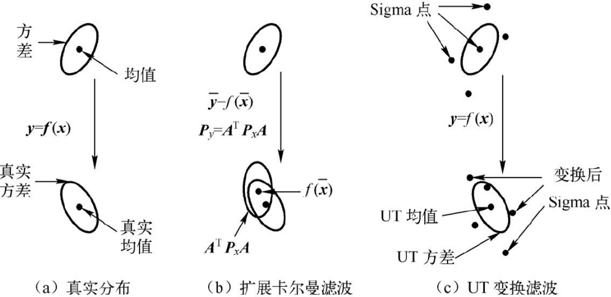

# 卡尔曼滤波原理及应用-MATLAB仿真(第2版) / 黄小平, 王岩编著

作者：洋盘男人

> 《卡尔曼滤波原理及应用——MATLAB仿真第2版》书籍笔记及代码

> 代码链接：[Code_Link](https://github.com/yangpannanren/Book_Code/tree/main/卡尔曼滤波原理及应用-MATLAB仿真)

[TOC]

# 绪论

滤波是从含有干扰的接收信号中提取有用信号的一种技术。而更广泛地，滤波是指利用一定的手段抑制无用信号，增强有用信号的数字信号处理过程。

无用信号，也叫噪声，是指观测数据对系统没有贡献或者起干扰作用的信号。在通信中，无用信号表现为特定波段频率、杂波；在传感器数据测量中，无用信号表现为幅度干扰。其实噪声是一个随机过程，而随机过程有其功率谱密度函数，功率谱密度函数的形状决定了噪声的“颜色”。如果这些干扰信号幅度分布服从高斯分布，而它的功率谱密度又是均匀分布的，则称它为高斯白噪声。高斯白噪声是大多数传感器所具有的一种测量噪声。

滤波理论就是在对系统可观测信号进行测量的基础上，根据一定的滤波准则，采用某种统计量最优方法，对系统的状态进行估计的理论和方法。所谓最优滤波或最优估计是指在最小方差意义下的最优滤波或估计，即要求信号或状态的最优估值应与相应的真实值的误差的方差最小。经典最优滤波理论包括Wiener（维纳）滤波理论和Kalman（卡尔曼）滤波理论。前者采用频域方法，后者采用时域状态空间方法。

# MATLAB编程基础

# 线性Kalman滤波
## Kalman滤波原理
### 射影定理
### Kalman滤波器

考虑用如下状态空间模型描述的动态系统：

 $$ X(k+1)=\Phi X(k)+\Gamma W(k) $$ 

 $$ Y(k)=HX(k)+V(k) $$ 

式中，k为离散时间，系统在时刻k的状态为 $\mathrm{X}(\mathrm{k})\in {\mathbb{R}}^{\mathrm{n}}$ ； $\mathrm{Y}(\mathrm{k})\in {\mathbb{R}}^{\mathrm{m}}$ 为对应状态的观测信号； $\textrm{W(k)}\in {\mathbb{R}}^{\mathrm{r}}$ 为输入的白噪声； $V(k)\in {\mathbb{R}}^{\mathrm{m}}$ 为观测噪声。称上式为状态方程，称下式为观测方程。称Φ为状态转移矩阵，Γ为噪声驱动矩阵，H为观测矩阵。

【假设1】W(k)和V(k)是均值为零、方差阵各为Q和R的不相关白噪声，即： $\mathrm{E}{W}(\mathrm{k})=0$ ， $\mathrm{E}{V}(\mathrm{k})=0$ ， $E[ {W}(\mathrm{k}){W}^{\mathrm{T}}(\mathrm{j})]=\mathrm{Q}\delta_{\mathrm{k}\mathrm{j}} $ ， $\mathrm{E}[ {V}(\mathrm{k}){V}^{\mathrm{T}}(\mathrm{j})]=\mathrm{R}\delta_{\mathrm{k}\mathrm{j}}$ ， ${W}(\mathrm{k})$ 和 ${V}(\mathrm{k})$ 互不相关，因此有 ${E}[ {W(k)V}^{\mathrm{T}} \textrm{(j)}] =0,\forall \textrm{k},\textrm{j}$ ，其中 $\delta_{\mathrm{k}\mathrm{k}} =1,\delta_{\mathrm{k}\mathrm{j}} =0$ 。

【假设2】初始状态X(0)不相关于W(k)和V(k)， 即：

 $$ E[ X(0)] =\mu_0 , E[ (X(0)-\mu_0 )(X(0)-\mu_0^T )] =P_0 $$ 

Kalman滤波问题是：基于观测信号 $\{Y(1),Y(2),\cdots,Y(k)\}$ ，求状态X（j）的线性最小方差估计值 $\hat{X} (\mathrm{j}|\mathrm{k})$ ，它极小化性能指标：

 $$ \mathrm{J}=\mathrm{E}[ (\mathrm{X}(\mathrm{j})-\hat{\mathrm{x}} (\mathrm{j}|\mathrm{k}))^{\mathrm{T}} (\mathrm{X}(\mathrm{j})-\hat{\mathrm{x}} (\mathrm{j}|\mathrm{k}))] $$ 

对于 $j=k,j>k,j<k$ ，分别称 $\hat{X} (\mathrm{j}|\mathrm{k})$ 为Kalman滤波器、预报器和平滑器。滤波器一般是对当前状态噪声的处理。预报器即为状态预测，通常在导弹拦截、卫星回收等问题上涉及导弹和卫星轨道预测。平滑器主要用在解决卫星入轨初速度估计或卫星轨道重构问题。

（Kalman滤波器）上面状态空间模型在【假设1】和【假设2】下，递推Kalman滤波器如下：

-  状态一步预测： $\hat{X} (k+1\left|k)=\Phi \hat{X} (k\right|k)$ 
-  状态更新： $\begin{array}{l} \hat{X} (k+1\left|k+1)=\hat{X} (k+1\right|k)+{\mathbf{K}}(k+1)\varepsilon (k+1)\\ \varepsilon (k+1)={\mathbf{Y}}(k+1)-{\mathbf{H}}\hat{\mathbf{X}} (k+1\left|k)\right. \end{array}$ 
-  滤波增益矩阵： ${\mathbf{K}}(k+1)={\mathbf{P}}(k+1\left|k){\mathbf{H}}^{\mathrm{T}} [ {\mathbf{H}}{\mathbf{P}}(k+1\right|k){\mathbf{H}}^{\mathrm{T}} +{\mathbf{R}}]^{-1}$ 
-  一步预测协方差阵： ${\mathbf{P}}(k+1\left|k)=\Phi {\mathbf{P}}(k\right|k)\Phi^{\mathrm{T}} +\Gamma {\mathbf{Q}}\Gamma^{\mathrm{T}}$ 
-  协方差阵更新： $\begin{array}{l} {\mathbf{P}}(k+1\left|k+1)=[ {\mathbf{I}}_n -{\mathbf{K}}(k+1){\mathbf{H}}] {\mathbf{P}}(k+1\right|k)\\ \hat{\mathbf{X}} (0\left|0)=\mu_0 ,{\mathbf{P}}(0\right|0)={\mathbf{P}}_0  \end{array}$ 

在一个滤波周期内，从Kalman滤波在使用系统信息和观测信息的先后次序来看，Kalman滤波具有两个明显的信息更新过程：时间更新过程和观测更新过程。状态一步预测说明了根据k\-1时刻的状态估计预测k时刻状态的方法，一步预测协方差阵对这种预测的质量优劣做了定量描述。该两式的计算中仅使用了与系统的动态特性有关的信息，如状态一步转移矩阵、噪声输入阵、过程噪声方差阵。从时间的推移过程来看，该两式将时间从k\-1时刻推进至k时刻，描述了Kalman滤波的时间更新过程。其余各式用来计算对时间更新值的修正量，该修正量由时间更新的质量优劣（P（k|k\-1））、观测信息的质量优劣（R）、观测与状态的关系（H）以及具体的观测信息Y（k）所确定，所有这些方程围绕一个目的，即正确、合理地利用观测Y（k），所以这一过程描述了Kalman滤波的观测更新过程。

### Kalman滤波的参数处理

Kalman滤波算法具有如下特点：

1.  由于Kalman滤波算法将被估计的信号看作在白噪声作用下一个随机线性系统的输出，并且其输入/输出关系是由状态方程和输出方程在时间域内给出的，因此这种滤波方法不仅适用于平稳随机过程的滤波，而且特别适用于非平稳或平稳马尔可夫序列或高斯\-马尔可夫序列的滤波，所以其应用范围是十分广泛的。
2. Kalman滤波算法是一种时间域滤波方法，采用状态空间描述系统。系统的过程噪声和量测噪声并不是需要滤除的对象，它们的统计特性正是估计过程中需要利用的信息，而被估计量和观测量在不同时刻的一、二阶矩却是不必要知道的。
3. 由于Kalman滤波的基本方程是时间域内的递推形式，其计算过程是一个不断地“预测\-修正”的过程，在求解时不要求存储大量数据，并且一旦观测到了新的数据，随即可以算得新的滤波值，因此这种滤波方法非常适合于实时处理、计算机实现。
4. 由于滤波器的增益矩阵与观测无关，因此它可预先离线算出，从而可以减少实时在线计算量。在求滤波器增益矩阵时，要求一个矩阵的逆，它的阶数只取决于观测方程的维数，而该维数通常很小，这样，求逆运算是比较方便的。另外，在求解滤波器增益的过程中，随时可以算得滤波器的精度指标P，其对角线上的元素就是滤波误差向量各分量的方差。

## Kalman滤波在温度测量中的应用
## Kalman滤波在自由落体运动目标跟踪中的应用
## Kalman滤波在船舶GPS导航定位系统中的应用
## Kalman滤波在石油地震勘探中的应用
## Kalman滤波在视频图像目标跟踪中的应用
## 奶牛尾部图像目标跟踪

# 扩展Kalman滤波

对于非线性系统滤波问题，常用的处理方法是利用线性化技巧将其转化为一个近似的线性滤波问题，其中应用最广泛的方法是扩展Kalman滤波方法（Extended KalmanFilter，EKF）。扩展Kalman滤波建立在线性Kalman滤波的基础上，其核心思想是，对一般的非线性系统，首先围绕滤波值将非线性函数f（\*）和h（\*）展开成Taylor级数并略去二阶及以上项，得到一个近似的线性化模型，然后应用Kalman滤波完成对目标的滤波估计等处理。

EKF的优点是不必预先计算标称轨迹（过程噪声W（k）与观测噪声V（k）均为0时非线性方程的解），但它只能在滤波误差 ${\tilde{X} }_k =X_k -{\hat{X} }_k$ 及一步预测误差 ${\tilde{X} }_{k,k-1} =X_k -X_{k-1}$ 较小时才能使用。

## 扩展Kalman滤波原理
### 局部线性化

离散非线性系统动态方程可以表示为：

 $$ \begin{array}{c} \mathrm{X}(\mathrm{k}+1)=f[ \mathrm{k},\mathrm{X}(\mathrm{k})] +\mathrm{G}(\mathrm{k})\mathrm{W}(\mathrm{k})\\ \mathrm{Z}(\mathrm{k})=\mathrm{h}[ \mathrm{k},\mathrm{X}(\mathrm{k})] +\mathrm{V}(\mathrm{k}) \end{array} $$ 

当过程噪声W（k）和观测噪声V（k）恒为零时，系统模型的解为非线性模型的理论解，又称为“标称轨迹”或“标称状态”，而把非线性系统的真实解称为“真轨迹”或“真状态”。

### 线性Kalman滤波

扩展Kalman滤波递推方程：

 $$ \begin{array}{c} \hat{\mathbf{X}} (k|k+1)=f(\hat{X} (k|k))\\ {\mathbf{P}}(k+1\left|k)=\Phi (k+1\right|k){\mathbf{P}}(k\left|k)\Phi^{\mathrm{T}} (k+1\right|k)+{\mathbf{Q}}(k+1)\\ K(k+1)={\mathbf{P}}(k+1\left|k){\mathbf{H}}^{\mathrm{T}} (k+1)[ {\mathbf{H}}(k+1){\mathbf{P}}(k+1\right|k){\mathbf{H}}^{\mathrm{T}} (k+1)+{\mathbf{R}}(k+1)]^{-1} \\ \hat{\mathbf{X}} (k+1\left|k+1)=\hat{\mathbf{X}} (k+1\right|k)+{\mathbf{K}}(k+1)[ {\mathbf{Z}}(k+1)-{\mathbf{h}}(\hat{\mathbf{X}} (k+1\left|k)] \right.\\ {\mathbf{P}}(k+1)=[ {\mathbf{I}}-{\mathbf{K}}(k+1){\mathbf{H}}(k+1)] {\mathbf{P}}(k+1\left|k)\right. \end{array} $$ 

其中， $\Phi (k+1|k)=\frac{\partial f}{\partial \hat{X} (k)}=\frac{\partial f[ \hat{X} (k),k] }{\partial \hat{X} (k)}{\left|\right.}_{\hat{X} (k)=X(k)}$ ， ${\mathbf{H}}(k)=\frac{\partial h}{\partial \hat{X} (k)}|_{X(k)=\hat{X} (k)}$ ，滤波初值和滤波误差方差矩阵的初值分别为： ${X(0)=E[X(0)],P(0)=var[X(0)]}$ 。

同Kalman滤波基本方程相比，在线性化后的系统方程中，状态转移Φ（k+1|k）和观测矩阵H（k+1）由f和h的雅可比矩阵代替。

## 简单非线性系统的扩展Kalman滤波器设计
## 扩展Kalman滤波在目标跟踪中的应用
## 扩展Kalman滤波在纯方位寻的导弹制导中的应用
## 扩展Kalman滤波在电池寿命估计中的应用

# 无迹Kalman滤波

第4章讨论的扩展Kalman滤波算法是对非线性的系统方程或者观测方程进行泰勒展开并保留其一阶近似项，这样不可避免地引入了线性化误差。如果线性化假设不成立，采用这种算法则会导致滤波器性能下降以至于造成发散。另外，在一般情况下计算系统状态方程和观测方程的Jacobian矩阵是不易实现的，增加了算法的计算复杂度。

无迹Kalman滤波（Unscented Kalman Filter，UKF）摒弃了对非线性函数进行线性化的传统做法，采用Kalman线性滤波框架，对于一步预测方程，使用无迹变换（Unscented Transform，UT）来处理均值和协方差的非线性传递问题。UKF算法是对非线性函数的概率密度分布进行近似，用一系列确定样本来逼近状态的后验概率密度，而不是对非线性函数进行近似，不需要对Jacobian矩阵进行求导。UKF没有把高阶项忽略，因此对于非线性分布的统计量有较高的计算精度，有效地克服了扩展Kalman滤波的估计精度低、稳定性差的缺陷。

## 无迹Kalman滤波原理

### 无迹变换

UT变换实现方法为：在原状态分布中按某一规则选取一些采样点，使这些采样点的均值和协方差等于原状态分布的均值和协方差；将这些点代入非线性函数中，相应得到非线性函数值点集，通过这些点集求取变换后的均值和协方差。这样得到的非线性变换后的均值和协方差精度最少具有2阶精度（Taylor序列展开）。对于高斯分布，可达到3阶精度。其采样点的选择是基于先验均值和先验协方差矩阵的平方根的相关列实现的。非线性变换比较如下图所示。

设一个非线性变换 $y=f(x)$ 。状态向量x为n维随机变量，并且已知其均值 $\bar{\mathbf{x}}$ 和方差P。 则可通过下面的UT变换得到2n+1个Sigma点X和相应的权值ω来计算y的统计特征：

1.  计算2n+1个Sigma点，即采样点，这里的n指的是状态的维数。 $ \begin{cases} X^{(0)} =\overline{X} ,i=0\\ X^{(i)} =\overline{X} +(\sqrt{(n+\lambda )P})_i ,i=1\sim n\\ X^{(i)} =\overline{X} -(\sqrt{(n+\lambda )P})_i ,i=n+1\sim 2n \end{cases}$ 式中， $(\sqrt{P})^{\mathrm{T}} (\sqrt{P})=P$ ， $(\sqrt{P})_i$ 表示矩阵方根的第i列。
2. 计算这些采样点相应的权值。 $ \begin{cases} \omega_m^0 =\frac{\lambda }{n+\lambda }\\ \omega_c^0 =\frac{\lambda }{n+\lambda }+(1-a^2 +\beta )\\ \omega_c^0 =\omega_{\mathrm{c}}^{(i)} =\frac{\lambda }{2(n+\lambda )},i=1\sim 2n \end{cases}$ 式中，下标m为均值，c为协方差，上标为第几个采样点。参数 $\lambda ={\mathrm{a}}^2 (\mathrm{n}+\kappa )-\mathrm{n}$ 是一个缩放比例参数，用来降低总的预测误差，a的选取控制了采样点的分布状态，κ为待选参数，其具体取值虽然没有界限，但通常应确保矩阵 $(n+\lambda)P$ 为半正定矩阵。待选参数 $\beta\ge0$ 是一个非负的权系数，它可以合并方程中高阶项的动差，这样就可以把高阶项的影响包括在内。

UT变换得到的Sigma点集具有下述的性质：

1.  由于Sigma点集围绕均值对称分布并且对称点具有相同的权值，因此Sigma集合的样本均值为 $\bar{\mathbf{x}}$ ，与随机向量X的均值相同。
2. 对于Sigma点集的样本方差与随机向量X的方差相同。
3. 任意正态分布的Sigma点集，是由标准正态分布的Sigma集合经过一个变换得到的。

### 无迹Kalman滤波算法实现

对于不同时刻k，由具有高斯白噪声W（k）的随机变量X和具有高斯白噪声V（k）的观测变量Z构成的非线性系统可以由下式描述，

 $$  \begin{cases} X(k+1)=f(x(k),W(k))\\ Z(k)=h(x(k),V(k)) \end{cases} $$ 

式中，f是非线性状态方程函数；h是非线性观测方程函数。设W（k）具有协方差阵Q，V（k）具有协方差阵R。随机变量X在不同时刻k的无迹Kalman滤波算法基本步骤如下：

1.  利用UT公式获得一组采样点（称为Sigma点集）及其对应权值。 $X^{(i)} (k\left|k)=[ \hat{X} (k\right|k)\quad \hat{X} (k\left|k)+\sqrt{(n+\lambda ){\mathbf{P}}(k\left|k)\right.}\quad\hat{X} (k\right|k)-\sqrt{(n+\lambda ){\mathbf{P}}(k\left|k)\right.}]$
2. 计算2n+1个Sigma点集的一步预测。 ${\mathrm{X}}^{(\mathrm{i})} (\mathrm{k}+1|\mathrm{k})=\mathrm{f}[ \mathrm{k},{\mathrm{X}}^{(\mathrm{i})} (\mathrm{k}|\mathrm{k})] , i=1,2,\cdots,2n+1$
3. 计算系统状态量的一步预测及协方差矩阵，它由Sigma点集的预测值加权求和得到，其中权值 $\omega^{(\textrm{i})}$ 通过UT变换得到。这一点不同于传统的Kalman滤波算法，传统Kalman算法只需通过上一时刻的状态代入状态方程，仅计算一次便获得状态的预测；而UKF在此利用一组Sigma点的预测，并计算对它们加权求均值，得到系统状态量的一步预测。 $\begin{array}{l} \hat{\mathbf{X}} (k+1\left|k)=\sum_{i=0}^{2n} \omega^{(i)} {\mathbf{X}}^{(i)} (k+1\right|k)\\ {\mathbf{P}}(k+1\left|k)=\sum_{i=0}^{2n} \omega^{(i)} \lbrack \hat{\mathbf{X}} (k+1\right|k)-{\mathbf{X}}^{(i)} (k+1\left|k)\rbrack \lbrack \hat{{mathbf{X}} (k+1\right|k)-{\mathbf{X}}^{(i)} (k+1\left|k)\rbrack^{\mathrm{T}} +{\mathbf{Q}}\right. \end{array}$
4. 根据一步预测值，再次使用UT变换，产生新的Sigma点集。 $X^{(i)} (k+1\left|k)=\lbrack \hat{\mathrm{X}} (k+1\right|k)~~ \hat{\mathrm{X}} (k+1\left|k)+\sqrt{(n+\lambda ){\mathbf{P}}(k+1\left|k)\right.}~~ \hat{\mathbf{X}} (k+1\right|k)-\sqrt{(n+\lambda ){\mathbf{P}}(k+1\left|k)\right.}\rbrack$
5. 将由步骤（4）预测的Sigma点集代入观测方程，得到预测的观测量。 ${\mathrm{Z}}^{(\mathrm{i})} (\mathrm{k}+1|\mathrm{k})=\mathrm{h}\lbrack {\mathrm{X}}^{(\mathrm{i})} (\mathrm{k}+1|\mathrm{k})\rbrack , i=1,2,...,2n+1$
6. 由步骤（5）得到Sigma点集的观测预测值，通过加权求和得到系统预测的均值及协方差。 $\begin{array}{c} \overline{\mathbf{Z}} (k+1\left|k)=\sum_{i=0}^{2n} \omega^{(i)} {{\mathbf{Z}}}^{(i)} (k+1\right|k)\\ {{\mathbf{P}}}_{z_k z_k }=\sum_{i=0}^{2n} \omega^{(i)} \lbrack {\mathbf{Z}}^{(i)} (k+1|k)-{\overline{\mathbf{Z}} } (k+1|k)\rbrack \lbrack {\mathbf{Z}}^{(i)} (k+1|k)-{\overline{\mathbf{Z}} }( k+1|k)\rbrack^{\mathrm{T}} +R\\ {{\mathbf{P}}}_{x_k z_k } =\sum_{i=0}^{2n} \omega^{(i)} \lbrack X^{(i)} (k+1\left|k)-\overline{{\mathbf{Z}}} (k+1\right|k)\rbrack \lbrack {{\mathbf{Z}}}^{(i)} (k+1\left|k)-\overline{{\mathbf{Z}}} (k+1\right|k)\rbrack^{\mathrm{T}}  \end{array}$
7. 计算Kalman增益矩阵。 $K(k+1)=P_{x_k z_k } P_{z_k z_k }^{-1}$
8. 最后，计算系统的状态更新和协方差更新。 $\begin{array}{c} \hat{\mathbf{X}} (k+1\left|k+1)=\hat{\mathbf{X}} (k+1\right|k)+{\mathbf{K}}(k+1)\lbrack {\mathbf{Z}}(k+1)-\hat{\mathbf{Z}} (k+1\left|k)\rbrack \right.\\ {\mathbf{P}}(k+1\left|k+1)={\mathbf{P}}(k+1\right|k)-{\mathbf{K}}(k+1){\mathbf{P}}_{z_k z_k } {\mathbf{K}}^{\mathrm{T}} (k+1) \end{array}$

由此可以看出，无迹Kalman滤波在处理非线性滤波时并不需要在估计点处做Taylor级数展开，然后再进行前N阶近似，而是在估计点附近进行UT变换，使获得的Sigma点集的均值和协方差与原统计特性匹配，再直接对这些Sigma点集进行非线性映射，以近似得到状态概率密度函数。这种近似其实质是一种统计近似而非解。

## 无迹Kalman滤波在单观测站目标跟踪中的应用
## 无迹Kalman滤波在匀加速度直线运动目标跟踪中的应用
## 无迹Kalman滤波与扩展Kalman滤波算法的应用比较
## 无迹Kalman滤波算法在电池寿命估计中的应用
代码似乎有问题

# 交互多模型Kalman滤波

当目标实施机动时（突然转弯或加、减速等），仅采用基本的Kalman滤波算法往往得不到理想的结果。这时需要采用自适应算法。交互多模型（IMM）是一种软切换算法，IMM算法使用两个或更多的模型来描述工作过程中可能的状态，最后通过有效的加权融合进行系统状态估计，很好地克服了单模型估计误差较大的问题。

## 交互多模型Kalman滤波原理

IMM算法采用多个Kalman滤波器进行并行处理。每个滤波器对应不同的状态空间模型，不同的状态空间模型描述不同的目标运行模式，所以每个滤波器对目标状态的估计结果不同。IMM算法的基本思想是在每一时刻，假设某个模型在现在时刻有效的条件下，通过混合前一时刻所有滤波器的状态估计值来获得与这个特定模型匹配的滤波器的初始条件，然后对每个模型并行实现正规滤波（预测和修正）步骤；最后，以模型匹配似然函数为基础更新模型概率，并组合所有滤波器修正后的状态估计值（加权和）以得到状态估计。因此IMM算法的估计结果是对不同模型所得估计的混合，而不是仅仅在每一个时刻选择完全正确的模型来估计。下面介绍IMM算法的一般步骤。

假定目标有r种运动状态，对应有r个运动模型（即r个状态转移方程），设第j个模型表示的目标状态方程为：

 $$ X_j (k+1)=\Phi_j (k)X_j (k)+G_j (k)W_j (k) $$ 

量测方程为：

 $$ Z(k)=H(k)X(k)+V(k) $$ 

式中， $W_j (k)$ 是均值为零，协方差矩阵为Qj的白噪声序列。各模型之间的转移由马尔可夫概率转移矩阵确定，其中的元素pij表示目标由第i个运动模型转移到第j个运动模型的概率，概率转移矩阵如下。 

 $$ {\mathbf{P}}={\left[\begin{array}{ccc} p_{11}  & \cdots  & p_{1r} \\ \cdots  & \cdots  & \cdots \\ p_{r1}  & \cdots  & p_{rr}  \end{array}\right]} $$ 

IMM算法是以递推方式进行的，每次递推主要分为以下四个步骤：

1.  输入交互（模型j） 。由目标的状态估计 ${\hat{X} }_i (k-1\left|k-1)\right.$ 与上一步中每个滤波器的模型概率 $\mu_j (k-1)$ 得到混合估计 ${\hat{X} }_{0j} (k-1\left|k-1)\right.$ 和协方差 $P_{0j} (k-1|k-1)$ ，将混合估计作为当前循环的初始状态。具体的参数计算如下：模型j的预测概率（归一化常数）为 ${\overline{\mathit{\mathbf{c}}} }_j =\sum_{i=1}^r p_{ij} \mu_i (k-1)$ ；模型i到模型j的混合概率 $\mu_{ij} (k-1\left|k-1)=\sum_{i=1}^r p_{ij} \mu_i (k-1)/{\overline{c} }_j \right.$ ；模型j的混合状态估计 ${\hat{\mathit{\mathbf{X}}} }_{0j} (k-1\left|k-1)=\sum_{i=1}^r {\hat{\mathit{\mathbf{X}}} }_i (k-1\right|k-1)\mu_{ij} (k-1\left|k-1)\right.$ ；模型j的混合协方差估计 ${\mathit{\mathbf{P}}}_{0j} (k-1|k-1)\mathrm{}=\sum_{i=1}^r \mu_{ij} (k-1\left|k-1)\lbrace {\mathit{\mathbf{P}}}_i (k-1\right|k-1)\mathrm{}+\lbrack {\hat{X} }_i (k-1\left|k-1)-{\hat{X} }_{0j} (k-1\right|k-1)\rbrack \mathrm{}\cdot \lbrack {\hat{X} }_i (k-1\left|k-1)-{\hat{X} }_{0j} (k-1\right|k-1)\rbrack^{\mathrm{T}} \rbrace$ ，式中， $p_{ij}$ 为模型i到模型j的转移概率； $\mu_j(k-1)$ 为模型j在k−1时刻的概率。
2. Kalman滤波（模型j）：以 ${\hat{X} }_{0j} (k-1\left|k-1)\right.$ 、 $P_{0j} (k-1|k-1$ 及 $Z(k)$ 作为输入进行Kalman滤波，来更新预测状态 ${\hat{X} }_j (k\left|k)\right.$ 和滤波协方差 $P_j (k|k)$ 。预测 ${\hat{\mathit{\mathbf{X}}} }_j (k\left|k-1)=\Phi_j (k-1){\hat{\mathit{\mathbf{X}}} }_{0j} (k-1\right|k-1)$ ；预测误差协方差 ${\mathit{\mathbf{P}}}_j (k\left|k-1)=\Phi_j {\mathit{\mathbf{P}}}_{0j} (k-1\right|k-1)\Phi_j^{\mathrm{T}} +{\mathit{\mathbf{G}}}_j {\mathit{\mathbf{Q}}}_j {\mathit{\mathbf{G}}}_j^{\mathrm{T}}$ ；Kalman增益 ${\mathrm{K}}_{\mathrm{j}} (\mathrm{k})={\mathrm{P}}_{\mathrm{j}} (\mathrm{k}|\mathrm{k}-1){\mathrm{H}}^{\mathrm{T}} \lbrack \mathrm{H}{\mathrm{P}}_{\mathrm{j}} (\mathrm{k}|\mathrm{k}-1){\mathrm{H}}^{\mathrm{T}} +\mathrm{R}\rbrack^{-1}$ ；滤波 ${\hat{\mathit{\mathbf{X}}} }_j (k\left|k)={\hat{\mathit{\mathbf{X}}} }_j (k\right|k-1)+{\mathit{\mathbf{K}}}_j (k)\lbrack \mathit{\mathbf{Z}}(k)-\mathit{\mathbf{H}}(k){\mathit{\mathbf{X}}}_j (k\left|k-1)\rbrack \right.$ ；滤波协方差 ${\mathrm{P}}_{\mathrm{j}} (\mathrm{k}|\mathrm{k})=\lbrack \mathrm{I}-{\mathrm{K}}_{\mathrm{j}} (\mathrm{k})\mathrm{H}(\mathrm{k})\rbrack {\mathrm{P}}_{\mathrm{j}} (\mathrm{k}|\mathrm{k}-1)$ 。
3. 模型概率更新。采用似然函数来更新模型概率 $\mu_j (k$ )，模型j的似然函数为 $\Lambda_j (k)=\frac{1}{(2\pi )^{n/2} |{\mathit{\mathbf{S}}}_j (k)|^{1/2} }\exp {\left\{-\frac{1}{2}{\mathit{\mathbf{v}}}_j ^T {\mathit{\mathbf{S}}}_j^{-1} (k){\mathit{\mathbf{v}}}_j \right\}}$ ，式中 $\begin{array}{l} {\mathit{\mathbf{v}}}_j (k)=\mathit{\mathbf{Z}}(k)-\mathit{\mathbf{H}}(k){\hat{\mathit{\mathbf{X}}} }_j (k\left|k-1)\right.\\ {\mathit{\mathbf{S}}}_j (k)=\mathit{\mathbf{H}}(k){\mathit{\mathbf{P}}}_j (k\left|k-1)\mathit{\mathbf{H}}(k)^{\mathrm{T}} +\mathit{\mathbf{R}}(k)\right. \end{array}$ ；则模型j的概率为 $\mu_j (k)=A_j (k){\overline{c} }_j /c$ ，式中，c为归一化常数，且 $c=\sum_{j=1}^r \Lambda_j (k){\overline{c} }_j$ 。
4. 输出交互。基于模型概率，对每个滤波器的估计结果加权合并，得到总的状态估计 $\hat{X} (k\left|k)\right.$ 和总的协方差估计 $P(k\left|k)\right.$ 。总的状态估计 $\hat{X} (k\left|k)=\sum_{j=1}^r \textrm{ }{\hat{X} }_j (k\right|k)\mu_j (k)$ ；总的协方差估计 $P(k\left|k)=\sum_{j=1}^r \textrm{ }\mu_j (k)\lbrace {\mathit{\mathbf{P}}}_j (k\right|k)+\lbrack {\hat{\mathit{\mathbf{X}}} }_j (k\left|k)-\hat{\mathit{\mathbf{X}}} (k\right|k)\rbrack \cdot \lbrack {\hat{\mathit{\mathbf{X}}} }_j (k\left|k)-\hat{\mathit{\mathbf{X}}} (k\right|k)\rbrack^{\mathrm{T}} \rbrace$ 。

所以，滤波器的总输出是多个滤波器估计结果的加权平均值。权重即为该时刻模型正确描述目标运动的概率，简称为模型概率。 

选取滤波器的目标运动模型，可以从下面3个方面考虑：

1.  选择一定个数的IMM滤波器，包括较为精确的模型和较为粗糙的模型。IMM滤波算法不仅描述了目标的连续运动状态，而且描述了目标的机动性。
2. 马尔可夫链状态转移概率的选取对IMM滤波器的性能有较大影响。马尔可夫链状态转移概率矩阵实际上相当于模型状态方程的状态转移矩阵，它将直接影响模型误差和模型概率估计的准确性。一般情况下，当马尔可夫链状态转移概率呈现一定程度的模型性时，IMM滤波器能够更稳健地描述目标运动。
3. IMM滤波算法具有模块化的特性。当对目标的运动规律较为清楚时，滤波器可以选择能够比较精确地描述目标运动的模型。当无法预料目标的运动规律时，就应该选择更一般的模型，即该模型应具有较强的鲁棒性。

## 交互多模型Kalman滤波在目标跟踪中的应用

#  Kalman滤波的Simulink仿真
## Simulink概述
## S函数

S函数（S\-Function）是系统函数（System Function）的简称，是一个动态系统的计算机语言描述。

S函数之所以会出现，是因为在研究中经常需要复杂的算法设计，而这些算法因为其复杂性不适合用普通的Simulink模块来搭建，即MATLAB所提供的Simulink模块不能满足用户的需求，需要用编程的形式设计出S函数模块，然后将其嵌入到系统中。如果恰当使用S函数，理论上讲可以在Simulink下对任意复杂的系统进行仿真。

## 线性Kalman的Simulink仿真
## 非线性Kalman滤波
