# 电子战辐射源检测与定位 / Nicholas A. O'Donoughue 编著

作者：洋盘男人

> 《电子战辐射源检测与定位》书籍笔记及代码

> 代码地址：[Code_Link](https://github.com/nodonoughue/emitter-detection-book)

[TOC]

# 电子战辐射源检测与定位-威胁辐射源检测

# 检测理论

## 背景

## 二元假设检测

接收机工作特性（receiver operating characteristics，ROC）曲线。

## 复合假设

## 恒定虚警率检测器

若待检测的信号已知，但信号幅度未知，并且噪声功率也是未知的，则无法通过建立一个确保给定 $P_{\textrm{FA}}$ 的阈值测试。解决方法是使用恒定虚警率（constant false alarm rate，CFAR）检测器。该检测器既可以缩放输入信号以适应噪声功率的变化，也可以根据输入噪声信号的功率调整检测阈值。

CFAR检测器可以通过最大不变检验统计量的阈值检验来实现，该检测器可在噪声功率条件未知条件下检测出已知信号：

$$ T(\mathbf{z})=\frac{{\mathbf{s}}^H {\mathbf{P}}_s \mathbf{z}}{\sqrt{{\mathbf{s}}^H \mathbf{s}}\sqrt{{\mathbf{z}}^H {\left(\mathbf{I}-{\mathbf{P}}_s \right)}\mathbf{z}}} $$
 
其中， ${\mathbf{P}}_s$ 为已知信号 $\mathbf{s}$ （ ${\mathbf{P}}_s =\frac{\mathbf{s}{\mathbf{s}}^H }{{\mathbf{s}}^H \mathbf{s}}$ ）的投影矩阵。分子项 ${\mathbf{s}}^H {\mathbf{P}}_s \mathbf{z}$ 用于计算与预期信号 $\mathbf{s}$ 相关的接收能量，而分母为 $T(\mathbf{z})$ 大小的缩放因子。第一项 $\sqrt{{\mathbf{s}}^H \mathbf{s}}$ 控制与 $\mathbf{s}$ 相乘的尺度，而 $\sqrt{{\mathbf{z}}^H {\left(\mathbf{I}-{\mathbf{P}}_s \right)}\mathbf{z}}$ 计算噪声功率，以使噪声能量的变化不会影响测试统计量 $T(\mathbf{z})$ 。

测试统计量 $T(\mathbf{z})$ 是按照学生t分布（student\-t distribution）进行分布的，该分布可以用于计算一些预期 $P_{\textrm{FA}}$ 的阈值η。但该分布无法表示为闭式解形式，因此必须使用数值计算方法。
CA\-CFAR（Cell Averaging\-Constant False Alarm Rate）使用滑动窗口来计算相邻单元内的平均功率强度，并与被测单元的功率强度比较。可以在预期噪声稳定的任何维度（如时间或频率）中完成这一点。CA\-CFAR的主要参数包括窗口大小、计算噪声功率估计值的平均单元数、保护带大小、被测单元附近被忽略的单元数。保护带可以防止被测单元中的信号泄露污染相邻单元或影响噪声功率估计值。

CA\-CFAR估计：

$$\overline{\sigma}_n^2=\frac{1}{K(M-1)}\sum _{i=1}^M\overline{\mathbf{z}}_i^H\overline{\mathbf{z}}_i$$

$$T(\mathbf{z})=\frac{1}{\sqrt{2NE_s}}\sum_{i=1}^K\Re\{{\mathbf{s}}^H{\mathbf{z}}_i\}$$

$$\eta=\sqrt{2{\overline{\sigma}}_n^2}\textrm{erfinv}{(1-2P _{\textrm{FA}})}$$

其中， ${\overline{\mathbf{z}} }_i ,i=1,\ldots,M$ 为当前被测单元的M个侧信道（即当前检验中未使用的数据样本）样本矢量；K为样本矢量 ${\bar{\mathbf{z}} }_i$ 的长度。输出 ${\bar{\sigma} }_n^2$ 为噪声功率 $\sigma_n^2$ 的估计值。为确保无偏估计，将噪声功率估计值除以M\-1而不是M，以确保其是无偏估计。

# 连续波信号检测

本章讨论具有有限带宽连续波信号的检测。随后的章节将重点讨论扩频信号检测以及具有未知载频（通过扫描或搜索正在使用的信道）的信号检测。

## 背景

连续波信号的定义特征是时域无限长（与脉冲信号相反，他始终处于开启状态）和频域有限长（频率成分仅限于某个频带）。

## 公式

二元假设表示为：

$$ \begin{array}{lll} {\mathcal{H}}_0 :\mathbf{z}=\mathbf{n}\sim \mathcal{C}\mathcal{N}{\left(0,\sigma_n^2 {\mathbf{I}}_M \right)}\\ {\mathcal{H}}_1 :\mathbf{z}=\mathbf{s}+\mathbf{n}\sim \mathcal{C}\mathcal{N}{\left(\mathbf{s},\sigma_n^2 {\mathbf{I}}_M \right)} \end{array} $$

其中，M为样本数 $M=\lfloor TF_s \rfloor$ ，T为观测间隔，Fs为采样率。

## 求解

若信号 $\mathbf{s}$ 未知，假设噪声功率已知或估计结果是准确的，则检验统计量为：

$$ T(\mathbf{z})=\frac{2}{\sigma_n^2 }{\mathbf{z}}^H \mathbf{z} $$

此时：

$$ T_ {{\mathcal{H}}_ 0}(\mathbf{z})\sim\chi_{2M}^2$$

$$ T_ {{\mathcal{H}}_ 1 } (\mathbf{z})\sim \chi_{2M}^2 {\left(\frac{2\textrm{MS}}{N}\right)} $$

其中， $\chi_{2M}^2$ 为具有2M自由度的卡方分布，S为从带通滤波器发出的信号功率。则：

$$P_ {FA}=\mathrm{P}_ {\mathcal{H}_ 0}\{T(\mathbf{z})\geq\eta\}=1-F_{\chi^2}(\eta;2M)$$

$$ P_{\mathrm{D}} =1-F_{\chi^2 } {\left(\eta ;2M,2M\xi \right)} $$

其中， $\xi =\frac{S}{N}$ 。

## 性能分析

讨论两个示例场景：（非常强大的）调频无线电传输检测和机载防撞雷达检测。

发射和接收功率相关的单项链路方程： $S=\frac{P_t G_t G_r }{L_{\textrm{prop}} L_{\textrm{atm}} L_t L_r }$ 。其中， $P_t$ 为发射功率； $G_t$ 为发射天线增益； $G_r$ 为接收天线增益； $L_{\textrm{prop}}$ 为传播损耗（如自由空间或双径）； $L_{\textrm{atm}}$ 为大气损耗； $L_t$ 包括待检测发射机中的所有系统损耗； $L_r$ 包括检测器硬件的所有损耗以及处理损耗。

自由空间路径损耗，指（通过各向同性天线）接收到的功率与（接收机方向上）辐射源功率之比： $L_{\mathrm{f}\mathrm{s}\mathrm{p}\mathrm{l}} ={{\left(\frac{4\pi R}{\lambda }\right)}}^2$ 。收发机之间没有障碍物，且视线附近没有主要反射物。

双射线路径损耗，存在主要反射物（如地球表面）的情况下，主要反射会与直接路径信号重叠，从而造成相消干扰。 $L_{2-\mathrm{r}\mathrm{a}\mathrm{y}} =\frac{R^4 }{h_t^2 h_r^2 }$ 。其中， $h_t$ 和 $h_r$ 分别为发射机和接收机的离地高度。

对于任何地面链路，都有一个范围，超过这个范围，自由空间模型就不再适用，而应该使用双射线模型。这被称为菲涅尔带（Fresnel zone）： $\mathrm{F}\mathrm{Z}=\frac{4\pi h_t h_r }{\lambda }$ 。

大气吸收，由于大气中气体的电磁偶极子效应引起的。损耗方程： $L_{\textrm{atm}} \lbrack dB\rbrack =\alpha \frac{R}{1e3}$ 。其中， $\alpha$ \[dB\]为每千米传播距离的特定衰减率。当频率低于1GHz时，大气气体的吸收通常被忽略。

调频广播塔检测：最容易检测的CW传输信号是电视和无线电广播信号，它们以非常高的功率从塔顶发射并传输，以最大程度地减小地面对传播的影响。

对于发射源通常采用有效辐射功率（effective radiated power，ERP）代替 $P_t G_t /L_t$ 。

连续波雷达检测：二进制编码雷达，将二进制信号编码调制到载波信号的相位上。

# 扩频信号检测

电磁频谱（Electromagnetic Spectrum，EMS）自从被用于通信或感知以来，同样也被用来通过敌方辐射源来检测敌方的存在。因此，这一类受保护的信号被广泛采用。这些信号具有不同的保护级别，大致分为三类：低截获概率 （low probability of detection，LPD）、低拦截概率（low probability of interception，LPI）和低利用概率（low probability of exploitation，LPE）。根据定义，LPD信号也是LPI和LPE信号。同样，LPI信号也是 LPE信号。

LPD是指难以检测的信号。获取LP信号的最常见方法是在大带宽上传播信号能量，如直接序列扩频技术（Direct Sequence Spread Spectrum，DSSS）通信信号。在大带宽上稀释能量，接收机成功检测到信号的概率更小。

LPI是指防止敌方截获某段传输信号。敌方可能会检测到正在发生的信号传输，但无法截获完整信号。LPI的主要优势是，由于敌方只能捕获少部分的信号，因此很难难估计LPI信号参数。实现LPI的一种常见方法是跳频。

最后一类受保护的信号是LPE，即防止敌方对信号特征（如传输的信息）进行利用。实现LPE的主要方法是通过加密。

本章讨论扩频信号（DSSS是其中一种类型）以及一些非常适合此类难以检测信号的专用检测器。

## 背景

DSSS是指EMS中用于信号传输的部分要远多于所要求的部分。通过将发射信号分布在超过其原始带宽10~100倍的带宽上，传输的能量会被显著稀释，通常达到传输信号的功率谱密度（power spectral density，PSD）低于背景噪声水平的程度，从而使传统方法（能量检测器）的检测更具挑战性。

跳频扩频（Frequency\-hopping spread spectrum，FHSS）是一种在更宽带宽上传播信号的技术，但它依赖于中心频率的快速变化，并且在任何给定瞬间都是窄带信号。

DSSS在军事和民用环境中的使用越来越多。除了军事优势外，还可以减少干扰，并让多个用户占用单个信道。

雷达信号通常表现出与DSSS通信信号相似的特性，最明显的是相移键控（phase shift keying，PSK），噪声雷达波形表现出与DSSS信号相同的扩频特性，因为它们占用的瞬时带宽很宽。对于雷达信号，大带宽通常是有利的（因为分辨率与带宽成反比），但它可能会使跨多个分辨率单元检测大型目标的处理复杂化。

无论是哪种情况，数字扩频信号的在结构上都定义为由一系列重复的“码片”组成。这些码片的变化方式取决于所选的调制方案，例如二进制或多相PSK或正交幅度调制。每个码片传输的时间称为码片持续时间： $T_{\textrm{chip}}$ 。信号的带宽是码片速率的倒数（除非借助加窗功能使频谱平滑）： $B_s =\frac{1}{T_{\mathrm{c}\mathrm{h}\mathrm{i}\mathrm{p}} }$ 。

## 公式

与前几章中使用相同的二元假设检验：

 $$ \begin{array}{l} {\mathcal{H}}_0 :~~\mathbf{z}=\mathbf{n}~~\sim \mathcal{C}\mathcal{N}{\left(0,\sigma_n^2 {\mathbf{I}}_M \right)}\newline {\mathcal{H}}_1 :~~\mathbf{z}=\mathbf{s}+\mathbf{n}~~\sim \mathcal{C}\mathcal{N}{\left(\mathbf{s},\sigma_n^2 {\mathbf{I}}_M \right)} \end{array} $$ 

### DSSS编码

DSSS信号生成过程中，会将一串信息符号 $d_i$ 乘以工作速率更高的重复码 $c\left(t\right)$ 来实现的。长重复码（代码序列长于单个符号）与短重复码（代码序列至少每个符号重复一次）都可被协作接收机使用来扩频或调制，接着解扩或解调并恢复窄带宽传输。解调过程可以提升SNR，因为期望信号会响应解调滤波器，而噪声和干扰信号则不会，这被称为DSSS的处理增益，公式为： $G_p =\frac{R_s }{R_d }$ 。其中， $R_s$ 是扩频序列的码片速率（单位：b/s）， $R_d$ 是基础传输的数据速率（单位：b/s）。同理，如果信号在扩频前后具有相同的调制，则增益可以等效地表示为带宽之比： $G_p =\frac{B_s }{B_d }$ 。

实际中，短码更容易被敌方解码，特别是当码持续时间 $T_c$ 小于码片持续时间 $T_{\textrm{symbol}}$ （意味着每个符号都包含整个编码序列的副本）时。因此长码更安全，但同时也增加了复杂性和延迟，因为接收器的同步需要将接收到的信号与已知码相关联，以确定适当的延迟。

### 扩频雷达信号

LPD信号经常用于雷达，尽管在这种情况下它们通常被称为LPI。最常见的一类LPI雷达信号是PSK调制信号，其中，每 $T_{\textrm{chip}}$ 秒调整一次基础载波信号的相位。PSK雷达信号： $s(t)=Ae^{j(2\pi f_c t+\phi (t))}$ 。对于某些时间序列的相位偏移 $\phi (t)$ ，相位码可以是二进制（0和 $\pi$ ）或多相。Barker和Costas码因具有旁瓣结构是流行的选择。由于某些约束或期望的结果，波形设计越来越多地用于选择最优码。

雷达信号的特点因任务而异，但大多数雷达信号被设计为具有图钉形的模糊函数，即在距离向和多普勒向上主目标响应附近具有较低的旁瓣。

## 解法

由于假设发射机是非协作的，因此检测器不知道码片速率或信号的任何其他参数。本节考虑3种类型的检测器：一种是未知信号结构的检测器，一种是利用扩频信号特性（称为循环平稳性）的检测器，另一种是利用多个接收机来检测相干信号的检测器。

### 能量检测器

第一个也是最直接的解法是求解二元假设检验，而不使用 $s\left(t\right)$ 结构的其他信息。此方法与上章中介绍的能量检测器具有相同的解法，即能量探测器：

 $$ T(\mathbf{z})=\frac{2}{\sigma_n^2 }{\mathbf{z}}^H \mathbf{z} $$ 

 $P_{\textrm{FA}} 、\eta$ 和 $P_D$ 的方程都保持不变。在这种情况下，唯一的区别是信号为扩频信号，其PSD和相应的检测性能降低。由于该种检测器不知道用于生成信号的扩频序列，因此它无法利用处理增益Gp来抑制额外的噪声。
 
### 循环平稳检测器

平稳性体现了信号自相关性随时间的变化情况，它可以反映信号的周期性分量，如音调。循环平稳性是指信号自相关结果内部的相似现象，即信号的自相关具有一定的周期性。简而言之，每隔 $T_{chip}$ 秒发射一个唯一码片的信号将随着时间显示其自相关函数的周期特性。为了度量这种行为，首先定义循环自相关函数（cyclic autocorrelation function，CAF）：

$$R_\alpha(\tau)=\frac1{T_0}\int_{-T_0/2}^{T_0/2}R(t;t+\tau)e^{j2\pi\alpha t}dt$$

其中， $R(t;t+\tau)$ 是信号(时间t,延迟 $\tau$ )的自相关函数； $\alpha$ 是周期频率。CAF的傅里叶变换称为频谱相关函数（spectral correlation function，SCF）：

$$S_\alpha(f)=\int_{-\infty}^\infty R_\alpha(\tau)e^{j2\pi f\tau}d\tau$$

#### 延迟相乘接收机

利用扩频信号周期性结构的一种方法是延迟相乘接收机（delay and multiply receiver，DMR）。选择延迟 $\alpha$ ，将接收到的信号相应延迟该量，然后乘以无延迟的副本。如下图所示。如果在所选延迟相对应的循环特征中，信号载频附近存在单频偏移，则可以用窄带能量检测器检测到。
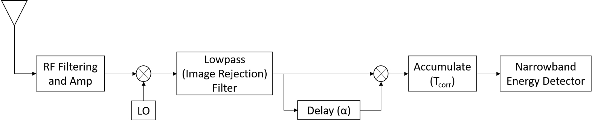

DMR的输出为：

$$z=\int_0^Ty(t)y(t-\alpha)dt$$

然而，DMR需要已知信号结构，如码片速率和所采用的调制方式，因为循环特性的位置会因调制方式的不同而变化。为了以非协作方式运作，DMR必须扫过备用延迟。
此外，DMR中的乘法将运算限制为正SNR格式。如果SNR<0dB，则乘法增加噪声功率，而不是增加信号功率。这是很棘手的，因为接收到的扩频信号通常具有较低的SNR。

#### 基于特征分解的接收机

这类接收机首先估计DSSS信号的几个参数，然后根据这些估计值实现码序列恢复。样本协方差矩阵公式为：

$$R=\frac{1}{K-1}\sum_{k=0}^{K-1}\mathbf{y}_k\mathbf{y}_k^H$$

这些算法假设估计了扩频码的周期，并且数据段 $y_k$ 与扩频码等长。
从本质上讲，样本协方差矩阵特征分解依赖环境噪声为平稳噪声，此时将样本协方差矩阵粗略看作是单位阵，这种矩阵的特征值大致相等。任何存在循环平稳特征的信号都具有周期性，并且会位于一个或两个特征向量内（前提是样本协方差矩阵的大小适当）。因此，特征值较大的特征向量的个数可以指示循环平稳信号的存在，并且对应的特征向量可用于估计所应用的扩频码 $c(t)$ 。
特征分析和频谱范数最大化这两种特定的技术唯一的区别在于它们如何处理特征向量。这些方法可以检测到远低于噪声水平的DSSS信号。

#### 基于ML的检测器

到目前为止讨论的循环平稳检测器是通过启发式和直觉开发的，而不是通过任何优化方法开发的。为了实现可实际操作的检测器，推导出了一个近似值，该近似值将根据接收信号 $(y)$ 在被测单元周围的一小块区域估计的频谱相关函数积分：

$$T_\alpha(t,f)=\frac1{\Delta f}\int_{f-\Delta f/2}^{f+\Delta f/2}S_\mathbf{y}^\alpha(t,v)dv$$

该检测器适用于单循环频率 $\alpha$ 、频谱效率 $f$ 和采样时间 $t$ （被测单元）。为了检测非合作信号，在每次检测器评估时间 $t$，必须对每个可能的循环频率 $\alpha$ 和频谱频率 $f$ 重复检验。

#### 互相关检测器

上一节描述了一类复杂的接收机，其专门设计以利用目标信号的结构，以提高基础能量检测器的性能。然而，这导致检测器通常最适合特定目标信号子集（雷达信号或采用给定调制方式的DSSS传输），并且需要在做出检测决策之前估计信号参数。

利用这种结构的另一种方法是额外使用第二个接收机并采用互相关技术。互相关已被研究用于LPI雷达检测，通常用作TDOA定位的时间延迟估计手段。假设噪声项不相关，则两个接收机之间的任何相关性都可以归因于入射到接收机上的信号。该检测器的主要优点是它可以利用目标信号的处理增益，而无需估计码片速率等参数。假设输入SNR如下：

$$\xi_i=\frac{S}{N}$$

其中，S和N是两个输入信号的功率谱密度（在接收机带宽上平均分布），互相关处理后的输出SNR为：

$$\xi_o=\begin{cases}\frac{T_\mathrm{corr}B_n\xi_i^2}{1+2\xi_i},T_\mathrm{corr}\leq T_p \\
\frac{T_pB_n\xi_i^2}{\frac{T_\mathrm{corr}}{T_p}+2\xi_i},T_\mathrm{corr}>T_p \end{cases} $$

其中 $T_{p}$ 是脉冲持续时间， $T_{corr}$ 是相关器的持续时间（信号相乘与结果求积分所用的时长）。 $B_s$ 是信号带宽，简单起见，假设它与接收机带宽 $(B_n)$ 匹配。每个信号的脉冲压缩增益由带宽和脉冲持续时间的乘积（称为时间带宽积(time bandwidth product，TBWP)）确定。注意，即使在高SNR下，交叉相关器接近但不能完全实现这一理想的处理增益。在低信噪比下，由于两个噪声信号相乘而产生的噪声功率增加会导致更明显的差距。但是，如果TBWP足够大，则处理增益可以克服此损耗。

考虑一对接收信号 $y_1$ 和 $y_2$，二元假设检验为：

$$\mathcal{H}_0:\mathbf{y}_1=\mathbf{n}_1;\mathbf{y}_2=\mathbf{n}_2$$

$$\mathcal{H}_1:\mathbf{y}_1=\mathbf{s}+\mathbf{n}_1;\mathbf{y}_2=A\mathbf{s}+\mathbf{n}_2$$

其中，A表示两个接收机之间的未知衰减和相移。则互相关接收机为：

$$R=\mathbf{y}_1^H\mathbf{y}_2$$

注意，互相关接收机仅检测互相关的零延迟项。如果两个接收机距离很近，则可以进行这种简化，这种情况通常用于互相关检测器检测信号时。用于时延估计的相关器则需要计算互相关的多个滞后项。由于 $y_1$ 和 $y_2$ 都是复数高斯随机向量，并且它们的方差相等，因此它们的内积分布可以求出，但该分布不是以封闭形式给出的，也不是标准分布。这不仅对性能预测提出了挑战，而且对设置适当的阈值以保证 $P_{FA}$ 也是一个挑战。

取而代之的是，我们借助了一个近似值，该近似值会形成更方便和可分析的解法，同时要注意这将存在性能下降和分析预测精度的损失。为了构建这种近似值，我们扩展了内积项并分别考虑。共有四项：信号互相关、噪声互相关和信号与两个噪声矢量的交叉项。

$$R=A\mathbf{s}^{H}\mathbf{s}+\mathbf{s}^{H}\mathbf{n}_{2}+A\mathbf{n}_{1}^{H}\mathbf{s}+\mathbf{n}_{1}^{H}\mathbf{n}_{2}$$

第一项是目标信号，其余三项是噪声项。两个交叉项是均值为零的复数高斯随机变量，给定方差为 $\sigma_{sn}=\sigma_{n}^2ST_p$。最后一个噪声项更复杂；它是一对零均值复数高斯随机变量的内积。如果样本矢量的长度足够，则适合应用中心极限定理并通过计算期望值(0)和方差 $(T _pN^2/B _n)$ 使其近似复高斯分布。汇总这些项，得出 $R$ 的近似分布：

$$R\sim\mathcal{CN}\left(AST_p,\frac{T_pN}{B_n}\left(N+2S\right)\right)$$

从而得出SNR：

$$\xi_{o}=\frac{|A|^{2}S^{2}T_{p}^{2}}{\frac{T_{p}N}{B_{n}}(N+2S)}=\frac{|A|^2T_pB_nS^2}{N^2+2SN}=\frac{|A|^2T_pB_n\xi_i^2}{1+2\xi_i}$$

假设 $|A|^2=1$ ，并且接收到的带宽 $B_n$ 与信号带宽 $B_s$ 匹配。

$R$ 的均值和方差都取决于接收到的信号强度 $S$ 。这意味着 $R$ 的均值和方差都将在原假设和备择假设之间发生变化，并且最优检测器是二次的。对于扩频信号检测，信号强度 $(S)$ 通常比噪声方差 $(N)$ 弱得多。因此，方差近似恒定 $\sigma_{r}^{2} \approx T_{p}N^{2}/B_{n}$ ，简单的阈值检测方法可使用。

为了构建检验统计量，我们注意到 $R$ 的期望取决于两个接收向量之间的未知相移。因此，我们必须找到不随A变化的检验统计量。可以通过将 $R$ 的平方除以 $\mathcal{H}_{0}$ 条件下的噪声来实现这一点。

$$z(\mathbf{y}_1,\mathbf{y}_2)=\frac{2}{\sigma_0^2}|\mathbf{y}_1^H\mathbf{y}_2|^2$$

其中，

$$\sigma_0^2=\frac{N^2T_{corr}}{B_n}$$

这遵循具有两个自由度的卡方分布。在 $\mathcal{H}_{1}$ 条件下，写出R的方差：

$$\sigma_1^2=\sigma_0^2(1+2\xi_i)$$

且可以用下列方法计算出虚警概率：

$$\begin{aligned}P_{\mathrm{FA}}&=-F_{\chi^{2}}(\eta;2)\\\eta&=F_{\chi^{2}}^{-1}(1-P_{\mathrm{FA}};2)\end{aligned}$$

接下来，定义一个虚拟变量：

$$\widehat{z}(\mathbf{y}_1,\mathbf{y}_2)=\frac{\sigma_0^2}{\sigma_1^2}z(\mathbf{y}_1,\mathbf{y}_2)=\frac{z(\mathbf{y}_1,\mathbf{y}_2)}{1+2\xi_i}$$

其在 $\mathcal{H}_{1}$ 下分布为非中心卡方随机变量（具有两个自由度和非中心参数）：

$$\lambda=\xi_{o}$$

为了计算检测的概率，为 $\widehat{z}(\mathbf{y}_1,\mathbf{y}_2)$ 定义了一个等效间隔：

$$Pr\{z(\mathbf{y}_1,\mathbf{y}_2)\geq\eta\}=Pr\left\{\widehat{z}(\mathbf{y}_1,\mathbf{y}_2)\geq\frac{\eta}{1+2\xi_i}\right\}$$

从这里可以看出，计算检测概率的方程基于非中心卡方CDF，但是具有阈值偏移：

$$P_\mathrm{D}=1-F_{\chi^2}\left(\frac\eta{1+2\xi_i};2,\xi_o\right)$$

## 性能分析

为验证能量检测器和互相关检测器的相对性能，考虑从飞机上检测以3G CDMA波形建模的商用宽带手机信号，以及从桅杆上的地面接收机检测机载LPI式雷达脉冲。

注意，能量检测器的性能和互相关检测器的性能是紧密相关的。这是因为这些计算假设噪声是完全已知的，在这种情况下，能量检测器可以很好地校准，以检测总能量的任意增量，特别是当M很大时。互相关检测器仍然受益于此：它将相关信号与不相关噪声进行比较，而能量检测器只有信号的单个噪声样本。

### 3G CDMA手机信号的检测
### 宽带雷达脉冲的检测

##局限性

检测扩频信号的主要局限性是，只需将发射能量扩展到极大的带宽上，发射机就可以使SNR降至极低水平。虽然具有足够长的观察窗口的能量检测器和互相关接收机可以恢复一定的扩频增益，其仍然需要对很大的噪声带宽进行采样。虽然存在一些技术可以充分利用扩频信号中的结构（循环稳态检测器），但它们的成功应用通常依赖于对信号参数的了解或估计。另一个限制（特别是对于宽带信号）是互相关器必须考虑大量可能的延迟，包括计算延迟。

# 扫描接收机

上面两章分别讨论了未知目标信号的检测，该目标信号既可以是连续且窄带信号，也可以是扩频信号。在每种情况下，都假定目标信号的载波频率位于接收机的带宽中心位置。实际上，须监视的电磁频谱带宽很大。雷达信号的范围可以从几十兆赫兹高频（high frequency，HF）到毫米波范围（30~300GHz），在商业世界中越来越多地被汽车雷达所占据。在此范围内，军用雷达实例几乎覆盖了所有频段。

同理，在通信方面，长距离语音链路可以在HF（3~30MHz）、VHF（30~300MHz）和UHF（300MHz~1GHz）上找到，数字通信（通过数据链路）分布在低千兆赫兹范围内；Link-16占用L波段（1~2GHz），许多无人机数据链路分布在S 波段（2~4GHz）和C波段（4~8GHz）。卫星上下行链路占用的频率更高，包括Ku波段（12~18GHz）、Ka波段（27~40GHz）和V波段（40~75GHz）。

从历史上看，电子战系统采用了各种各样的专用接收器。然而，随着商业技术的发展，越来越多的数字系统能够不断提高保真度和带宽。本书重点介绍数字接收机。

## 数字接收机

数字接收机比模拟接收机更受欢迎，原因有很多，包括成本更低、性能不断提高（由于商业电子和无线电信领域的进步），以及能够在不需要分离功率的情况下处理多种算法或信道处的数据，从而保持稳定的SNR。简化的框图如下图所示。数字接收机的核心是模拟-数字数转换器（analog to digital converter，ADC），它将输入信号电压转换为数字化形式。如果ADC的采样率超过了奈奎斯特频率以获得最高目标频率，则可直接进行数字采样。

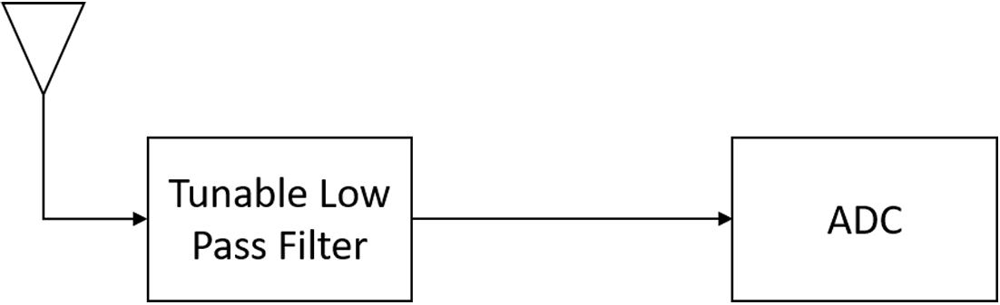

低通滤波器用于防止高频信号进入接收器，在接收机中，高频信号会被被混叠到感兴趣的频带中。无需本地振荡器（local oscillator，LO）就可以用低通滤波器替换预选滤波器，以防止数字化过程中的混叠。这简化了接收机的成本和复杂性，但在较高频率上的应用有限。

信号可以以下两种形式之一进行数字化；单独使用真实样本或通过复杂采样来获得 $I/Q$ 样本。当以数字方式采样时，奈奎斯特准则会放宽，因为当以接收信号的最高频率而不是最高频率的两倍（标准奈奎斯特采样准则）采样时，复式采样会提供必要信息以消除信号歧义。

下图显示了复数ADC的架构。输入信号在待采样带宽的中心频率处与本地振荡器的正弦和余弦分量混频。然后分别通过两个分路传递给ADC，并收集输出值作为复值样本的实部（I）和虚部（Q）。为简单起见，本章使用复采样。

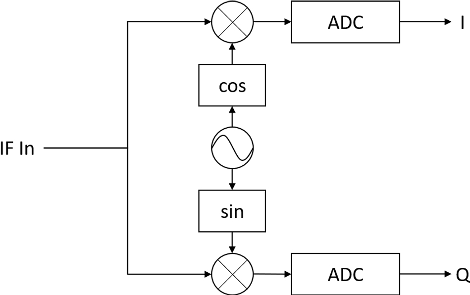

## 中频接收机

如果信号最高响应频率超过ADC的采样率，则无法进行直接采样，一种替代的方法中频（intermediate frequency，IF）接收机如下图所示。中频接收机的原理是，两个信号混频后将产生分别以两个输入信号频率与频率差为载频的组合信号，有时也称拍频，该现象实际由积化和差所致。

$$\cos(a)\cos(b)=\frac12[\cos\left(a-b)+\cos(a+b\right)]$$

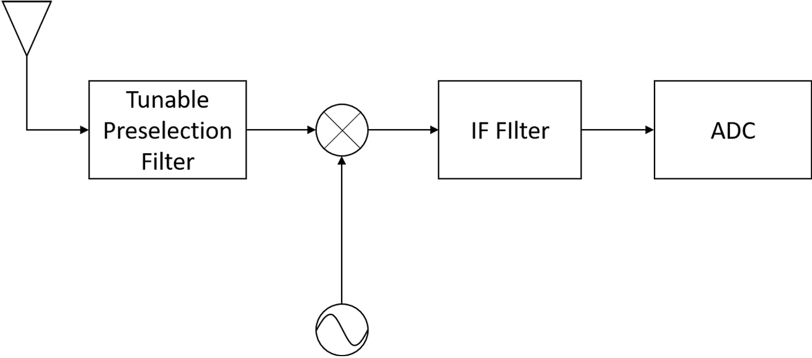

因此，非常高频率的输入信号可以与本地振荡器进行混频，从而产生具有非常低中心频率的信号。这一基本原理使在任何载波频率上传输信号都可以实现有效采样，为此次数将构建天线和滤波器，并将高频信号频至低频，以便进行细粒度的信道选择和检测。

预选滤波器设计用于抑制混频阶段之前的模糊信号称为图像，而中频滤波器可防止ADC中出现混叠。如果对信号进行了合适的滤波，就可以使用ADC对该信号进行采样，该ADC运行速率比中频滤波器的带宽（而不是输入信号的最大频率）低得多。这是中频接收机最重要的优点之一。中频滤波器电子器件和检测器无需一定在射频段（可能在数十甚至数百GHz的频率）下运行，也可以设计为接受直流到中频滤波器瞬时带宽之间的信号。

## 频率分辨率

扫描接收机的第二个约束是预期的频率分辨率，表示为 $\delta_f$ 。信号被数字化后，可以通过离散傅里叶变换进行处理，而单位频带带宽为 $\delta_{\omega}=1/M$ 。将其映射到实际频率单位，有：

$$\delta_f=\frac{1}{T_{\text{dwell}}}$$

其中， $T_{\text{dwell}}$ 表示扫描机驻留时间。频率分辨率与瞬时带宽同为扫描接收机的基础指标。

# 电子战辐射源检测与定位\-到达角估计

待补充

# 电子战辐射源检测与定位\-威胁辐射源定位
# 辐射源定位
## 背景

定位是指估计信号发射源物理坐标 $\mathbf{x}$ 。估计位置用 $\hat{\mathbf{x}}$ 表示。

信号 $p(t)$ 以速度 $v$ 从未知辐射源未知 $\mathbf{x}$ 发射，并以速度 $v_i$ 传播至传感器位置 ${\mathbf{x}}_i$ ，在传感器位置以信号 $y_i(t)$ 形式接收。在一些基本假设（恒定传播速度，无衍射或复杂传播路径）条件下，接收信号可表示如下：

$$ s(t)=p(t-\tau_i )e^{j2\pi \frac{v_i }{\lambda}}$$ 

$$ \tau_i=\frac{\|{\mathbf{x}}-{{\mathbf{x}}}_i \|}{c} $$

$$ v_i={{(v-v_i)}}^T \frac{{({\mathbf{x}}-{{\mathbf{x}}}_i )}}{{\|{\mathbf{x}}-{{\mathbf{x}}}_i \|}} $$ 

其中， $\tau_i$ 是 ${\mathbf{x}}$ 和 ${{\mathbf{x}}}_i$ 之间的时间延迟； $v_i$ 是相对速度在发射机和接收机之间视距上的投影；c是光速。

## 性能指标

通常性能指标是估计位置和真实位置之间误差的偏差项 $\mathbf{b}$ 和协方差矩阵 ${\mathbf{C}}_{\hat{\mathbf{x}} }$ 的函数：

$$\mathbf{b} = E \{(\mathbf{\hat{x}}-\mathbf{x})\}$$

$$\mathbf{C}_{\hat{\mathbf{x}}}=E\{(\hat{\mathbf{x}}-\mathbf{x}-\mathbf{b})(\hat{\mathbf{x}}-\mathbf{x}-\mathbf{b})^T\}$$

### 误差椭圆

位置精度最直接的指标是误差椭圆。对于任何二维系统，可以使用误差椭圆来跟踪有关偏置点的估计值分布。根据椭圆方程计算：

 $$ {\left(\frac{x-b_x }{\sigma_x }\right)}^2 +{\left(\frac{y-b_y }{\sigma_y }\right)}^2 =\gamma $$ 

其中， $b_x$ 和 $b_y$ 是偏差向量 $\mathbf{b}$ 的x分量和y分量； $\sigma_x$ 和 $\sigma_y$ 分别是 ${\mathbf{C}}_{\hat{\mathbf{x}} }$ 的x方差项和y方差项，而 $\gamma$ 是用于确定椭圆面积的比例参数， $\gamma$ 的选择控制椭圆内估计值的百分比，从而定义其置信区间。仅当二维中的误差不想管时，上方程采用有意义；若存在相关性，需将标准差替换为协方差矩阵特征值的平方根 $\sqrt{\lambda_1 }$ 和 $\sqrt{\lambda_2 }$ 。

### CEP(circular error probable)

CEP简单定义为以辐射源位置为中心的圆半径，以确保给定估计值百分比落在该园内。常用的指标是 $\textrm{CEP}_{50\%}$ （50%估计值在圆内）和 ${\textrm{CEP}}_{90\%}$ （90%估计值在圆内）。

CEP值是圆的半径，该圆以给定的概率包围误差。定义总误差： $\tilde{z}=\sqrt{\hat{x}^{2}+\hat{y}^{2}}$ ，则CEP可以定义为：

 $$ \int_0^{CEP_{\gamma } }f_z {(\tilde{z} )}d\tilde{z} =\frac{\gamma }{100} $$ 

误差项 \tilde{z} 是具有一个自由度的非中心卡方随机变量的加权和的平方根（因为 $\hat{x}$ 和 $\hat{y}$ 都是均值非零的高斯随机变量），尽管已经进行了几个近似计算，但该数量并不是封闭形式的。三维的则是求球概率误差（spherical error probable，SEP）。

对于 ${\textrm{CEP}}_{50\%}$ ，给出近似计算：

 $$ {{\mathrm{C}\mathrm{E}\mathrm{P}}}_{50}=\begin{cases} 0.59(\sigma_s +\sigma_l ) & \frac{\sigma_s }{\sigma_l }\ge 0.5\\ \sigma_l \left(0.67+0.8\frac{\sigma_s^2 }{\sigma_l^2 }\right) & \frac{\sigma_s }{\sigma_l }<0.5 \end{cases} $$ 

其中， $\sigma_s$ 是两个误差项中的较小者， $\sigma_l$ 是较大者。

## CRLB

在一般高斯情况下，当输入数据矢量上具有协方差矩阵C时，费歇尔信息矩阵如下：

 $$ \mathbf{F}={\mathbf{J}\mathbf{C}}^{-1} {\mathbf{J}}^T $$ 

其中， $\mathbf{J}$ 是接收到数据向量的雅可比矩阵，定义为：

 $$ \mathbf{J}=\nabla_{\mathbf{x}} \mathbf{f}(\mathbf{x})=[ \nabla_{\mathbf{x}} f_1 (\mathbf{x}),\cdots,\nabla_{\mathbf{x}} f_{L-1} (\mathbf{x})] $$ 

其中， $f(x)$ 是在位置 ${\mathbf{x}}$ 处给定辐射源的 $L$ 个接收信号的向量，而 $\nabla_x f_l ({\mathbf{x}})$ 是在该位置的第 $l$ 个接收信号的梯度。

## 跟踪仪

跟踪仪会优先考虑先前的测量值和位置估计以及运动模型中的信号，以提高测量精度。并且可以提供一个简单的初始估计。在每个时间步，都可以使用上一个时间步的解（或针对当前时间步生成的预测值）初始化迭代定位解。

## 定位算法

三边测量、TDOA、FDOA、TDOA/FDOA。

# AOA三角测量
## 背景

三角测量使用多个方位测量值来确定辐射源的位置。

## 公式

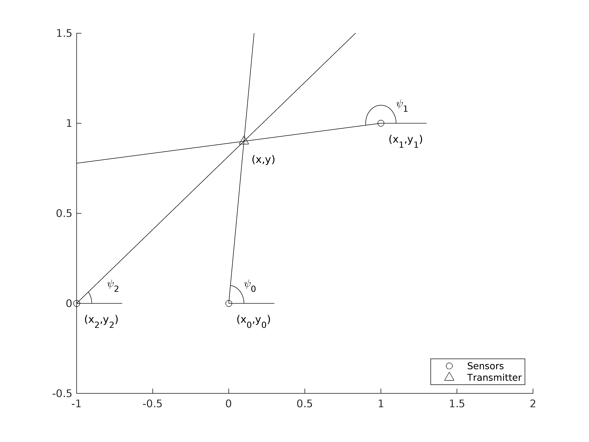

考虑图中的二维集合图像，其中包含3个传感器 $(x_i,y_i)$ 和一个目标 $(x,y)$ 。方位线（相对于+x方向）给定为 $\psi_i ,i=0,\ldots,N-1$ ，则： $\psi_i =\arctan (\frac{y-y_i }{x-x_i })$ 。

我们将N个可用噪声方位测量结果收集到方程组中： $\psi =\mathbf{p}(\mathbf{x})+\mathbf{n}$ 。其中，AOA向量 $\mathbf{p}$ 定义为： $\mathbf{p}(\mathbf{x})\triangleq [{\tan^{-1} {(\frac{y-y_0 }{x-x_0 })},\cdots,\tan^{-1} {(\frac{y-y_{N-1} }{x-x_{N-1} })} ]}$ ， $\mathbf{n}$ 表示N个方位测量中每个的误差项，假设其近似为高斯且无偏的，即 $\mathbf{n}\sim \mathcal{N}{(0_N ,{\mathbf{C}}_{\psi } )}$ 。一般情况下， ${\mathbf{C}}_{\psi }$ 可以是任何协方差矩阵，但通常假设每次方位测量中的误差都是不相关的，即设 ${\mathbf{C}}_{\psi }$ 是对角矩阵。

此时，可以在给定实际辐射源位置 ${\mathbf{x}}$ 的情况得到一组方位角测量值 $\psi$ 的对数似然函数：

 $$ \ell (\psi |\mathbf{x})=-\frac{1}{2}[ \psi -\mathbf{p}(\mathbf{x})]^H {\mathbf{C}}_{\psi }^{-1} [ \psi -\mathbf{p}(\mathbf{x})] $$ 

上式仅限于二维几何 $(x,y)$ ，可扩展到三维几何 $(x,y,z)$ ，例如将AOA测量值表示为一个方位角，以及相对于该几何 $(x,y)$ 平面的仰角或俯角 $\phi$ 。此时高度坐标可以表示为： $\phi_i =\tan^{-1} {\left(\frac{z-z_i }{\sqrt{(x-x_i )^2 +(y-y_i )^2 }}\right)} $ 。

三维中操作的主要优点是能够在地理坐标（如经纬度和海拔）中表示传感器、方位线和估计的辐射源位置。这里的符号 $(x,y,z)$ 与地心地固坐标系(Earth\-centered Earth\-fixed，ECEF)坐标最接近，这是一种欧几里得三维几何，其原点位于地球中心，所有的3个维度均以米表示。

通常，第一步是从每个传感器获取相对 $(x,y,z)$ 或 $(\psi,\phi)$ 坐标，并将他们转换为相同的ECEF参考系。

## 求解
### 两次测量的几何解

设有两个AOA解，则可根据他们的交点求出估计的辐射源位置 $\hat{{\mathbf{x}}}$ 。可以通过求解以 $y=mx+b$ 形式定义两条直线方差，然后求解：

 $$ {\left[\begin{array}{rcl} y =  \frac{\sin (\psi_0 )}{\cos (\psi_0 )}x+{\left(y_0 -\frac{\sin (\psi_0 )}{\cos (\psi_0 )}x_0 \right)}\newline y =  \frac{\sin (\psi_1 )}{\cos (\psi_1 )}x+{\left(y_1 -\frac{\sin (\psi_1 )}{\cos (\psi_1 )}x_1 \right)} \end{array}\right]} $$ 

### 三次或多次测量的几何解

当提供3个或多个噪声AOA估计时，实际它们不可能相较于一个点，但是每组3个AOA估计将形成一个三角形。因此可以计算给定三角的一个已知中心（质心），并将该点声明为估计的辐射源位置。

### 最大似然估计

 $\psi$ 的对数似然函数对目标位置 ${\mathbf{x}}$ 求导数：

 $$ \nabla_{\mathbf{x}} \ell (\psi |\mathbf{x})=\mathbf{J}(\mathbf{x}){\mathbf{C}}_{\psi }^{-1} {\left(\psi -\mathbf{p}(\mathbf{x})\right)} $$ 

其中， $\mathbf{J}(\mathbf{x})$ 是方程 $\mathbf{p}(\mathbf{x})$ 的雅可比矩阵：

$$\mathbf{J}(\mathbf{x})\triangleq {[\nabla_{\mathbf{x}} p_0 (\mathbf{x}),  \nabla_{\mathbf{x}} p_1 (\mathbf{x}), \cdots, \nabla_{\mathbf{x}} p_{N-1}(\mathbf{x})]}$$

$$\nabla_{\mathbf{x}} p_i (\mathbf{x})=\frac{1}{{{\|\mathbf{x}-{\mathbf{x}}_i \|}}^2 }{{[ -(\mathbf{y}-\mathbf{y}_i),  \mathbf{x}-\mathbf{x}_i]}}^T$$

令 $\nabla_{\mathbf{x}} \ell (\psi |\mathbf{x})=0$ 求解 ${\mathbf{x}}$ 可以求出最大似然估计。然而由于 $\mathbf{J}(\mathbf{x})$ 在 ${\mathbf{x}}$ 中不是线性的，因此没有解析解。下面讨论两个迭代解。

### 迭代最小二乘

将某个位置估计值 ${\mathrm{x}}^{(i)}$ 表示为近似方程 $\mathbf{p}(\mathbf{x})\triangleq [{\tan^{-1} {(\frac{y-y_0 }{x-x_0 })},\cdots,\tan^{-1} {(\frac{y-y_{N-1} }{x-x_{N-1} })} ]}$ 的线性近似值，并将偏移量 $\Delta {\mathbf{x}}^{(i)}$ 定义为 ${\mathbf{x}}$ 与当前估计值 ${\mathrm{x}}^{(i)}$ 之差：

 $$ \Delta {\mathbf{x}}^{(i)} =\mathbf{x}-{\mathbf{x}}^{(i)} $$ 

 $$ \mathbf{p}{\left({\mathbf{x}}^{(i)} +\Delta {\mathbf{x}}^{(i)} \right)}=\mathbf{p}{\left({\mathbf{x}}^{(i)} \right)}+{\mathbf{J}}^T {\left({\mathbf{x}}^{(i)} \right)}\Delta {\mathbf{x}}^{(i)} $$ 

记测量偏移矢量定义为从点 ${\mathrm{x}}^{(i)}$ 开始的预期AOA向量与（噪声）测量AOA向量 $\psi$ 之间的差：

 $$ \mathbf{y}{\left({\mathbf{x}}^{(i)} \right)}=\psi -\mathbf{p}{\left({\mathbf{x}}^{(i)} +\Delta {\mathbf{x}}^{(i)} \right)} $$ 

则有线性方程：

 $$ \mathbf{y}{\left({\mathbf{x}}^{(i)} \right)}={\mathbf{J}}^T {\left({\mathbf{x}}^{(i)} \right)}\Delta {\mathbf{x}}^{(i)} +\mathbf{n} $$

其中， $\mathbf{n}$ 是方程 $\psi =\mathbf{p}(\mathbf{x})+\mathbf{n}$ 中相同角度测量噪声向量。此时， $\mathbf{y}{({\mathbf{x}}^{(i)} )}$ 表示从当前位置估计值预测的AOA测量值与实际观察到的值之间的残差。对该线性方程求解得出当前估计值与辐射源真实位置之间的偏移量 $\Delta x$ 的估计值。

在求逆上方程之前，先对残差项 $\mathbf{n}$ 进行白化，这是通过将 $\mathbf{y}{({\mathbf{x}}^{(i)} )}$ 与 ${\mathbf{C}}_{\psi }^{-1/2}$ 左乘来完成的，其中 ${\mathbf{C}}_{\psi }^{-1/2}$ 满足： ${\mathbf{C}}_{\psi }^{-1/2} {\mathbf{C}}_{\psi } {\mathbf{C}}_{\psi }^{-1/2} ={\mathbf{I}}_N$ ，则得出白化残差：

 $$ \tilde{\mathbf{y}} {\left({\mathbf{x}}^{(i)} \right)} = {\mathbf{C}}_{\psi }^{-1/2} {\left[\psi -\mathbf{p}{\left({\mathbf{x}}^{(i)} \right)}\right]} = {\mathbf{C}}_{\psi }^{-1/2} {\mathbf{J}}^T {\left({\mathbf{x}}^{(i)} \right)}\Delta_{\mathbf{x}}^{(i)} +\tilde{\mathbf{n}}  $$ 

采用最小二乘解：

$$ \Delta {\mathbf{x}}^{(i)} ={{\left[\mathbf{J}{\left({\mathbf{x}}^{(i)} \right)}{\mathbf{C}}_{\psi }^{-1} {\mathbf{J}}^T {\left({\mathbf{x}}^{(i)} \right)}\right]}}^{-1} \mathbf{J}{\left({\mathbf{x}}^{(i)} \right)}{\mathbf{C}}_{\psi }^{-1} \mathbf{y}{\left({\mathbf{x}}^{(i)} \right)} $$

上述方法AOA测量次数必须大于或等于空间维度数量。该方法的主要局限性是需要重复计算以达到收敛，并且需要足够准确的初始位置估计。此外，该技术还存在稳健性问题，即估算值可能与实际辐射源位置大相径庭。因此有必要及逆行约束和其他优化以提高准确性。

### 梯度下降

目标函数 $f(x)$ 最小化白化残差 $\tilde{\mathbf{y}} (\mathbf{x})$ 的范数：

 $$ f(x)={\|\tilde{y} (x)\|}_2^2 ={(\psi -p(x))}^T C_{{\psi }}^{-1} (\psi -p(x)) $$ 

这等同于对数似然函数 $\ell (\psi |\mathbf{x})$ 的负数。因此，得到梯度如下：

 $$ \nabla_{\mathbf{x}} f(\mathbf{x})=-\nabla_{\mathbf{x}} \ell (\psi |\mathbf{x})=-\mathbf{J}(\mathbf{x}){\mathbf{C}}_{\psi }^{-1} {(\psi -\mathbf{p}(\mathbf{x}))} $$ 

步长t选择为沿梯度 $\Delta x$ （使目标函数最小化）的点：

 $$ t=\arg \min_{s\ge 0} f{(\mathbf{x}+s\Delta \mathbf{x})} $$ 

梯度下降算法的重要特征是更新方程 ${\mathbf{x}}^{(i+1)} ={\mathbf{x}}^{(i)} +t\Delta {\mathbf{x}}^{(i)}$ 不包含必须在每次迭代中都更新的矩阵求逆，因此计算速度比迭代最小二乘解要快得多。该算法的主要缺点仍是需要适当的初始估计值，以便可以假设目标函数的凸性。

## 其他解法
## 性能分析

费歇尔信息矩阵： ${\mathbf{F}}_{\mathbf{x}} (\psi )=\mathbf{J}(\mathbf{x}){\mathbf{C}}_{\psi }^{-1} {\mathbf{J}}^T (\mathbf{x})$ 

CRLB指明误差协方差的下界为 ${\mathbf{F}}_{\mathbf{x}} (\psi )$ 的倒数： ${\mathbf{C}}_{\mathbf{x}} \ge {{\left[\mathbf{J}(\mathbf{x}){\mathbf{C}}_{\psi }^{-1} {\mathbf{J}}^T (\mathbf{x})\right]}}^{-1}$ 

# TDOA

TDOA是一种高精度的辐射源定位技术，经常用于随时间生成非协作辐射源目标的轨迹，具有极高的精确度和完全被动的特性。TDOA的基本前提是测量脉冲在多个传感器位置的到达时间差，并使用该测量值来计算辐射源的位置。

## 背景

系统基线是指接收机之间的最大间隔。TODA处理的过程与GPS位置估计的过程基本相同；两者都依赖电磁波以光速传播。区别主要在于发射机和接收机是反向布置的：在GPS中，有多个辐射源，而传感器试图估计其自身的位置。GPS的主要优点是辐射源正在发射已知信号和参考时钟（用于到达时间的计算），而TDOA系统通常用于对抗使用未知波形并在未知时间发射的非协作系统。

## 公式

发射的信号是 $s(t)$ ，则第i个传感器接收到的信号定义为：

 $$ y_i (t)=\alpha_i s(t-\tau_i )+n_i (t) $$ 

其中，（对于电磁波）时延 $\tau_i$ 定义为 $\tau_i =R_i /c$ ， $R_i$ 是辐射源（发射机）与第i个传感器之间的距离。辐射源的位置是通过查找满足到该传感器的测量距离的所有点的所有传感器的交点来计算的，如下图所示。这种方法的主要局限性在于他需要知道何时发送信号，而电子战中很难能获得此类信息。为了弥补这种信息的缺失，使用TDOA。对于传感器，满足测得TDOA的点集合是双曲线，通常称为等时线。与到达时间（TOA）解一样，通过找到每个TDOA双曲线的交叉点来计算辐射源的位置，如图所示。

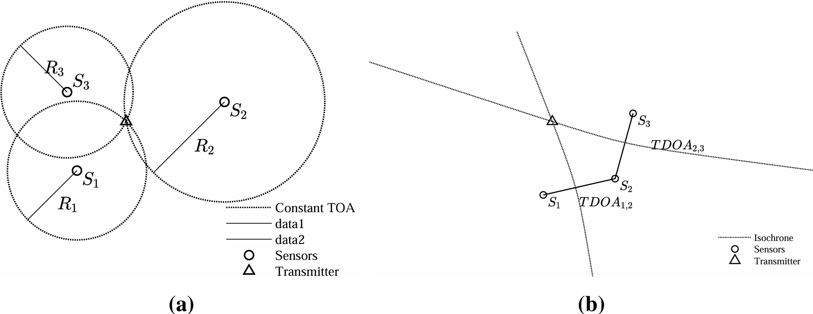

### 等时线

考虑任意两个传感器 $S_m$ 和 $S_n$ ，它们之间的时间差测量定义为 $t_{m,n} =\tau_m -\tau_n$ ，则距离差为 $R_{m,n}=c t_{m,n}$ 。两个信号之间的时间差勾勒出双曲线：

 $$ R_{m,n} {(x,y)}=\sqrt{{{(x-x_m )}}^2 +{{(y-y_m )}}^2 }-\sqrt{{{(x-x_n )}}^2 +{{(y-y_n )}}^2 } $$ 
此TDOA双曲线即为等时线。

### 传感器的数量

在二维空间中需要三个传感器才能定位出辐射源位置。显然三维，需要4个传感器。但是对于三维，需要确保任3个传感器不在一条线上。

## 求解方法

由于TDOA方程非线性，故没有解析解。方便推导，用 $\ell_2$ （欧几里得）范数以矢量形式重写TDOA方程：

 $$ R_{m,n} (\mathbf{x})={{\|\mathbf{x}-{\mathbf{x}}_m \|}}_2 -{{\|\mathbf{x}-{\mathbf{x}}_n \|}}_2 $$ 

其中， ${\mathbf{x}}$ 是辐射源位置； ${{\mathbf{x}}}_m$ 是第m个传感器的位置； $R_{m,n} ({\mathbf{x}})$ 是第m个和第n个传感器观测到的到辐射源位置 ${\mathbf{x}}$ 的距离差。则相对传感器N的所有距离差矢量为：

 $$ {\mathbf{r}}{(\mathbf{x})}={{[R_{1,N} {(\mathbf{x})},\cdots,R_{N-1,N} {(\mathbf{x})}]}}^T $$ 

该矢量有 $N-1$ 个元素，每个元素均为相对传感器N的值。将第N个传感器作为参考传感器。

令测量矢量 $\rho$ 表示真实距离差矢量 ${\mathbf{r}}$ 的噪声形式：

 $$ \rho ={\mathbf{r}}{(\mathbf{x})}+{\mathbf{n}} $$ 

假设 ${\mathbf{n}}$ 是协方差矩阵为 ${\mathbf{C}}_{\rho }$ 的零均值高斯随机向量。如果测量值不相关，则协方差矩阵为对角矩阵 ${\mathbf{C}}_{\rho } =\mathrm{diag}{\{\sigma_1^2 ,\cdots,\sigma_{N-1}^2 \}}$ 。这就要求TDOA测量值应取自 $N/2$个独特的对，因此不能将传感器用于1个以上的测量，因为这会在一些TDOA估计值（来自其共同辐射源）之间引入相关性。这种方法不是最优的，因为它需要更多的传感器才能达到所需的TDOA测量次数 $(2N_{\mathrm{dim}}\mathrm{vs.} N_{\mathrm{dim}} +1)$ 。在只有N个传感器的极限情况下（其中一个用作共同参考），协方差矩阵为：

 $$ {\mathbf{C}}_{\rho } =c^2 {\left[\begin{array}{cccc} \sigma_1^2 +\sigma_N^2  & \sigma_N^2  & \cdots  & \sigma_N^2 \newline \sigma_N^2  & \sigma_2^2 +\sigma_N^2  & \ldots & \sigma_N^2 \newline \vdots  & \vdots  & \ddots  & \vdots \newline \sigma_N^2  & \sigma_N^2  & \cdots  & \sigma_{N-1}^2 +\sigma_N^2  \end{array}\right]} $$ 

其中， $\sigma_i^2$ 是第i个传感器TOA测量值的方差； $c$ 是光速。则概率密度函数为：

 $$ f_{\mathbf{x}} {(\rho)}={{(2\pi)}}^{-\frac{{(N-1)}}{2}} {{∣{\mathbf{C}}_{\rho }∣}}^{-1/2} e^{-\frac{1}{2}(\rho -\mathbf{r}(\mathbf{x}))^T {\mathbf{C}}_{\rho }^{-1} (\rho -\mathbf{r}(\mathbf{x}))} $$ 

对数似然函数为：

 $$ \ell {(\mathbf{x}|\rho )}=-\frac{1}{2}{{(\rho -\mathbf{r}{(\mathbf{x})})}}^T {\mathbf{C}}_{\rho }^{-1} {(\rho -\mathbf{r}{(\mathbf{x})})} $$ 

### 最大似然估计

在给定未知辐射源位置 $\mathit{\mathbf{x}}$ 的情况下，通过最大化 $\rho$ 的对数似然来找到最大似然估计。我们取对数似然相对于未知传感器位置 ${\mathbf{x}}$ 的导数：

 $$ \nabla_{\mathbf{x}} \ell (\mathbf{x}|\rho )=\mathbf{J}{(\mathbf{x})}{\mathbf{C}}_{\rho }^{-1} {(\rho -\mathbf{r}{(\mathbf{x})})} $$ 

其中， $\mathbf{J}{(\mathbf{x})}$ 是 ${\mathbf{r}}{(\mathbf{x})}$ 的雅可比矩阵：

 $$ \mathbf{J}{(\mathbf{x})}=[ \nabla_{\mathbf{x}} R_{1,N} ,\cdots,\nabla_{\mathbf{x}} R_{N-1,N} ] $$ 

 $\nabla_{\mathbf{x}} R_{i,N}$ 是第i个传感器和参考传感器之间辐射源的距离差的梯度：

 $$ \nabla_{\mathbf{x}} R_{i,N} =\frac{\mathbf{x}-{\mathbf{x}}_i }{{{∣\mathbf{x}-{\mathbf{x}}_i ∣}}_2 }-\frac{\mathbf{x}-{\mathbf{x}}_N }{{{∣\mathbf{x}-{\mathbf{x}}_N∣}}_2 } $$ 

### 迭代最小二乘解

与上一章中的最小二乘迭代法相同，区别在于AOA估计值 $\psi$ 被到达距离差 $\rho$ 所代替，AOA系统矢量 $f(x)$ 被真实RDOA ${\mathbf{r}}{(\mathbf{x})}$ 所代替。

同样使用雅可比矩阵给出关于 $x^{(i)}$ 的近似线性方程，并且具有偏移 $\Delta {\mathbf{x}}^{(i)}$ ：

 $$ \mathbf{r}{\left({\mathbf{x}}^{(i)} +\Delta {\mathbf{x}}^{(i)} \right)}=\mathbf{r}{\left({\mathbf{x}}^{(i)} \right)}+{\mathbf{J}}^T {\left({\mathbf{x}}^{(i)} \right)}\Delta {\mathbf{x}}^{(i)} $$ 

定义如下测量偏移矢量：

 $$ \mathbf{y}{\left({\mathbf{x}}^{(i)} \right)}=\rho -\mathbf{r}{\left({\mathbf{x}}^{(i)} +\Delta {\mathbf{x}}^{(i)} \right)} $$ 

得到线性方程：

 $$ \mathbf{y}{\left({\mathbf{x}}^{(i)} \right)}={\mathbf{J}}^T {\left({\mathbf{x}}^{(i)} \right)}\Delta {\mathbf{x}}^{(i)} +\mathbf{n} $$ 

其中， $\mathbf{n}$ 是距离差测量噪声矢量。此时 $\mathbf{y}{({\mathbf{x}}^{(i)} )}$ 表示根据当前位置估计值预测的距离差测量值与实际观测到的距离差之间的残留误差。类似于上一章中， $\mathbf{y}{({\mathbf{x}}^{(i)} )}$ 具有协方差矩阵 ${\mathbf{C}}_{\rho }$ ，并且如果可以通过与 ${\mathbf{C}}_{\rho }^{-\frac{1}{2}}$ 前乘以使误差协方差白化，则可以优化性能。

 $$ \tilde{\mathbf{y}} {\left({\mathbf{x}}^{(i)} \right)}={\mathbf{C}}_{\rho }^{-1/2} {\mathbf{J}}^T {\left({\mathbf{x}}^{(i)} \right)}\Delta {\mathbf{x}}^{(i)} +{\mathbf{C}}_{\rho }^{-1/2} \mathbf{n} $$ 

对该线性方式的求解得出当前估计值与辐射源真实位置之间的偏移量 $\Delta x$ 估计值，采用最小二乘解：

 $$ \Delta {\mathbf{x}}^{(i)} ={{\left[\mathbf{J}{\left({\mathbf{x}}^{(i)} \right)}{\mathbf{C}}_{\rho }^{-1} {\mathbf{J}}^T {\left({\mathbf{x}}^{(i)} \right)}\right]}}^{-1} \mathbf{J}{\left({\mathbf{x}}^{(i)} \right)}{\mathbf{C}}_{\rho }^{-1} \mathbf{y}{\left({\mathbf{x}}^{(i)} \right)} $$ 

其中雅可比矩阵 $\mathbf{J}$ 的列数不得超过行数，即TDOA对的数量 $(N-1)$ 必须不小于空间维度数量。上式最小二乘解不能保证是最优的，只是比初始估计值 $x^{(i)}$ 更接近（假设 $x^{(i)}$ 足够接近真实位置且问题是局凸的）最优解。为了获得准确的解，必须以迭代方式重新进行该过程。

该方法的主要局限性是需要重新计算以达到收敛，并且需要足够准确的初始位置估计。此外该技术还存在鲁棒性问题，即估算值可能与实际辐射源位置大相径庭。为了提高数值稳定性，建议进项算法提供 ${\mathbf{C}}_{\rho }$ 的对角单元，而不要提供全协方差矩阵。

### 梯度下降算法

一般下降通过以下方程更新 ${\mathbf{x}}$ ：

 $$ {\mathbf{x}}^{(i+1)} ={\mathbf{x}}^{(i)} +t\Delta {\mathbf{x}}^{(i)} $$ 

其中， $\Delta {\mathit{\mathbf{x}}}^{(i)}$ 是下降方向；t是适当选择的步长。在梯度下降算法中，将下降方向选择为梯度的负方向 $(\Delta {\mathbf{x}}^{(i)} =-\nabla_{\mathbf{x}} f({\mathbf{x}}^{(i)} ))$ 。定义目标函数 $f(\mathbf{x})$ 为最小化偏移 $\mathit{\mathbf{y}}{\left(\mathit{\mathbf{x}}\right)}$ 的范数，并计算梯度：

$$f(\mathbf{x})=\| \mathbf{y}(\mathbf{x})\|_2^2，\nabla_{\mathbf{x}} f(\mathbf{x})=-2\mathbf{J}(\mathbf{x})\mathbf{y}(\mathbf{x}) $$

为了提高性能，可将残差 ${\mathbf{y}}({\mathbf{x}})$ 替换为白化残差 $\tilde{\mathbf{y}} (\mathbf{x})$ 。此时， $f(\mathbf{x})$ 是对数似然函数 $\ell (\mathbf{x}|\rho )$ 负值的缩小形式：

$$f(\mathbf{x})=\| \tilde{\mathbf{y}} (\mathbf{x})\|_2^2 =-2\ell (\mathbf{x}|\rho ) ，\nabla_{\mathbf{x}} f(\mathbf{x})=-2\mathbf{J}(\mathbf{x}){\mathbf{C}}_{\rho }^{-1} \mathbf{y}(\mathbf{x})$$

其中，梯度包含对原始（未白化）残差 ${\mathbf{y}}{({\mathbf{x}})}$ 的参考。步长t是通过线搜索方法（如精确线搜索或回溯线搜索）构建的，并且下降方向被限制为单位范数。该算法重要特征是不包含矩阵求逆，计算比迭代最小二乘快得多。主要缺点仍然是需要适当准确的初始估计，以便可以假设目标函数的凸性。

### Chan\-Ho方法

Chan\-Ho方法需要 $N_{\dim } +2$ 个传感器，原因是定义了一个辅助参数，即参考传感器与辐射源之间的距离，并使用该参数来线性化方程组；增加一个辅助参数意味着需要一个额外的传感器来求解新的（更大）线性方程。

将扩展参数矢量定义为：

 $$ \theta ={\left[\begin{array}{c} \mathbf{x}\\ R_N {\left(\mathbf{x}\right)} \end{array}\right]} $$ 

则TDOA方程可以表示为线性方程：

 $$ \mathbf{y}={\mathbf{G}}\theta +\mathbf{n} $$ 

其中，偏移测量矢量 ${\mathbf{y}}$ 和系统矩阵 $\mathbf{G}$ 定义为：

$$G=-\left[ \begin{array}{c} x_1^{T } -x_N^{T } \\ \vdots \\ x_{N-1}^{T } -x_N^{T }  \end{array}\right] ，\mathbf{y}=\frac{1}{2} \left[\begin{array}{c} R_{1,N}^2 -\| {\mathbf{x}}_1 \| +\| {\mathbf{x}}_N \| \\ \vdots \\ R_{N-1,N}^2 -\| {\mathbf{x}}_{N-1} \| +\| {\mathbf{x}}_N \|  \end{array}\right]$$ 

由于 $\theta$ 的单元由非线性方程关联，因此无法直接求解该方程组。提出的解忽略了这一事实，并先求解线性方程组，就好像 $\theta$ 的单元不相关一样，然后回过头来将它们的关系应用于估计的解。产生这种差异的原因是， $\bar{{\mathbf{n}}}$ 的误差协方差矩阵取决于从辐射源到 $N-1$ 个非参考传感器中每个传感器的距离。在辐射源教员的情况下，可以将其假定为缩小的单位矩阵，但在辐射源较近的情况下，也必须对其进行估计。

无论哪种情况，首先估计参数矢量：

 $$ \hat{\theta} ={{[{\mathbf{G}}^T {\mathbf{C}}^{-1} \mathbf{G}]}}^{-1} {\mathbf{G}}^T {\mathbf{C}}^{-1} \mathbf{y} $$

若是近场辐射源，则使用 $\theta$ 的估计值构建距离矩阵 ${\mathbf{B}}$ ，并使用定位误差协方差矩阵 $\hat{\mathbf{C}}$ ：

$$\mathbf{B}=2\mathrm{diag}[ \mathbf{R}(\hat{\mathbf{x}} )] ，\hat{\mathbf{C}} ={\mathbf{BCB}}^T  $$ 
其中， $\hat{{\mathbf{x}}}$ 是 $\hat{\theta}$ 的前 $N_{\dim}$ 个单元。然后将估计参数矢量方程中的 ${\mathbf{C}}$ 替换为 $\hat{\mathbf{C}}$ ，可以使用新的估计协方差矩阵 $\hat{\mathbf{C}}$ 来更新 $\hat{\theta}$ 。

第二步是利用参数单元之间的关系来更新参数估计值。为此，我们使用距离估计位置 $\hat{{\mathbf{x}}}$ 的偏移量重新定义系统矩阵。算法第二阶段使用的新参数矢量 $\theta_1$ 为： $\theta_1 =\hat{\theta} -{\left[\begin{array}{c} {\mathbf{x}}_N \\ 0 \end{array}\right]}$ 。更新后的方程组写为：

 $$ {\mathbf{y}}_1 ={\mathbf{G}}_1 \theta_1 +{\mathbf{n}}_1 $$ 

其中， ${\mathbf{n}}_1$ 的协方差矩阵为：

 $$ {\mathbf{C}}_1 ={\mathbf{B}}_1 {{({\mathbf{G}}^T {\hat{\mathbf{C}} }^{-1} \mathbf{G})}}^{-1} {\mathbf{B}}_1^T $$ 

更新后的系统矩阵为：

$$ [{\mathbf{y}}_1 ]_i =[ \theta_1 ]_i^2  ， {\mathbf{G}}_1 = {\left[\begin{array}{c} {\mathbf{I}}_N \\ \mathbf{0}_{1*N}  \end{array}\right]}，{\mathbf{B}}_1 =2\mathrm{diag}[ \theta_1 ]$$ 

注意，参数矢量现在在每个维度上都具有参考传感器和辐射源之间的平方距离。该方程组的解将为我们提供距参考传感器的偏移平方；初始解可用于确定应在哪个方向上应用偏移。根据以下方程求解偏移量：

$$\mathbf{A}={\mathbf{G}}_1^T {\mathbf{B}}_1^{-1} {\mathbf{G}}^T {\mathbf{C}}_1^{-1} \mathbf{G}{\mathbf{B}}_1^{-1} ， {\hat{\theta} }_1 ={{[\mathbf{A}{\mathbf{G}}_1 ]}}^{-1} \mathbf{A}{\mathbf{y}}_1， {\hat{\mathbf{x}} }_1 =\pm \sqrt{{\hat{\theta} }_1 }+{\mathbf{x}}_N $$ 

根据提供与初始位置估算值 $\hat{\mathit{\mathbf{x}}}$ 位于同一象限的估算值 ${\hat{\mathbf{x}} }_1$ 的值来选择平方根的正解。

### 球面法

与上面介绍的双曲线定位公式相反，球面法定位是另一种求解TDOA定位问题的方法。主要区别在一，任意两个接收机处的TDOA定义了一条双曲线，任意3个接收机处的TDOA定义了一条直线，这条直线与第3个传感器相交并具有真实辐射源位置的球体的主轴，真实辐射源位置其实就是两个焦点之一。基于这种几何形状，有两种著名的方法：球面相交法（S\-X）和球面插值法（SI），二者在代数上是等效的。算法的基本方法是使用到达平方差重新推导TDOA公式，并执行在其零空间中具有数据矢量 $\rho$ 的矩阵投影，从而简化方程组。尽管球面解是封闭式的，但比之前介绍的迭代方法要快的多，他们并不提供渐进有效的解，这意味着它们无法在高SNR时收敛于理论性能阈值。

## TDOA估计

到目前为止，我们认为每个传感器和参考传感器之间存在TDOA估计是理所当然的。如果发射信号已知，则这是一个任意步骤，因为即使在低信噪比下，每个接收器也可以利用匹配滤波器来获得信号TOA的良好估计。对于未知的传输信号，这要困难得多。

对于未知辐射源的TDOA估计，主要有两种方法：

1. 检测脉冲到达时间（time of arrival，TOA）的前沿或者峰值，所有传感器中心融合处理TOA结果的比较；
2. 接收信号在中心融合处求互相关函数。

前者的估计要简单得多，并且通信开销要低得多，而后者则要稳健和准确得多。

无论那种情况，都已经证明TDOA估计中的误差项 $\mathbf{n}$ 近似为高斯。方差取决于下面使用的形式，但协方差矩阵的结构取决于如何计算TDOA估计。在单个参考传感器的情况下，如本章前面所讨论的，协方差矩阵的形式是每个唯一传感器误差项的单位矩阵，以及来自共同参考的所有估计中的共同误差项， ${\mathbf{C}}_{\rho } =c^2 {\left[\begin{array}{cccc} \sigma_1^2 +\sigma_N^2  & \sigma_N^2  & \cdots  & \sigma_N^2 \newline \sigma_N^2  & \sigma_2^2 +\sigma_N^2  & \ldots & \sigma_N^2 \newline \vdots  & \vdots  & \ddots  & \vdots \newline \sigma_N^2  & \sigma_N^2  & \cdots  & \sigma_{N-1}^2 +\sigma_N^2  \end{array}\right]}$ 。

另一种常见方案是定义唯一的TDOA传感器对。这样做的好处是提供对角协方差矩阵，但要求传感器的数量是维数的两倍，并且不能有效地利用给定的所有信息。这种情况下的协方差矩阵为 $\mathbf{C}=c^2 \mathrm{diag}{\left\{{\overline{\sigma} }_1^2 ,\cdots,{\overline{\sigma} }_N^2 \right\}}$ 。

其中，方差 ${\bar{\sigma} }_n^2$ 是对于测量值n的两个传感器的方差之和，再通过乘以光速的平方转化为距离差。接下来讨论如何获得到达时间估计。

### 到达时间检测

TDOA的第一种方法是独立测量到达每个传感器的时间，然后只将时间戳和脉冲描述符字发送到中央处理站进行比较和TDOA处理。如果发射信号是已知的，那么接收信号可以经过匹配的滤波器进行峰值分析。这在TDOA中不太可能出现。因此，我们必须依靠能量探测方案。文献中提出了许多技术，最简单的例子是带阈值的前缘检测(见下图)，然而，它很容易受到噪声的影响。

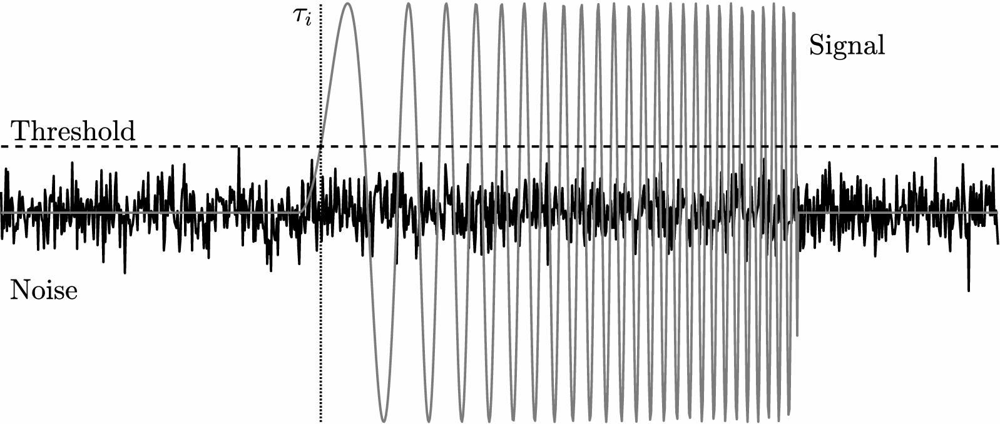

一种改进的边缘检测基于估计输入信号自相关前缘的形状。改进的TOA检测器具有误差方差：

 $$ \sigma_{\textrm{TOA,Edge}}^2 =\frac{1}{\xi }{\left[1+2\frac{\alpha }{\tau }+2{{\left(\frac{\alpha }{\tau }\right)}}^2 \right]} $$ 

其中ξ是信噪比，α是阈值参数， $\tau$ 是用于估计前缘形状的连续点之间的时间延迟(以码片为单位)。另一种技术是峰值检测，它基于对接收信号自相关函数峰值的估计，其误差方差为：

 $$ \sigma_{\textrm{TOA,Peak}}^2 =\frac{1}{\sqrt{2\xi }} $$ 

峰值检测提供了一个更简单的误差估计，并且对于阈值 $\alpha$ 和延迟 $\tau$ 的最合理值，它比边缘检测性能更好。

### 互相关处理

互相关TDOA估计需要在每个传感器对复杂的采样信号进行采样，并传送到中心融合进行处理。在中心融合处，将各对接收信号相互关联，定位峰值以确定两个传感器之间的TDOA，如下图所示。

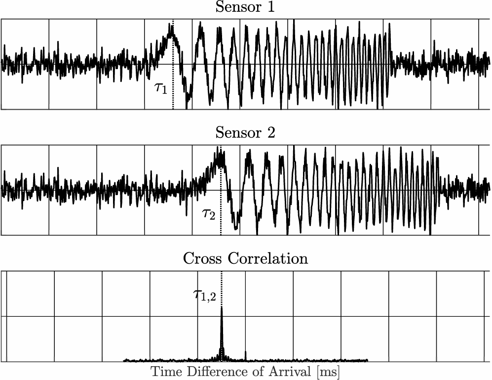

互相关处理的性能由辐射源信号的带宽决定。具有较宽带宽的信号将表现出较窄的互相关峰。与前缘检测情况类似：

 $$ \sigma_{\textrm{TDOA,xc}}^2 \ge \frac{1}{8\pi B_{\textrm{RMS}} BT\xi_{eff} } $$ 

其中，$\xi_{eff}$ 为有效信噪比，计算公式：

 $$ \xi_{eff} =\frac{1}{\frac{1}{\xi_1 }+\frac{1}{\xi_2 }+\frac{1}{\xi_1 \xi_2 }}\approx \min {(\xi_1 ,\xi_2 )} $$ 

$B$ 为信号的通带带宽， $T$ 为脉冲持续时间， $B_{\textrm{RMS}}$ 为发射信号 $S(f)$ 的均方根带宽：

 $$ B_{\textrm{RMS}} =\sqrt{\frac{\int_{-\infty }^{\infty }|S(f)|^2 f^2 df}{\int_{-\infty }^{\infty }|S(f)|^2 df}} $$ 

注意，对于频谱平坦的信号，简化为 $B_{\textrm{RMS}} =\frac{B}{\sqrt{3}}$ 。当使用互相关处理时，这些项增加了有效信噪比。与前沿情况不同，互相关处理受益于使用大量脉冲压缩的信号，例如LPI雷达。

### 时钟同步

随着系统变得更加精确，导致更高的信噪比水平和更小的单传感器TOA估计方差，传感器之间的时钟漂移开始占主导地位。我们可以合理地假设接收机噪声与时钟漂移无关，则TDOA的总误差可以认为是所有辐射源影响的总和。

GPS已经成为事实上的时间同步标准，因为它的全球可用性和易于实现，不需要在传感器之间进行协调，只需要为每个传感器配备一个GPS接收器并依赖其时间信号即可。对于非键控接收机，会导致100\-500ns的时间同步误差。美国海军天文台最近的测试表明，该系统能够将分布在2.5km区域内的传感器网络无线同步至200ps内。

## 定位性能

在一般高斯情况下，对于测量协方差矩阵 ${\mathbf{C}}_{\rho }$ ，费歇尔信息矩阵为：

 $$ \mathbf{F}(\mathbf{x})=\mathbf{J}(\mathbf{x}){\mathbf{C}}_{\rho }^{-1} {\mathbf{J}}^T (\mathbf{x}) $$ 

其中， $\mathbf{J}(\mathbf{x})$ 是对数似然函数的雅可比矩阵（对于TDOA， $\mathbf{J}{(\mathbf{x})}=[ \nabla_{\mathbf{x}} R_{1,N} ,\cdots,\nabla_{\mathbf{x}} R_{N-1,N} ]$ ），因此辐射源估计位置 $\hat{{\mathbf{x}}}$ 的协方差矩阵 $C_{\hat{\mathbf{x}} }$ 的阈值为：

 $$ {\mathbf{C}}_{\hat{\mathbf{x}} } \ge {{\left[\mathbf{J}{(\mathbf{x})}{\mathbf{C}}_{\rho }^{-1} {\mathbf{J}}^T {(\mathbf{x})} \right]}}^{-1} $$ 

该边界必须以数值方式求解。

## 局限性

本章假设传感器的位置是已知或者能够获取的，这在实际中是很难的，特别是对于移动的接收器，如无人机或海上舰船。虽然本章中的算法仍将产生中等精度的解，但它们不会达到预期的性能边界。

TDOA 中的另一个问题是存在多个发射器。多个发射器会导致数据融合问题，到达时间估计可能被错误地关联。通常，通过提供辅助信息以及到达时间统计信息（如脉冲描述字）来解决此问题，其中包括接收信号的各种参数，如脉冲宽度、中心频率、带宽、调制类型，甚至可能还有AOA（如果传感器配备了执行该测量的设备）。所有这些辅助信息都有助于融合处理中心消除脉冲到达时间的歧义。与峰值检测TOA的前沿相比，通过为融合中心提供完整的采样信号（而不是一些估计参数），相关TDOA的实现显著改善了排序问题。然而，即使不添加侧信道信息或互相关接收器，也有通过TDOA对多个辐射源进行定位的算法。有兴趣的读者可以参考相关文献。

TDOA 依赖于目标发出信号，并且容易受到电子静默（Emissions Control，EMCON）隐患的影响。更简单的系统（如在各个位置基于脉冲的边缘/峰值检测的系统）也无法处理连续波信号，并且对具有非常大扩频带宽和低能量频谱密度（W/Hz 频谱）的低截获概率（low probability of intercept，LPI）类型信号的能力较差。互相关接收机可以弥补这些辐射源的一些性能损失，但仍然容易受到目标无线电静默的影响。如果目标没有发射，或者没有在TDOA系统覆盖的频段内发射，则不会被检测或处理。

# FDOA

到达频率差（Frequency Difference of Arrival, FDOA）是一种类似于TDOA的高精度辐射源定位技术，用于生成非合作发射目标随时间变化的轨迹。与TDOA不同，FDOA要求辐射源或更常见的传感器移动，并且依赖于辐射源和每个目标之间相对速度的差异，这导致每个接收器的多普勒频移略有不同。测量并处理此差异以估计辐射源的位置。要获得精确的FDOA的频率测量值更加困难，特别在速度不确定性、信号幅度以及传感器的运动方向的情况下。由于这些原因，FDOA的使用频率低于TDOA。然而，它是一种容易理解且经常研究的技术。

## 背景

与TDOA类似，FDOA依赖于一组传感器，每个传感器估计未知辐射源发射信号的参数。主要区别在于，使用FDOA时，每个接收机需准确测量接收信号的频率。如果接收机（或辐射源）正在移动，则这些接收器中的每一个都将测量略有不同的信号频率，辐射源的载波频率由多普勒频移调制，代表每个传感器看到的辐射源相对速度。两个接收器之间的频率差可用于生成部分解，即辐射源所在的曲线。通过比较其他传感器的频率，可以形成位置估计。下图描绘了此方案的场景。

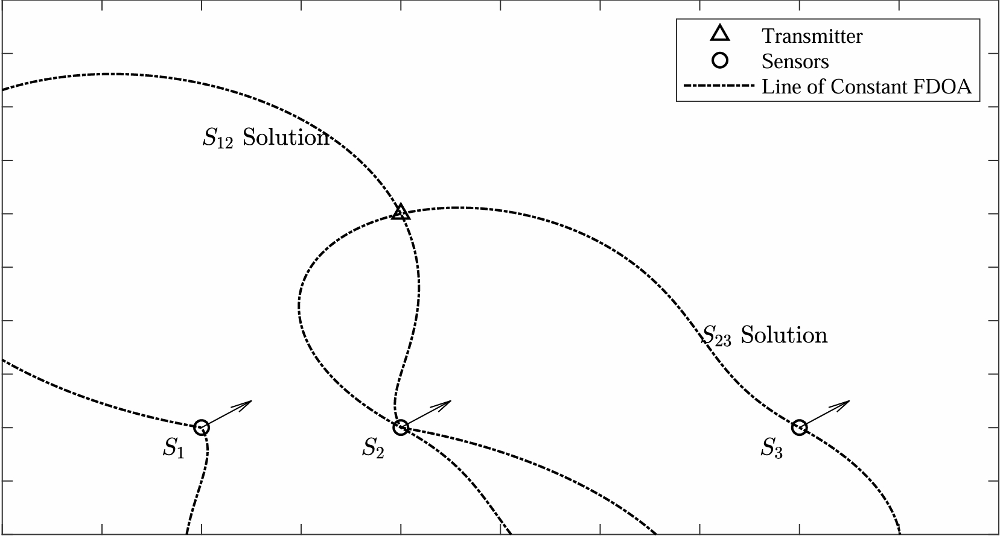

在TDOA的情况下，基本延迟是一个未知数，无法直接估计，但通过比较一组传感器的TDOA，可以估计未知的批量延迟。同样，对于FDOA，无法直接估计实际的载波频率 $f_0$ ，但通过比较每个传感器的FDOA，可以估计每个传感器的多普勒频移，并最终估计辐射源的位置。

由于其额外的复杂性，以及生成足够准确的频率测量的问题，FDOA不像TDOA那样被广泛采用或研究。然而，FDOA的几何公式和关于在卫星星座中的应用的讨论却很多。关于估计频率差（通常称为差分多普勒）基础精度和可实现辐射源位置精度的讨论可以追溯到20世纪70年代，早期的大部分工作都集中在声纳应用上。由于FDOA依靠速度已知的移动传感器，因此它最容易应用于卫星电子情报（electronic intelligence，ELINT）星座。

此外，与TDOA和三角测量类似，通过应用跟踪方法可以大大改善辐射源位置估计。为简单起见，我们考虑单个目标位置估计。

## 公式

发射信号 $s(t)$ 经历衰减、延迟和多普勒频移后：

 $$ y_i (t)=\alpha_i s(t-\tau_i )e^{jf_i (t-\tau_i )} +n_i (t) $$ 

其中 $\tau_i$ 是第i个接收器的时间延迟， $f_i$ 是由发射器和接收器之间的相对运动引起的多普勒频移， $n_i (t)$ 是噪声项。定义目标（位置x，速度v）与第i个传感器的的距离，以及距离变化率（距离随时间的变化）：

$$ R_i (\mathbf{x})\triangleq |\mathbf{x}-{\mathbf{x}}_i | ，{\dot{R} }_i (\mathbf{x},\mathbf{v})\triangleq \frac{{{({\mathbf{v}}_i -\mathbf{v})}}^T (\mathbf{x}-{\mathbf{x}}_i )}{R_i (\mathbf{x})}$$

根据该几何形状，时间延迟和多普勒频移给定为：

 $$\tau_i =\frac{R_i }{c} ， f_i =\frac{f_0 }{c}{\dot{R} }_i$$

类似TDOA中每对传感器产生一组等时线，FDOA中的每对传感器都有一组等多普勒轮廓（isoDoppler contours），或恒定多普勒差分线。定义两个传感器之间的频率差：

 $$ f_{m,n} (\mathbf{x},\mathbf{v})=f_m (\mathbf{x},\mathbf{v})-f_n (\mathbf{x},\mathbf{v})=\frac{f_0 }{c}{[\frac{{{({\mathbf{v}}_m -\mathbf{v})}}^T {(\mathbf{x}-{\mathbf{x}}_m )}}{{{\|\mathbf{x}-{\mathbf{x}}_m \|}}_2 }-\frac{{{({\mathbf{v}}_n -\mathbf{v})}}^T {(\mathbf{x}-{\mathbf{x}}_n )}}{{{\|\mathbf{x}-{\mathbf{x}}_n \|}}_2 }]} $$ 

为简单起见，假设 $v=0$ 。如果v不为0，则v表示一个额外的未知数（实际上，每个空间维度有一个未知数）。为了估计位置x以外的速度v，必须通过额外的传感器或模式（如TDOA或AOA）收集额外的信息，见下一章。

在下图中绘制了两个简单场景的等多普勒轮廓。在第一种情况下，速度与两个传感器的轴线对齐，并且轮廓类似于磁场的轮廓。传感器之间直接存在峰值频率差（一个为正，另一个为负），并且等值线逐渐向两个传感器左右两侧区域的相等点发展。在第二种情况下，速度垂直于中心轴。轮廓更复杂，但相对容易理解。在每个象限中，都有一个传感器是离轴的，且具有较小的多普勒频移（S0表示第一和第四个，S1表示第二和第三个）。在上象限中，更紧密对齐的具有更大的正位移，而在下象限中，它具有更大的负位移。在其他更现实的场景中，轮廓将更加复杂且难以直观地解释，但它们遵循这些相同的原则。

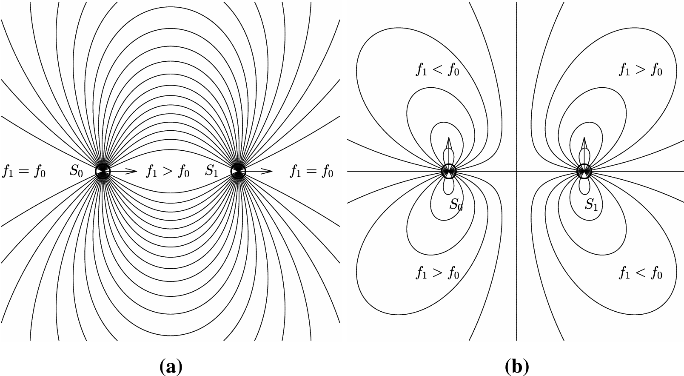

## 求解方法

通过第m个传感器与第n个传感器之间的多普勒频移计算距离变化率差 ${\dot{R} }_{m,n} (\mathbf{x})$ ：

 $$ {\dot{R} }_{m,n} (\mathbf{x})=\frac{c}{f_0 }f_{m,n} (\mathbf{x})={\frac{{\mathbf{v}}_m^T {(\mathbf{x}-{\mathbf{x}}_m )}}{{{\|\mathbf{x}-{\mathbf{x}}_m \|}}_2 }-\frac{{\mathbf{v}}_n^T {(\mathbf{x}-{\mathbf{x}}_n )}}{{{\|\mathbf{x}-{\mathbf{x}}_n \|}}_2 }} $$ 

收集全矢量：

 $$ \dot{\mathbf{r}} (\mathbf{x})={{[ {\dot{R} }_{1,N} (\mathbf{x}),\cdots,{\dot{R} }_{N-1,N} (\mathbf{x}) }}^T $$ 

距离变化率差分矢量的噪声测量给定为：

 $$ \dot{\rho} =\dot{\mathbf{r}} (\mathbf{x})+\mathbf{n} $$ 

其中， $\mathbf{n}$ 是协方差 ${\mathbf{C}}_{\dot{\mathbf{r}} }$ 的高斯随机向量。假设所有频率测量都是独立的，方差为 $\sigma_m^2$ （单位： ${\textrm{Hz}}^2$ ）。因此，可以通过将多普勒频率差转换为距离差变化率，协方差矩阵写为：

 $$ {\mathbf{C}}_{\dot{\mathbf{r}} } =\frac{c^2 }{f_0^2 }{\left[\begin{array}{cccc} \sigma_1^2 +\sigma_N^2  & \sigma_N^2  & \cdots  & \sigma_N^2 \newline \sigma_N^2  & \sigma_2^2 +\sigma_N^2  & \ldots & \sigma_N^2 \newline \vdots  & \vdots  & \ddots  & \vdots \newline \sigma_N^2  & \sigma_N^2  & \cdots  & \sigma_{N-1}^2 +\sigma_N^2  \end{array}\right]} $$ 

其中， ${\mathbf{C}}_{\dot{\mathbf{r}} }$ 以 $m^2 /s^2$ 为单位。这与我们在距离差分矢量 $\dot{\mathbf{r}} (\mathbf{x})$ 中测量 $\dot{\rho}$ 具有相同的形式。因此，概率密度函数（probability density function，PDF）和对数似然函数类似地给出：

$$f_{\mathbf{x}} {(\dot{\rho} )}={{(2\pi )}}^{-\frac{{(N-1)}}{2}} {{∣{\mathbf{C}}_{\dot{\mathbf{r}} } ∣}}^{-1/2} e^{-\frac{1}{2}{{(\dot{\rho} -\dot{\mathbf{r}} (\mathbf{x}))}}^T {\mathbf{C}}_{\dot{\mathbf{r}} }^{-1} {(\dot{\rho} -\dot{\mathbf{r}} (\mathbf{x}))}}$$

 $$\ell {(\mathbf{x}|\dot{\rho} )}=-\frac{1}{2}{{(\dot{\rho} -\dot{\mathbf{r}} {(\mathbf{x})})}}^T {\mathbf{C}}_{\dot{\mathbf{r}} }^{-1} {(\dot{\rho} -\dot{\mathbf{r}} {(\mathbf{x})})}$$

### 最大似然估计

最大似然估计是通过最大化给定的未知发射极位置x的对数似然 $\dot{\rho}$ 来得出的。取对未知传感器位置x的对数似然的导数：

 $$ \nabla_{\mathbf{x}} \ell (\mathbf{x}|\dot{\rho} )=\mathbf{J}{(\mathbf{x})}{\mathbf{C}}_{\dot{\mathbf{r}} }^{-1} {(\dot{\rho} -\dot{\mathbf{r}} {(\mathbf{x})})} $$ 

其中， $\mathbf{J}{(\mathbf{x})}$ 是 $\dot{\mathbf{r}} {(\mathbf{x})}$ 的雅可比矩阵：

 $$ \mathbf{J}{(\mathbf{x})}={[\nabla_{\mathbf{x}} {\dot{R} }_{1,N} ,\ldots,\nabla_{\mathbf{x}} {\dot{R} }_{N-1,N} ]} $$ 

 $\nabla_{\mathbf{x}} {\dot{R} }_{n,N}^T$ 是距离差变化率对辐射源（第n个传感器和参考传感器之间）的梯度矩阵：

 $$ \nabla_{\mathbf{x}} {\dot{R} }_{n,N} ={(\mathbf{I}-{\mathbf{P}}_n (\mathbf{x}))}\frac{{\mathbf{v}}_n }{{{\|{\mathbf{x}}_n -\mathbf{x}\|}}_2 }-{(\mathbf{I}-{\mathbf{P}}_N (\mathbf{x}))}\frac{{\mathbf{v}}_N }{{{\|{\mathbf{x}}_N -\mathbf{x}\|}}_2 } $$ 

其中， $P_n (\mathbf{x})=\frac{{(\mathbf{x}-{\mathbf{x}}_n )}{{(\mathbf{x}-{\mathbf{x}}_n )}}^T }{{{\|\mathbf{x}-{\mathbf{x}}_n \|}}_2^2 }$ 是在第n个传感器和辐射源之间视距上的投影矩阵。该式表明传感器n和参考传感器N之间距离差变化率主要对与该传感器的视距正交的每个传感器的速度分量以及该传感器与辐射源之间的距离敏感。同时，当vn正交于x—xn或vN正交于x—xN时，性能将最大化（梯度对x的变化最敏感），因为这将导致 ${\dot{R} }_{n,N}$ 的最大变化。

### 迭代最小二乘解

在雅可比矩阵 $\mathbf{J}{(\mathbf{x})}$ 中收集每个距离速率差的梯度。由此，我们可以表示关于某个位置估计值 $x^{(i)}$ 的线性近似值和偏移量 $\Delta x^{(i)}$ ：

 $$ \dot{\mathbf{r}} {\left({\mathbf{x}}^{(i)} +\Delta {\mathbf{x}}^{(i)} \right)}=\dot{\mathbf{r}} {\left({\mathbf{x}}^{(i)} \right)}+{\mathbf{J}}^T {\left({\mathbf{x}}^{(i)} \right)}\Delta {\mathbf{x}}^{(i)} $$ 

其余的推导与上章中的推导相同，只是将几个变量替换为FDOA等效项。值得注意的是，距离差矢量 $\mathbf{r}$ 替换为距离差变化率 $\dot{\mathbf{r}}$ 、对应的测量矢量、协方差矩阵和雅可比矩阵。

回顾前文，为了保证有解，雅可比矩阵 $\mathbf{J}$ 的列数不得多于行数。换言之，唯一FDOA对的数量（N\-1）必须不小于空间维度的数量。如果辐射源速度也是未知的，则唯一FDOA对的数量（N\-1）必须大于空间维度数的两倍。这是必要条件，但不是充分条件。即使 $\mathbf{J}$ 包含的列数多于行数，它也有可能无解；当一列是其他列的线性组合时，就是这种情况。类似TDOA，假设 $x^{(i)}$ 足够接近真实位置（问题确实是局凸的），最小二乘解并不能保证是最优的，只能保证最终解比初始估计值 $x^{(i)}$ 更近。为了获得准确的解决方案，必须以迭代方式重复该过程。

这种方法的主要局限性是需要重复计算才能达到收敛性，并且需要足够准确的初始位置估计。非常重要的是，必须理解“足够准确”的定义本身就是病态的，因此很难保证用来播种这种方法的初始位置估计满足局凸的要求。此外，该技术还存在鲁棒性问题，即估计值可能与真实辐射源位置大相径庭。为了提高数值稳定性，建议项算法仅提供 ${\mathbf{C}}_{\dot{\rho} }$ 的对角元，而不是完整的协方差矩阵。可以考虑约束和其他优化函数从而提高估计的准确性。

### 梯度下降算法

通过将FDOA定义替换为雅可比 $\mathbf{J}{\left(\mathbf{x}\right)}$ 和偏移向量 $\mathit{\mathbf{y}}\left(\mathit{\mathbf{x}}\right)$ ，将上章中的梯度下降算法直接应用于FDOA定位。梯度下降算法最重要的特征也许是更新方程不包含矩阵求逆，因此它的计算速度比迭代最小二乘解快得多。主要的缺点仍然是需要一个适当准确的初始估计，以便可以假设目标函数的凸性。

### 其他方法

Cameron针对两个FDOA接收机推导出了一种特殊解法，利用随着时间变化的样本（假设是静止接收机），并随机采样了3组测量，从每组形成了一个定位，然后在解中达成一致。这是RANSAC（随机抽样一致性）算法在FDOA的应用，它依赖FDOA方程组的多项式表示。

使用来自两个传感器的重复测量的更广泛方法利用静止辐射源假设在n个不同的时间点生成n个 FDOA 测量值，如下图所示。这种方法对于FDOA非常有用，因为辐射源已经被假定为静止的，并且它最大限度地减少了所需的传感器平台数量（从3维FDOA的四个减少到两个）。唯一的缺点是辐射源需要在更长的观察间隔内处于活动状态，以允许移动传感器穿越更大的基线（理想情况下，远距离定位基线>10km），并且带来在环境人口稠密情况下融合测量值的额外挑战。

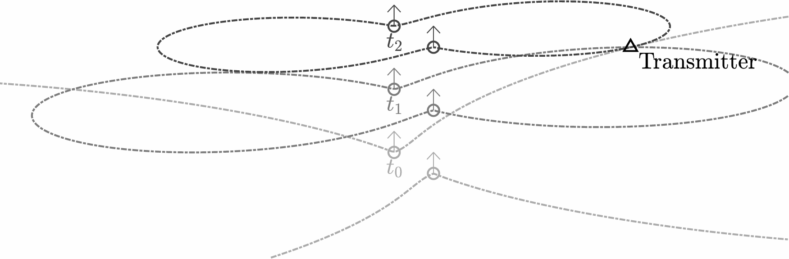

Mušicki和Koch指出，虽然FDOA的测量值是高斯的，但当它们投影到空间坐标上时，它们显然是非高斯的（因为 $\dot{\mathbf{r}} {(\mathbf{x})}$ 是非线性的）。因此，使用高斯假设来推导ML估计值和CRLB虽然方便，但并不严谨。他们认为，在观测空间内的正确估计需要对各种FDOA测量进行非线性信息融合，他们使用高斯测量混合（Gaussian of mixture model，GMM）算法实现。尽管有上述观点，但鉴于高斯假设易于推导和计算，本文继续基于该假设进行CRLB分析。但是，我们必须承认其存在缺陷。

## FODA估计

FDOA的关键分量是每对传感器之间频率差的估计。类似TDOA，这可以通过首先估计每个传感器的频率，然后比较这些估计值，或者直接比较接收信号来实现。后者要准确得多，但会带来传输原始传感器数据的额外负担。

### 到达频率估计

通常，频率分辨率受奈奎斯特采样极限的限制：

 $$ \sigma_f \ge 1/T_s $$ 

其中， $T_s$ 是观测间隔。虽然奈奎斯特定理限定了近距离信号的分辨能力，但这不会限定估计精度，CRLB给出更好的限定。未知正弦波频率估计的CRLB：

 $$ \sigma_f^2 \ge \frac{3}{\pi^2 t_s^2 M(M^2 -1)\xi } $$ 

其中 $t_s$ 是采样周期（单位：秒）；M是采样次数， $\xi$ 是每个采样的SNR。

### FDOA估计

Stein在1981年给出了两个接收器之间FDOA测量的CRLB的经典结果。如果我们假设时间延迟可以忽略不计，那么频率差估计值为：

 $$ \sigma_{fd}^2 \ge \frac{1}{4\pi^2 T_{rms}^2 B_r T_s \xi_{eff} } $$ 

其中， $T_{\textrm{rms}}$ 是RMS信号持续时间（类似于上章中使用的RMS带宽）， $B_r T_s$ 是发射信号的时间带宽乘积（分别取决于接收机带宽和观察间隔）：

 $$ T_{rms}^2 =\frac{\int_{-\infty }^{\infty } t^2 |s(t)|^2 dt}{\int_{-\infty }^{\infty } |s(t)|dt} $$ 

 $\xi_{eff}$ 在上章中被定义为结合两次测量得到的有效SNR：

 $$ \xi_{eff} =2{{\left[\frac{1}{\xi_1 }+\frac{1}{\xi_2 }+\frac{1}{\xi_1 \xi_2 }\right]}}^{-1} $$ 

对于持续时间为 $T_s$ 恒定包络的信号，RMS持续时间简化为：

 $$ T_{rms}^2 =\frac{\int_0^{T_s } t^2 dt}{\int_0^{T_s } 1dt}=\frac{T_s^2 }{3} $$ 

因此，CRLB可以被重写：

 $$ \sigma_{fd}^2 \ge \frac{3}{4\pi^2 B_r T_s^3 \xi_{eff} } $$ 

未调制脉冲 $(B_r T_s =1)$ 和已调制脉冲 $(B_r T_s =1000)$ 相比。调制脉冲频率差估计精度更好。

### 频率估计的局限性

请注意，对于某些波形，延迟和多普勒之间存在固有的模糊性。因此，如果没有假设延迟可以忽略不计（或以其他方式已知），则无法可靠地估计频率差。线性调频（linear frequency modulated，LFM）啁啾最为明显，它在脉冲期间扫过整个频率，并被雷达系统广泛使用。如果目标信号是啁啾信号，则很难准确测量延迟和多普勒。同样，对于更通用的宽带系统，多普勒频移不是简单的频移，而是时间轴的延伸，需要更复杂的算法来准确估计它。

## 定位性能

类似TDOA，使用CRLB将定位性能作为几何形状和单个传感器性能的函数。上章中TDOA的CRLB可以直接应用，只需替换可比较的变量即可。协方差矩阵 ${\mathbf{C}}_{\rho }$ 被 ${\mathbf{C}}_{\dot{\rho} }$ 替换，雅可比矩阵 $\mathbf{J}$ 替换为其对应的FDOA：

 $$ {\mathbf{C}}_{\hat{\mathbf{x}} } \ge {{\left[\mathbf{J}{(\mathbf{x})}{\mathbf{C}}_{\dot{\rho} }^{-1} {\mathbf{J}}^T {(\mathbf{x})}\right]}}^{-1} $$ 

该解必须用数值形式求解。

## 局限性

FDOA 依赖于来自多个来源的信息融合，TDOA 和 AOA 也是如此。多传感器信息融合的主要限制之一是该信息的可靠性。如果攻击者可以污染信息或向数据流注入虚假报告，则可能会削弱定位性能。这个问题仍然是一个有待深入研究的开放领域。TDOA的所有其他限制也同样适用于FDOA，包括多目标定位、数据关联、错误的位置估计，以及EMCON隐患。

# TDOA/FDOA组合

前面的章节讨论了在多个传感器上使用角度、时间和频率估计来确定辐射源的位置，传感器是相互孤立的。本章将考虑3个参数的联合使用。文献中讨论的最常见方式是 TDOA 和 FDOA 技术的配对，因为两者都可以通过每个接收站的简单传感器来完成，并且只需要传感器或辐射源移动（以产生FDOA所需的差分多普勒）。

## 背景

联合考虑TDOA和FDOA的常用参数是等值测量（iso\-measurement）等高线（TDOA等距和FDOA等多普勒）。由于沿着这些等值线的定位误差最大，TDOA和FDOA的误差通常是互补的。因此，可以利用来自TDOA的信息在一个维度上获得准确测量，而在另一个维度通过FDOA来测量。遗憾的是，FDOA等高线的复杂性并不能保证正确性。

## 公式

可以通过组合分量系统方程来构建AOA、TDOA和FDOA的等式方程，从而实现定位。

 $$ \mathbf{z}={\left[\begin{array}{c} \mathbf{p}(\mathbf{x})\\ \mathbf{r}(\mathbf{x})\\\dot{\mathbf{r}} (\mathbf{x}) \end{array}\right]} $$ 

上式中， $\mathbf{p}(\mathbf{x})$ 、 $\mathbf{r}(\mathbf{x})$ 、 $\dot{\mathbf{r}} (\mathbf{x})$ 分别为AOA、TDOA、FDOA相关参数。如果假设每个测量值都以高斯随机向量的形式分布，则总测量值的概率分布为：

 $$ \zeta \sim \mathcal{N}{(\mathbf{z},{\mathbf{C}}_{\mathbf{z}} )} $$ 

其中， $\zeta =[ \psi^T ,\rho^T ,{\dot{\rho} }^T ]^T$ 是测量噪声矢量； ${\mathbf{C}}_{\mathbf{z}}$ 是其协方差矩阵。此协方差矩阵可以采用多种形式。例如，如果我们有N个能够测量角度、时间和频率的传感器，并且传感器之间的测量值是独立且相同的，则联合协方差矩阵将采用以下形式：

 $$ {\mathbf{C}}_{\mathbf{z}} =\left[\begin{array}{ccc} {\mathbf{C}}_{\psi }  & 0_{N,N-1}  & 0_{N,N-1} \\ 0_{N-1,N}  & {\mathbf{C}}_{\rho }  & {\mathbf{C}}_{\rho ,\dot{\rho} } \\ 0_{N-1,N}  & {\mathbf{C}}_{\rho ,\dot{\rho} }^T  & {\mathbf{C}}_{\dot{\rho} }  \end{array}\right] $$ 

其中 ${\mathbf{C}}_{\psi }$ 是所有AOA测量值的NxN协方差矩阵， ${\mathbf{C}}_{\rho }$ 是TDOA测量值的(N\-1)x(N\-1)协方差矩阵（假设使用公共参考传感器）； ${\mathbf{C}}_{\dot{\rho} }$ 是FDOA测量值的(N\-1)x(N\-1)协方差矩阵（同样假设使用公共参考矩阵）； ${\mathbf{C}}_{\rho ,\dot{\rho} }$ 是TDOA和FDOA测量值之间的(N\-1)x(N\-1)互协方差矩阵。如果传感器是单功能的（即有 $N_a$ 个AOA传感器、 $N_t$ 个TDOA传感器和 $N_f$ 个FDOA传感器，没有重叠），则协方差矩阵 ${\mathbf{C}}_{\mathbf{z}}$ 将是块对角线（ ${\mathbf{C}}_{\rho ,\dot{\rho} }$ 将是零矩阵）。

由于测量矩阵 $\zeta$ 只是分量测量向量的堆叠形式（高斯联合），因此对数似然函数 $\ell {(\mathbf{x}|\zeta )}$ 为：

 $$ \ell {(\mathbf{x}|\zeta )}=-\frac{1}{2}{{(\zeta -\mathbf{z}(\mathbf{x}))}}^H {\mathbf{C}}_{\mathbf{z}}^{-1} {(\zeta -\mathbf{z}(\mathbf{x}))} $$ 

同理，可以使用上几章中的分量来定义雅可比矩阵：

 $$ \mathbf{J}(\mathbf{x})= [{\mathbf{J}}_{\mathbf{p}} (\mathbf{x}),  {\mathbf{J}}_{\mathbf{r}} (\mathbf{x}),  {\mathbf{J}}_{\dot{\mathbf{r}} } (\mathbf{x}) ] $$ 

在完整测量场景中（所有N个传感器都测量TDOA、FDOA和AOA）， $\mathbf{J}(\mathbf{x})$ 将有 $3N-2$ 列，每个空间维度一行。在减少测量的情况下，将有 $N_a +N_t +N_f$ 列（ $N_a$ 个AOA传感器、 $N_t$ 个TDOA传感器对和 $N_f$ 个FDOA传感器对）。

## 求解方法

对于最大似然解，如下图，如果从基线提高测向精度，则可以降低超出目标范围的不确定性。如果提高TDOA精度，则几乎可以完全消除横向距离误差，但不影响下降距离的不确定性。如果提高FDOA精度，则在目标之外和离目标更近的位置，下降距离精度都会有显著提高。

### 数值可处理解

在前面的章节中，强调了最小二乘法和梯度下降法对近似迭代解的效用。相同的求解器也可以应用于混合定位，但要对散度和准确性做相同说明。

### 其他解法

这里介绍的算法均是通用解法，旨在为进一步的研究和分析提供基础。它们并不针对当前问题进行专门调整，通常可以通过针对特定应用的解法加以改进。系统通常不直接将测向传感器与TDOA和FDOA结合使用，而是经常将后者一起分析。

## 联合参数估计

本节将讨论到达角（AOA）、到达时间（TOA）和到达频率（FOA）的不确定性对其他参数的影响。

### AOA估计

前面介绍了AOA，通常认为它独立于是TDOA和FDOA测量。对于阵列处理尤其如此，在阵列处理中，首先可以针对一系列转向角信号，然后可以分析每个转向角的数据以检测信号并估计其时间和频率成分。因此，可以安全地假设：①AOA测量值是高斯测量值并且彼此独立；②它们都独立于TDOA和FDOA测量值。即， ${\mathbf{C}}_{\psi }$ 是一个对角矩阵，且交叉项 ${\mathbf{C}}_{\psi ,\rho }$ 和 ${\mathbf{C}}_{\psi ,\dot{\rho} }$ 为零。

### 时间/频率差的联合估计

频率差的直接估计在已知或未知多余参数（例如两个信号之间的幅度、延迟和相位差）的各种条件下和各种假设下，以及其中某个参数是否是无噪声的（已知参考信号或被视为参考的第二噪声接收信号），已经广泛研究了频率差的直接估计（窄带信号的多普勒补偿）。

通过交叉模糊函数最容易计算时间和频率估计。给定来自传感器n和m的数据，定义了交叉模糊函数（对于某些频移 $\omega$ 和延迟 $\tau$ ）：

 $$ \chi_{n,m} {(\omega ,\tau )}=\int_0^T s_n (t)s_m^{\ast } {(t+\tau )}e^{-j\omega t} dt $$ 

通过搜索 $\chi_{n,m} {(\omega ,\tau )}$ 的峰值，可以估计时延和频移：

 $$ [ {\hat{\omega} }_{n,m} ,{\hat{\tau} }_{n,m} ] =\arg \max_{\omega ,\tau } |\chi_{n,m} {(\omega ,\tau )}| $$ 

Stein在1981年给出了两个接收机之间TDOA和FDOA的CRLB经典结果，但该结果适用于声纳信号模型，其中接收信号的方差取决于未知的相对速度。在正确的射频信号模型中，延迟和多普勒是确定性（但未知）参数，因此它们对信号方差没有影响，并且可以形成更严格的界限。在下面的信号模型中，延迟 $(\kappa)$ 是样本中的数字化延迟（对于采样率 $t_s$ ， $\tau =\kappa t_s$ ），多普勒 $(\nu )$ 以弧度/样本为单位（ $\omega =\nu /t_s$ ）。

 $${\mathbf{s}}_1 =\mathbf{s}+{\mathbf{n}}_1 ， {\mathbf{s}}_2 =ae^{j\phi } {\mathbf{D}}_{\nu } {[{\mathbf{W}}^H {\mathbf{D}}_{\kappa } \mathbf{W}]}\mathbf{s}+{\mathbf{n}}_2$$ 

其中 ${\mathbf{D}}_{\kappa }$ 是延迟矩阵， ${\mathbf{D}}_{\nu }$ 是多普勒矩阵，定义为：

$$\mathbf{W}=\frac{1}{\sqrt{M}}\exp{(-j\frac{2\pi }{M}{\mathbf{m}\mathbf{m}}^T )} ,{\mathbf{D}}_{\kappa } =\textrm{diag}{\left\{\exp {(-j\frac{2\pi }{M}\kappa \mathbf{m})}\right\}}$$ 
 
$${\mathbf{D}}_{\nu } =\textrm{diag}{\{\exp {(-j\nu \mathbf{m})}\}}, \mathbf{m}={{[-\frac{M}{2},-\frac{M}{2}+1,\cdots,\frac{M}{2}-1]}}^T$$

全未知参数矢量为：

 $$ \vartheta =[ \Re \{{\mathbf{s}}^T \} ,\Im\{{\mathbf{s}}^T \} ,a,\phi ,\kappa ,\nu ]^T $$ 

可以看出，费歇尔信息矩阵（fisher information matrix，FIM）是块对角矩阵，上子块为未知信号( $\mathbf{s}$ )和振幅差( $a$ )，下子块为相位( $\phi$ )、时延( $\kappa$ )和多普勒( $\nu$ )。这些块的交叉项均为0，因此当我们求逆时，下对角子块(对于 $\bar{\vartheta} =[ \phi ,\kappa ,\nu ]^T$ )不会受到上子块的影响。因此，我们可以忽略估计 $\mathbf{s}$ 和 $a$ 时的不确定性。第二个子块为：

 $$ {\mathbf{F}}_{\bar{\vartheta} } =\frac{2}{a^2 \sigma_1^2 +\sigma_2^2 }\times {\left[\begin{array}{ccc} E_s  & -{\mathbf{s}}^H \bar{\mathbf{s}}  & {\tilde{\mathbf{s}} }^H \mathbf{M}\tilde{\mathbf{s}} \\ -{\mathbf{s}}^H \bar{\mathbf{s}}  & {\bar{\mathbf{s}} }^H \bar{\mathbf{s}}  & -\Re {{{\bar{\mathbf{s}} }^H {\mathbf{Q}}_{\kappa ,\nu }^H \mathbf{M}\tilde{\mathbf{s}} }}\\ {\tilde{\mathbf{s}} }^H \mathbf{M}\tilde{\mathbf{s}}  & -\Re {{{\bar{\mathbf{s}} }^H {\mathbf{Q}}_{\kappa ,\nu }^H \mathbf{M}\tilde{\mathbf{s}}}} & {\tilde{\mathbf{s}} }^H {\mathbf{M}}^2 \tilde{\mathbf{s}}  \end{array}\right]} $$

其中， $\mathbf{F}$ 是单个DFT矩阵； $\sigma_1^2$ 和 $\sigma_2^2$ 分别是 $s_1 (t)$ 和 $s_2 (t)$ 的噪声方差。修正后的信号矢量和辅助矩阵定义为：

$$\overline{\mathrm{s}} =\frac{2\pi }{M}{\mathbf{W}}^H \mathbf{MWs} , \tilde{\mathrm{s}} ={\mathrm{Q}}_{\kappa ,\nu } \mathrm{s}={\mathrm{D}}_{\nu } [ {\mathrm{W}}^H {\mathrm{D}}_{\kappa } \mathrm{W}] \mathrm{s}$$ $$\mathbf{M}=\mathrm{diag}\{ \mathbf{m}\} , {\mathrm{Q}}_{\kappa ,\nu } ={\mathbf{D}}_{\nu } [ {\mathbf{W}}^H {\mathbf{D}}_{\kappa } \mathbf{W}]$$ 

我们注意到，对角项是信号能量，类似RMS带宽（乘以信号能量）的项。如果忽略非对角线项，则将剩余的矩阵求逆会得出前几章中DF（Direction Finding）、TDOA和FDOA精度的边界。

我们希望用距离差和距离差变化率来表示CRLB，因为它们是 ${\mathbf{C}}_{\zeta }$ 的分量。注意到，从 $[ \phi ,\kappa ,\nu ]$ 到 $[ r,\dot{r} ]$ 的转换为：

 $$ {\left[\begin{array}{c} r_{n,m} \\ {\dot{r} }_{n,m}  \end{array}\right]}={\left[\begin{array}{ccc} 0 & ct_s  & 0\\ 0 & 0 & \frac{c}{2\pi f_0 t_s } \end{array}\right]}{\left[\begin{array}{c} {\hat{\phi} }_{n,m} \\ \kappa_{n,m} \\ \nu_{n,m}  \end{array}\right]} $$ 

其中， $t_s$ 是采样间隔； $f_0$ 是信号的中心频率。则未知变量函数的CRLB为：

 $$ {\mathbf{C}}_{r,\dot{r} } ={\left[\begin{array}{ccc} 0 & ct_s  & 0\\ 0 & 0 & \frac{c}{2\pi f_0 t_s } \end{array}\right]}{\mathbf{F}}_{\phi ,\kappa ,\nu }^{-1} {\left[\begin{array}{ccc} 0 & 0\\ ct_s  & 0\\ 0 & \frac{c}{2\pi f_0 t_s } \end{array}\right]} $$ 

这是来自一组传感器的一组TDOA/FDOA测量的CRLB。

### 全协方差矩阵

全协方差 ${\mathbf{C}}_{\mathbf{z}}$ 是每个测量值的方差及其对测量值的交叉协方差的集合，由块对角矩阵给出：

 $$ {\mathbf{C}}_{\mathbf{z}} ={\left[\begin{array}{cc} {\mathbf{C}}_{\psi }  & 0\\ 0 & {\mathbf{C}}_{\mathbf{r},\dot{\mathbf{r}} }  \end{array}\right]} $$ 

对于 $N_a$ 个不同的测向传感器， ${\mathbf{C}}_{\psi }$ 的大小为 $N_a {\times N}_a$ 。如果我们假设有 $N_0$ 个不同的TDOA/FDOA传感器对，则 ${\mathbf{C}}_{\mathbf{r},\dot{\mathbf{r}} }$ 将有 $N_0$ 行和 $N_0$ 列，并且由4个块对角矩阵组成：

 $$ {\mathbf{C}}_{\mathbf{r},\dot{\mathbf{r}} } ={\left[\begin{array}{cc} {\mathbf{C}}_{\mathbf{r}}  & {\mathbf{S}}_{\mathbf{r},\dot{\mathbf{r}} } \\ {\mathbf{S}}_{\mathbf{r},\dot{\mathbf{r}} }  & {\mathbf{C}}_{\dot{\mathbf{r}} }  \end{array}\right]} $$ 

其中， ${\mathbf{C}}_{\mathbf{r}}$ 和 ${\mathbf{C}}_{\dot{\mathbf{r}} }$ 是时间和频率估计的方差；对角矩阵 ${\mathbf{S}}_{\mathbf{r},\dot{\mathbf{r}} }$ 是每个TDOA测量值与其配对的FDOA测量值之间的交叉项的对角矩阵。

如果存在一个公共参考传感器（如前几章中所述），则误差协方差矩阵将采用与前几章相同的形式，具有块对角矩阵和公共方差项：

 $$ {\mathbf{C}}_{\mathbf{r},\dot{\mathbf{r}} } ={\left[\begin{array}{cc} {\mathbf{C}}_{\mathbf{r}} +\sigma_{r_N }^2  & {\mathbf{S}}_{\mathbf{r},\dot{\mathbf{r}} } +\sigma_{r_N ,{\dot{r} }_N } \\ {\mathbf{S}}_{\mathbf{r},\dot{\mathbf{r}} } +\sigma_{r_N ,{\dot{r} }_N }  & {\mathbf{C}}_{\dot{\mathbf{r}} } +\sigma_{{\dot{r} }_N }^2  \end{array}\right]} $$ 

其中，矩阵项由 $N-1$ 个唯一传感器给出，标量项 $\sigma_{r_N }^2$ 、 $\sigma_{{\dot{r} }_N }^2$ 和 $\sigma_{r_N ,{\dot{r} }_N }$ 是公共参考传感器的误差。

## 性能分析

对于定位性能，使用CRLB，定义为FIM的倒数：

 $$ {\mathbf{C}}_{\hat{\mathbf{x}} } \ge {{[ \mathbf{J}{(\mathbf{x})}{\mathbf{C}}^{-1} {\mathbf{J}}^T {(\mathbf{x})} ]}}^{-1} $$ 

其中，雅可比矩阵 $\mathbf{J}{(\mathbf{x})}$ 和 $\mathbf{C}$ 是完整形式，包含本章中定义的所有AOA、TDOA和FDOA测量。

## 局限性

前几章简要讨论了TDOA和FDOA的局限性，最关键的是强调了准确获取传感器位置和速度的重要性，否则到达时间/频率差测量会增加很大的误差。结合AOA测量数据会有所帮助，主要是因为引起的误差与TDOA和FDOA测量中引起的误差不相关，并且固有界限更广（传感器定位中出现10m的位置误差会在AOA辐射源估计中产生10m误差；对于TDOA和FDOA，所引起的估计误差可能更大）。

对全部3种模式，还有另一组误差同样值得考虑，并且对联合定位带来了重大挑战，那就是多路径。多径回波的到达角与直达路径不同，并可能导致虚假目标或AOA错误测量。将来自多个目标的TDOA、FDOA和AOA测量值正确关联起来（尤其是在存在多径的情况下），这是一个极具挑战性的问题，本文中的算法或性能预测并未解决这一问题。