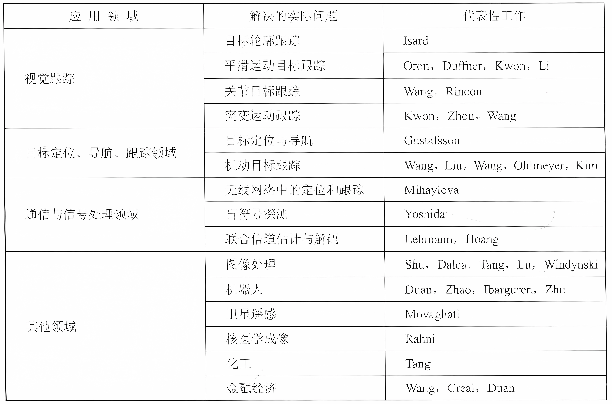
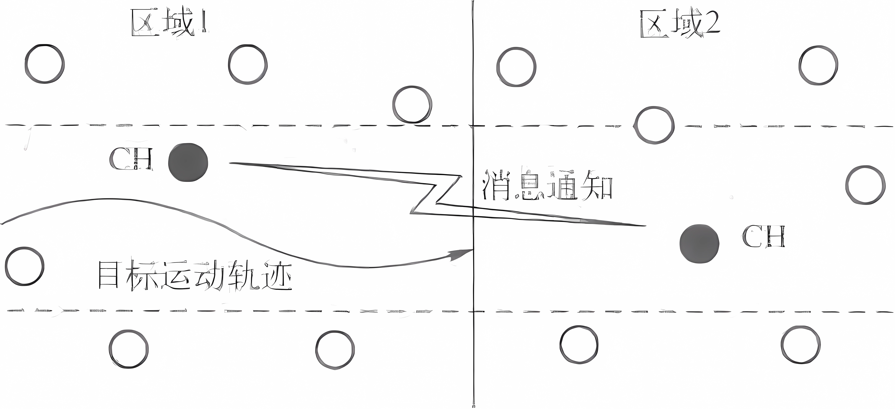

# 粒子滤波原理及应用-MATLAB仿真 / 黄小平, 王岩, 缪鹏程编著

作者：洋盘男人

> 《粒子滤波原理及应用-MATLAB仿真》书籍笔记及代码

> 代码链接：[Code_Link](https://github.com/yangpannanren/Book_Code/tree/main/粒子滤波原理及应用-MATLAB仿真)

[TOC]

# 绪论
## 粒子滤波的发展历史

滤波的先决条件是给系统建立数学模型，包括状态方程和观测方程。通常，系统模型具有复杂的非线性和非高斯分布的特性。

## 粒子滤波的现状及趋势

粒子滤波的思想基于蒙特卡洛方法，它利用粒子集来表示概率，可以用在任何形式的状态空间模型上。其核心思想是通过从后验概率中抽取的随机状态粒子来表达其分布，是一种顺序重要性采样法(Sequential Importance Sampling)。

## 粒子滤波的特点

粒子滤波(Particle Fiter，PF)是一种基于蒙特卡洛仿真的近似贝叶斯滤波算法。它通过计算粒子集合的样本均值来估计被辨识的参数，是一种概率统计的算法。它的核心思想是用一组离散的随机采样点(即粒子集合)来近似系统随机变量的概率密度函数，以样本均值代替积分运算，从而获得状态的最小方差估计。粒子滤波的粒子集合根据贝叶斯准则进行适当的加权和递归传播。

从其滤波机理来讲，主要有以下特点：

1.  噪声模型不受限制。与卡尔曼滤波相比，粒子滤波无须知道系统的噪声模型，即可以估计被任何形式的噪声干扰过的数据。而卡尔曼滤波只能用在高斯噪声模型中，而且必须知道系统过程噪声和测量噪声的均值和方差，而这些参数在实际应用中往往很难获取。粒子滤波是基于概率统计的，它可以不用知道系统的过程噪声和测量噪声，因此它能够广泛应用在线性与非线性系统的参数估计中。卡尔曼滤波只能处理高斯噪声，粒子滤波既可以处理高斯噪声，又可以处理非高斯噪声:粒子滤波是不受噪声模型限制的。
2. 系统模型不受限制。卡尔曼滤波只能处理线性系统，对于非线性系统的处理，往往需要借助扩展卡尔曼滤波或无迹卡尔曼滤波。而粒子滤波既可以处理线性系统中的滤波问题，也可以处理非线性系统滤波问题。简单来说，粒子滤波法是指通过寻找一组在状态空间传播的随机样本对概率密度函数进行近似，以样本均值代替积分运算，从而获得状态最小方差分布的过程。这里的样本即指粒子，当样本数量 $N\to \infty$ 时可以逼近任何形式的概率密度分布。尽管算法中的概率分布只是真实分布的一种近似，但由于非参数化的特点，它摆脱了解决非线性滤波问题时随机量必须满足高斯分布的制约，能表达比高斯模型更广泛的分布，对变量参数的非线性特性也有更强的建模能力。因此，粒子滤波能够比较精确地表达基于观测量和控制量的后验概率分布，可以用于解决即时定位与地图构建(simultaneous localization and mapping，SLAM) 问题。
3. 精度优势。粒子滤波与卡尔曼滤波相比有其优越性，理论上粒子滤波的估计精度比非线性卡尔曼滤波(如扩展卡尔曼滤波、无迹卡尔曼滤波)的精度高，但是这仅是从理论上论证的，实际中，因为噪声特点、系统模型等因素的不同，粒子滤波的精度未必优于前者。

## 粒子滤波的应用领域

# 编程基础

# 概率论与数理统计基础

## 几个重要的概率密度函数
### 均匀分布
1. R=unifrnd(a,b)产生一个在(a,b)区间上均匀分布的随机数。
2. R=unifrnd(a,b,m,n)产生mxn行矩阵，该矩阵中的元素分布情况同上。

### 指数分布

### 高斯分布

在MATLAB中randn()可产生均值为0、方差为1的标准正态分布随机序列。在randn()基础上继续封装了两个函数，可以产生高斯白噪声的函数，分别是wgn()和awgn()，典型用法如下。

1. R=randn(n)：产生n个均值为0、方差为1的高斯分布序列。
2. R=randn(m,n)：产生m行n列均值为0，方差为1的高斯分布矩阵序列。
3. R=wgn(m,n,p)：产生一个m行n列的高斯白噪声的矩阵，p以dBW为单位，指定输出噪声的强度。需要说明的是，从MATLAB源码看，wgn是调用了randn 函数的。本质上wgn(m,n,1)=randn(m,n)。
4. R=awgn(x,NR)：在信号x中加入高斯白噪声，信噪比SNR以dB为单位，x的强度假定为 0dBW。如果x是复数，就加入复噪声。在 MATLAB 源码中，awgn 又调用 wgn。

### 伽马分布

在数字信号处理中，有些噪声的分布就是伽马分布，我们可以调用MATLAB 工具箱中已有的伽马函数随机数 gamrnd，其使用方法有以下几种：

1.  R=gamrnd(α,β)：产生服从伽马分布参数为α,β的随机数。α,β可以是向量、矩阵或多维数组，但它们的维数必须相同。
2. R=gαmrnd(α,β,v)：产生服从伽马分布参数为α,β的随机数，v是一个行向量。若v是一个1x2的向量，R就是有v(1)行v(2)列的矩阵，若v是1xn的矩阵，那么R就是一个n维数组。
3. R=gαmrnd(α,β,m,n)产生服从伽马分布参数为α,β的随机数，m和n是R的行和列维数的范围。

## 白噪声和有色噪声

### 白噪声和有色噪声的定义

1.  白噪声：所谓的高斯白噪声是指信号的幅度分布服从高斯分布，而它的功率谱密度又是均匀分布的(是一个常数)。白噪声是一种功率谱密度为常数的随机信号或随机过程。换而言之，此信号在各个频段上的功率是一样的，由于白光是由各种频率(颜色)的单色光混合而成的，因而此信号的这种具有平坦功率谱的性质被称作是“白色的”，此信号也因此被称作白噪声。相对的，其他不具备这一性质的噪声信号被称为有色噪声(功率谱密度随频率变化)。
2. 有色噪声：理想的白噪声只是一种理论上的抽样，在物理上是很难实现的，现实中并不存在这样的噪声。因而，工程实际中测量的数据所包含的噪声往往是有色噪声。所谓的有色噪声(或相关噪声)是指序列中每一时刻都是相关的。有色噪声可以看成是由白噪声序列驱动的线性环节的输出。
3. 两者的区别：(1)由定义可以看出，白噪声在不同时刻是不相关的，自相关函数为脉冲函数;有色噪声则是相关的。(2)实际测试中可以通过测试功率谱来区分，白噪声的功率谱在各频率的值都比较平均，有色噪声则会表现出较明显的峰值。

# 蒙特卡洛原理

## 蒙特卡洛概述

## 蒙特卡洛方法

利用它来解决参数估计的主要步骤，可以归结为以下三步：

1.  构造或描述概率过程。
2. 从已知概率分布中抽样。
3. 建立各种估计量。

Monte Carlo方法的优点及它与一般数值方法的不同点，可归纳为以下三个方面：

1.  Monte Carlo 方法及其程序结构简单。
2. 收敛的概率性和收敛速度与问题维数无关。
3. Monte Carlo 方法的适应性强。

## 模拟

蒙特卡洛方法的重要手段就是模拟，可以分为物理模拟和数学模拟两种。

## 蒙特卡洛的应用

# 粒子滤波原理

## 算法引例

## 系统建模

### 状态方程和过程噪声

### 观测方程和测量噪声

## 核心思想

粒子滤波是一种基于蒙特卡洛仿真的近似贝叶斯滤波算法。其核心思想是用一些离散随机采样点来近似系统随机变量的概率密度函数，以样本均值代替积分运算，从而获得状态的最小方差估计。为了理解这一点，需要从以下几个方面来分析粒子滤波的实现过程。

### 均值思想

粒子滤波的均值思想就是利用粒子集合的均值来作为滤波器的估计值。如果粒子集合的分布不能很好地“覆盖”真实值，那么滤波器经过几次选代必然会出现滤波发散现象。

### 权值计算

权重计算是粒子滤波算法的核心，它的重要意义在于，根据权重大小能实现“优质”粒子的大量复制，对“劣质”粒子实现淘汰制。另外，经过权重计算，它也是重新指导粒子空间分布的依据。权重最终影响滤波结果，在均值思想中并未引入权重，如果做加权平均，那么粒子滤波的结果为：

 $$ \overline{X} =E(X_{\mathrm{set}} )=\frac{1}{N}\sum_{i=1}^N w_i x_i $$ 

实际中，粒子滤波的估计结果就是根据上式计算得到的。这里重点讨论权重w计算方法问题。在计算权值时，分为以下步骤：

1.  首先将表示目标k\-1时刻的状态 $X^i(k)$ 的每一个粒子代入状态方程，得到一步预测 $X_{\mathrm{pre}}^i (k),i=1,2,\cdots ,N$ 。
2. 由于粒子集合的因素，因此得到的 $X_{\mathrm{pre}}^i (k)$ 也是一个集合，将该集合中的每一个值代入观测方程计算观测值的预测 $Z_{\mathrm{pre}}^i (k)$ 。
3. 当前时刻，也就是k时刻，测量系统能够唯一地采集到一个观测值 $Z_g (k)$ ，可以通过它来衡量每个粒子的权重： $dz_i =\left|Z_{\mathrm{pre}}^i (k)-Z_{\mathrm{g}} (k)\right|$ 。 $dz_i$ 反映的是k时刻粒子集合的观测预测与测量值之间的偏差的绝对值，然后利用改值来计算权重（常采用高斯函数）。

## 优胜劣汰

粒子滤波的“优胜劣汰”主要体现在对粒子的复制上，这种机制从某种意义上说保证了粒子滤波的最终目标得以实现。实现“优胜劣汰”的重要手段是重采样算法。重采样的思想是通过对样本重新采样，大量繁殖权重高的粒子，淘汰权值低的粒子，从而抑制退化。

### 随机重采样
### 多项式重采样
### 系统重采样
### 残差重采样
## 粒子滤波器
### 蒙特卡洛采样
### 贝叶斯重要性采样
### 序列重要性采样（Sequential Importance Sampling，SIS）滤波器
### Bootstrap/采样\-重要性再采样(Sampleing\-lmportance Resampling，SIR)滤波器
### 粒子滤波算法通用流程

1.  初始化，t=0。For i=1:N，从先验分布 $p(X_0)$ 中抽取初始化状态 $X_0^{(i)}$ 。
2. For t=1:T。（a）重要性采样阶段。    For i=1:N，采样 ${\hat{X} }_{\mathrm{k}}^{(\mathrm{i})} \sim \mathrm{q}(X_{\mathrm{k}} \left|{\mathrm{X}}_{0:\mathrm{k}-1}^{(\mathrm{i})} ,Z_{\mathrm{l}:\mathrm{k}} )\right.$ ，并设置 ${\hat{\mathrm{X}} }_{0:\mathrm{k}}^{(\mathrm{i})} \triangleq ({\mathrm{X}}_{0:\mathrm{k}}^{(\mathrm{i})} ,{\hat{\mathrm{X}} }_{\mathrm{k}}^{(\mathrm{i})} )$ 。    For i=1:N，为每个粒子重新计算权重 ${\mathrm{w}}_{\mathrm{k}}^{(\mathrm{i})} ={\mathrm{w}}_{\mathrm{k}-1}^{(\mathrm{i})} \frac{\mathrm{p}({\mathrm{Z}}_{\mathrm{k}} |{\mathrm{X}}_{\mathrm{k}}^{(\mathrm{i})} )\mathrm{p}({\mathrm{X}}_{\mathrm{k}}^{(\mathrm{i})} |{\mathrm{X}}_{\mathrm{k}-1}^{(\mathrm{i})} )}{\mathrm{q}({\mathrm{X}}_{\mathrm{k}}^{(\mathrm{i})} |{\mathrm{X}}_{\mathrm{k}-1}^{(\mathrm{i})} ,{\mathrm{Z}}_{1:\mathrm{k}} )}$ 。    For i=1:N，归一化权重， ${\overset{~}{\mathrm{w}} }_{\mathrm{k}} {({\mathrm{X}}_{0:\mathrm{k}}^{(\mathrm{i})} )}=\frac{{\mathrm{w}}_{\mathrm{k}} {({\mathrm{X}}_{0:\mathrm{k}}^{(\mathrm{i})} )}}{\sum_{\mathrm{i}=1}^{\mathrm{N}} {\mathrm{w}}_{\mathrm{k}} {({\mathrm{X}}_{0:\mathrm{k}}^{(\mathrm{i})} )}}$ 。（b）选择阶段（重采样）。    根据近似分布 $p({\mathrm{X}}_{0:\mathrm{k}}^{(\mathrm{i})} |Z_{\mathrm{l}:\mathrm{k}} )$ 产生N个随机样本集合X，在计算权重时根据上几节的方法得到权重，根据归一化权值 ${\overset{~}{\mathrm{w}} }_{\mathrm{k}} (X_{0:\mathrm{k}}^{(\mathrm{i})} )$ 的大小，对粒子集合 ${\hat{X} }_{0:\mathrm{k}}^{(\mathrm{i})}$ 进行复制和淘汰。    For i=1:N，重新设置权重 ${\mathrm{w}}_{\mathrm{k}}^{(\mathrm{i})} ={\overset{~}{\mathrm{w}} }_{\mathrm{k}}^{(\mathrm{i})} =\frac{1}{\mathrm{N}}$ 。（c）输出。    粒子滤波算法的输出其实是一组样本点，这些样本点可以近似地表示成后验分布，即： $\mathrm{p}({\mathrm{X}}_{0:\mathrm{k}} |{\mathrm{Z}}_{1:\mathrm{k}} )\approx \hat{\mathrm{p}} ({\mathrm{X}}_{0:\mathrm{k}} |{\mathrm{Z}}_{1:\mathrm{k}} )=\frac{1}{\mathrm{N}}\sum_{\mathrm{i}=1}^{\mathrm{N}} \delta_{({\mathrm{X}}_{0:\mathrm{k}}^{(\mathrm{i})} )} (\mathrm{d}{\mathrm{X}}_{0:\mathrm{k}} )$ 。对其计算均值的一种快捷方法是： $\mathrm{E}({\mathrm{g}}_{\mathrm{k}} ({\mathrm{X}}_{0:\mathrm{k}} ))=\int {\mathrm{g}}_{\mathrm{k}} ({\mathrm{X}}_{0:\mathrm{k}} )\mathrm{p}({\mathrm{X}}_{0:\mathrm{k}} |{\mathrm{Z}}_{1:\mathrm{k}} )\mathrm{d}{\mathrm{X}}_{0:\mathrm{k}} \approx \frac{1}{\mathrm{N}}\sum_{\mathrm{i}=1}^{\mathrm{N}} {\mathrm{g}}_{\mathrm{k}} ({\mathrm{X}}_{0:\mathrm{k}}^{(\mathrm{i})} )$ 。在这里称 ${\mathrm{g}}_{\mathrm{k}} :({\mathrm{R}}^{\mathrm{n}\mathrm{X}} )^{(\mathrm{k}+1)} \to {\mathrm{R}}^{{\mathrm{n}}_{\mathrm{g}\mathrm{k}} }$ 为利益函数，它与 $\mathrm{p}({\mathrm{X}}_{0:\mathrm{k}} |{\mathrm{Z}}_{1:\mathrm{k}} )$ 的乘积是可积的。该函数的例子有很多，如选用 ${\mathrm{X}}_{0:\mathrm{k}}$ 边缘条件均值，此时 ${\mathrm{g}}_{\mathrm{k}} ({\mathrm{X}}_{0:\mathrm{k}} )={\mathrm{X}}_{\mathrm{k}}$ ；再如选用 ${\mathrm{X}}_{0:\mathrm{k}}$ 的边缘条件协方差，即： ${\mathrm{g}}_{\mathrm{k}} ({\mathrm{X}}_{0:\mathrm{k}} )={\mathrm{X}}_{\mathrm{k}} {\mathrm{X}}_{\mathrm{k}}^{\mathrm{T}} -{\mathrm{E}}_{\mathrm{p}({\mathrm{X}}_{0:\mathrm{k}} |{\mathrm{Z}}_{1:\mathrm{k}} )}  {\mathrm{X}}_{\mathrm{k}}  \mathrm{p}({\mathrm{X}}_{0:\mathrm{k}} |{\mathrm{Z}}_{1:\mathrm{k}} ){\mathrm{E}}_{\mathrm{p}({\mathrm{X}}_{0:\mathrm{k}} |{\mathrm{Z}}_{1:\mathrm{k}} )}^{\mathrm{T}}  {\mathrm{X}}_{\mathrm{k}}  $ 。边缘条件均值反映了利益函数的质量。

## 粒子滤波仿真实例 

# 改进粒子滤波算法
## 基本粒子滤波存在的问题

基本粒子滤波算法中普遍存在的问题是退化现象，这是因为粒子权值的方差会随着时间迭代而不断增加。退化现象是不可避免的，经过若干次迭代，除了少数粒子外，其他粒子的权值小到可以忽略不计的程度。退化意味着如果继续迭代运算下去,那么大量的计算资源就会消耗在处理那些微不足道的粒子上，不仅造成资源的浪费，也影响了最终的估计结果。为了减小退化现象的影响，可以采取以下三种措施：

1.  增加粒子数。增加粒子数也叫增加采样点，粒子数目多，自然能全面反映粒子多样性，能延缓退化。换句话说,粒子数目增多了,要退化都比较难。但是粒子数目的增多必然增加算法的运行时间在实时性要求较高的应用领域是不可取的。因此，这并不是一个聪明的做法。
2. 重采样技术。重采样的本质是增加粒子的多样性。采样\-重要性重采样（Sampling\-Importance Resampling, SIR）粒子滤波在这点上做得比 序列重要性采样(Sequential Importance Sampling，SIS）粒子滤波成功。引入重采样机制，基本上避免了粒子丧失多样性的可能。目前重采样算法有很多，除了第5章介绍的4种之外，目前最新的论文中也有各种改进的重采样算法。问题是重采样时需要借助建议密度分布，两者是缺一不可的。否则没有目的，盲目地重采样也是解决不了问题的。因此重采样技术和选择合理的建议密度是同时采用的。
3. 选择合理的建议密度。基本粒子滤波的前提假设：重要性重采样能够从一个合理的后验建议密度分布中采样得到一组样本点集合，而且这组样本点集合能很好地“覆盖”真实状态。如果这些假设条件不能满足，粒子滤波算法的效果就要下降了;因此，如果能找到一个最优的建议密度分布函数，引导重采样做正确的采样分布，那么就能保证样本集合的有效性，也就保证了滤波的最终质量。

## 建议密度函数

我们需要做的工作是找到一个最优的建议密度分布函数，该最优的建议分布能帮助我们将落在先验分布区域中的样本点转移到最大似然区域中去。重要性采样其实在很大程度上依赖于后验分布与建议分布之间的距离,如果它们似然函数的峰值与先验分布的峰值重合，且似然函数的宽窄与先验分布的峰值宽度基本吻合，即达到最大的重合度，那么这是最理想的状态;如果情况相反，似然函数远离先验分布的峰值，它们之间的重合度非常小，那么就需要将粒子集合中的样本转移到似然函数覆盖的区域中去。这个工作就是构建建议密度函数的问题。

## EPF算法

局部线性化是一种比较好的产生建议分布的办法，扩展卡尔曼滤波(Extended Kalman Filter，EKF)就是一种局部线性化的方法，它通过一阶 Taylor 展开式实现。它是一种递归的最小均方误差(MinimumMean Square Error，MMSE)估计方法，要求系统是近似高斯后验分布模型。

用EKF改进粒子滤波算法的核心在于：在采样阶段，可以利用EKF算法为每个粒子计算其均值和协方差，然后利用该均值和方差“指导”采样。因为用EKF算法计算均值和方差的过程中，利用了近似后验滤波密度的函数，换句话说，它已经“吸纳”了最新的观测信息Z：

 $$ p(X_k |Z_{1:k} )\approx p_N (X_k |Z_{1:k} )=N(X_k ,{\hat{P} }_k ) $$ 

在粒子滤波算法框架(第5.5.5节粒子滤波算法流程)下，EKF算法主要用于为每个粒子产生符合高斯建议密度分布，即：

 $$ q(X_k^{(i)} |X_{0:k-1}^{(i)} ,Z_{1:k} )=N(X_k^{(i)} ,{\hat{P} }_k^{(i)} ) $$ 

也就是说，在k\-1时刻利用EKF算法，以及最新的观测信息Zk来计算第i个粒子的均值和方差，并利用该均值和方差来采样并更新该粒子。这个过程需要我们重新给定EKF的过程噪声和测量噪声的协方差。将上面的这种改进算法称为扩展卡尔曼粒子滤波(The Extended Kalman Particle Filter，EPF)。EPF算法流程如下：

1.  初始化，t=0；For i=1:N，从先验分布p(X0)中抽取初始化状态 $X_0^{(i)}$ 。
2. For t=1:T；（a）重要性采样阶段：For i=1:N；计算状态转移矩阵的 Jacobians ${\mathrm{F}}_{\mathrm{k}}^{(\mathrm{i})}$ 、噪声驱动矩阵 ${\mathrm{G}}_{\mathrm{k}}^{(\mathrm{i})}$ 、观测矩阵 $H_{\mathrm{k}}^{(\mathrm{i})}$ 和观测噪声驱动矩阵 $U_k^{(i)}$ 。用EKF算法更新粒子集合:

$$\begin{array}{l} {\bar{X} }_{\mathrm{k},\mathrm{pre}}^{(\mathrm{i})} =\mathrm{f}({\mathrm{X}}_{\mathrm{k}-1}^{(\mathrm{i})} )\\ {\mathrm{P}}_{\mathrm{k},\mathrm{pre}}^{(\mathrm{i})} ={\mathrm{F}}_{\mathrm{k}}^{(\mathrm{i})} {\mathrm{P}}_{\mathrm{k}-1}^{(\mathrm{i})} {\mathrm{F}}_{\mathrm{k}}^{\mathrm{T}(\mathrm{i})} +{\mathrm{G}}_{\mathrm{k}}^{(\mathrm{i})} {\mathrm{Q}}_{\mathrm{k}} {\mathrm{G}}_{\mathrm{k}}^{\mathrm{T}(\mathrm{i})} \\ {\mathrm{K}}_{\mathrm{k}} ={\mathrm{P}}_{\mathrm{k},\mathrm{pre}}^{(\mathrm{i})} {\mathrm{H}}_{\mathrm{k}}^{\mathrm{T}(\mathrm{i})} \lbrack {\mathrm{U}}_{\mathrm{k}}^{(\mathrm{i})} {\mathrm{R}}_{\mathrm{k}} {\mathrm{U}}_{\mathrm{k}}^{\mathrm{T}(\mathrm{i})} +{\mathrm{H}}_{\mathrm{k}}^{(\mathrm{i})} {\mathrm{P}}_{\mathrm{k},\mathrm{pre}}^{(\mathrm{i})} {\mathrm{H}}_{\mathrm{k}}^{\mathrm{T}(\mathrm{i})} \rbrack^{-1} \\ {\bar{X} }_{\mathrm{k}}^{(\mathrm{i})} ={\bar{X} }_{\mathrm{k},\mathrm{pre}}^{(\mathrm{i})} +{\mathrm{K}}_{\mathrm{k}} (Z_{\mathrm{k}} -\mathrm{h}(X_{\mathrm{k},\mathrm{pre}}^{(\mathrm{i})} ))\\ {\hat{\mathrm{P}} }_{\mathrm{k}}^{(\mathrm{i})} ={\mathrm{P}}_{\mathrm{k},\mathrm{pre}}^{(\mathrm{i})} -{\mathrm{K}}_{\mathrm{k}} {\mathrm{H}}_{\mathrm{k}}^{(\mathrm{i})} {\mathrm{P}}_{\mathrm{k},\mathrm{pre}}^{(\mathrm{i})}  \end{array}$$

。此处的核心是计算得到样本均值 $X_{\mathrm{k}}^{(\mathrm{i})}$ 和协方差 ${\hat{\mathrm{P}} }_{\mathrm{k}}^{(\mathrm{i})}$ 。第i个粒子更新： 

$$\begin{array}{l} {\hat{\mathrm{X}} }_k^{(\mathrm{i})} \sim \mathrm{q}({\mathrm{X}}_k^{(\mathrm{i})} |{\mathrm{X}}_{0:\mathrm{k}-1}^{(\mathrm{i})} ,{\mathrm{Z}}_{1:\mathrm{k}} )=\mathrm{N}({\bar{\mathrm{X}} }_k^{(\mathrm{i})} ,{\hat{\mathrm{P}} }_k^{(\mathrm{i})} )\\ {\hat{\mathrm{X}} }_{0:\mathrm{k}}^{(\mathrm{i})} \triangleq ({\mathrm{X}}_{0:\mathrm{k}-1}^{(\mathrm{i})} ,{\hat{\mathrm{X}} }_{\mathrm{k}}^{(\mathrm{i})} )\\ {\hat{\mathrm{P}} }_{0:\mathrm{k}}^{(\mathrm{i})} \triangleq ({\mathrm{P}}_{0:\mathrm{k}-1}^{(\mathrm{i})} ,{\hat{\mathrm{P}} }_{\mathrm{k}}^{(\mathrm{i})} ) \end{array}$$

。For i=1:N，为每个粒子重新计算权重： ${\mathrm{w}}_{\mathrm{k}}^{(\mathrm{i})} \propto\frac{\mathrm{p}({\mathrm{Z}}_{\mathrm{k}} \left|{\hat{\mathrm{X}} }_{\mathrm{k}}^{(\mathrm{i})} )\mathrm{p}({\hat{\mathrm{X}} }_{\mathrm{k}}^{(\mathrm{i})} \right|{\mathrm{X}}_{\mathrm{k}-1}^{(\mathrm{i})} )}{\mathrm{q}({\hat{\mathrm{X}} }_{\mathrm{k}}^{(\mathrm{i})} \left|{\mathrm{X}}_{0:\mathrm{k}-1}^{(\mathrm{i})} ,{\mathrm{Z}}_{1:\mathrm{k}} )\right.}$ 。For i=1:N，归一化权重。（b）选择阶段(重采样)：利用重采样算法，根据归一化权值 ${\tilde{\mathrm{w}} }_k (X_{0:\mathrm{k}}^{(\mathrm{i})} )$ 大小，对粒子集合 ${\hat{X} }_{0:\mathrm{k}}^{(i)}$ 进行复制和淘汰。For i=1:N，重新设置权重 ${\mathrm{w}}_{\mathrm{k}}^{(i)} ={\tilde{\mathrm{w}} }_{\mathrm{k}}^{(i)} =\frac{1}{\mathrm{N}}$ 。（c）输出。与基本粒子滤波一样，在此处计算粒子集合的均值即可。

这种方法的本质是改善了建议密度分布问题，将先验分布的粒子集合转移到似然区域，其代价在于对系统做了高斯假设。EPF受到高斯模型的约束。这也是算法的不足之处。另外，EKF是一阶线性化的递归MMSE估计，其本身也存在线性化带来的误差问题。

## UPF算法

无迹卡尔曼滤波(The Unscented Kalman Filter，UKF)也是一种递归的最小均方误差估计。利用UKF来改进粒子滤波的算法称为无迹卡尔曼粒子滤波(The Unscented Kalman Particle Filter,UPF)。UPF算法流程如下：

1.  初始化，k=0。For i=1:N，从先验分布p(X0)中抽取初始化状态 $X_0^{(i)}$ ：

$$\begin{array}{l} {\mathrm{X}}_0^{(\mathrm{i})} =\mathrm{E}[ {\mathrm{X}}_0^{(\mathrm{i})} ] \\ {\mathrm{P}}_0^{(\mathrm{i})} =\mathrm{E}[ ({\mathrm{X}}_0^{(\mathrm{i})} -{\bar{\mathrm{X}} }_0^{(\mathrm{i})} )({\mathrm{X}}_0^{(\mathrm{i})} -{\bar{\mathrm{X}} }_0^{(\mathrm{i})} )^{\mathrm{T}} ] \\ {\bar{\mathrm{X}} }_0^{(\mathrm{i})\mathrm{a}} =\mathrm{E}[ {\bar{\mathrm{X}} }_0^{(\mathrm{i})\mathrm{a}} ] =[({\bar{\mathrm{X}} }_0^{(\mathrm{i})} )^{\mathrm{T}} \;0\;0]^{\mathrm{T}} \\ {\mathrm{P}}_0^{(\mathrm{i})\mathrm{a}} =\mathrm{E}[ ({\mathrm{X}}_0^{(\mathrm{i})\mathrm{a}} -{\bar{\mathrm{X}} }_0^{(\mathrm{i})\mathrm{a}} )({\mathrm{X}}_0^{(\mathrm{i})\mathrm{a}} -{\bar{\mathrm{X}} }_0^{(\mathrm{i})\mathrm{a}} )^{\mathrm{T}} ] ={\left[\begin{array}{ccc} {\mathrm{P}}_0^{(\mathrm{i})}  & 0 & 0\\ 0 & \mathrm{Q} & 0\\ 0 & 0 & \mathrm{R} \end{array}\right]}\end{array}$$

2.  For k=1:T。（a）重要性采样阶段：For i=1:N；用UKF算法计算均值和方差。计算Sigma点集合： ${\mathrm{X}}_{\mathrm{k}-1}^{(\mathrm{i})\mathrm{a}} ={[ {\overline{X} }_{k-1}^{(i)a}, {\overline{X} }_{k-1}^{(i)a} \pm \sqrt{(n_a +\lambda )P_{k-1}^{(i)a} } ]}$ ；对Sigma点集做一步预测： 
$$\begin{array}{c} {\overline{X} }_{\mathrm{k}|\mathrm{k}-1}^{(\mathrm{i})\mathrm{a}} =\mathrm{f}({\mathrm{X}}_{\mathrm{k}-1}^{(\mathrm{i})\mathrm{x}} ,{\mathrm{X}}_{\mathrm{k}-1}^{(\mathrm{i})\mathrm{v}} )\\ {\overline{\mathrm{X}} }_{\mathrm{k}|\mathrm{k}-1}^{(\mathrm{i})} =\sum_{\mathrm{j}=0}^{2{\mathrm{n}}_{\mathrm{s}} } {\mathrm{W}}_{\mathrm{j}}^{(\mathrm{m})} {\mathrm{X}}_{\mathrm{j},\mathrm{k}|\mathrm{k}-1}^{(\mathrm{i})\mathrm{x}} \\ {\mathrm{P}}_{\mathrm{k}|\mathrm{k}-1}^{(\mathrm{i})} =\sum_{\mathrm{j}=0}^{2{\mathrm{n}}_{\mathrm{g}} } {\mathrm{W}}_{\mathrm{j}}^{(\mathrm{c})} {[{\mathrm{X}}_{\mathrm{j},\mathrm{k}|\mathrm{k}-1}^{(\mathrm{i})\mathrm{x}} -{\overline{\mathrm{X}} }_{\mathrm{k}|\mathrm{k}-1}^{(\mathrm{i})} ]}[ {\mathrm{X}}_{\mathrm{j},\mathrm{k}|\mathrm{k}-1}^{(\mathrm{i})\mathrm{x}} -{\overline{\mathrm{X}} }_{\mathrm{k}|\mathrm{k}-1}^{(\mathrm{i})} ]^{\mathrm{T}} \\ {\mathrm{Z}}_{\mathrm{k}|\mathrm{k}-1}^{(\mathrm{i})} =\mathrm{h}({\mathrm{X}}_{\mathrm{k}|\mathrm{k}-1}^{(\mathrm{i})\mathrm{x}} ,{\mathrm{X}}_{\mathrm{k}-1}^{(\mathrm{i})\mathrm{n}} )\\ {\overline{Z} }_{\mathrm{k}|\mathrm{k}-1}^{(\mathrm{i})} =\sum_{\mathrm{j}=0}^{2{\mathrm{n}}_{\mathrm{a}} } {\mathrm{W}}_{\mathrm{j}}^{(\mathrm{c})} {\mathrm{Z}}_{\mathrm{j},\mathrm{k}|\mathrm{k}-1}^{(\mathrm{i})}  \end{array}$$

融入最新的观测，并更新：

$$\begin{array}{c} {\mathrm{P}}_{{\tilde{\mathrm{Z}} }_{\mathrm{k}} ,{\tilde{\mathrm{Z}} }_{\mathrm{k}} } =\sum_{\mathrm{j}=0}^{2{\mathrm{n}}_{\mathrm{j}} } {\mathrm{W}}_{\mathrm{j}}^{(\mathrm{c})} [ {\mathrm{Z}}_{\mathrm{j},\mathrm{k}|\mathrm{k}-1}^{(\mathrm{i})} -{\mathrm{Z}}_{\mathrm{k}|\mathrm{k}-1}^{(\mathrm{i})} ] [ {\mathrm{Z}}_{\mathrm{j},\mathrm{k}|\mathrm{k}-1}^{(\mathrm{i})} -{\mathrm{Z}}_{\mathrm{k}|\mathrm{k}-1}^{(\mathrm{i})} ]^{\mathrm{T}} \\ {\mathrm{P}}_{{\mathrm{X}}_{\mathrm{k}} ,{\mathrm{Z}}_{\mathrm{k}} } =\sum_{\mathrm{j}=0}^{2{\mathrm{n}}_{\mathrm{j}} } {\mathrm{W}}_{\mathrm{j}}^{(\mathrm{c})} [ {\mathrm{X}}_{\mathrm{j},\mathrm{k}|\mathrm{k}-1}^{(\mathrm{i})} -{\overline{\mathrm{X}} }_{\mathrm{k}|\mathrm{k}-1}^{(\mathrm{i})} ] [ {\mathrm{X}}_{\mathrm{j},\mathrm{k}|\mathrm{k}-1}^{(\mathrm{i})} -{\overline{\mathrm{X}} }_{\mathrm{k}|\mathrm{k}-1}^{(\mathrm{i})} ]^{\mathrm{T}} \\ {\mathrm{K}}_{\mathrm{k}} ={\mathrm{P}}_{{\tilde{Z} }_{\mathrm{k}} ,{\tilde{Z} }_{\mathrm{k}} } {\mathrm{P}}_{X_{\mathrm{k}} ,Z_{\mathrm{k}} } \\ {\overline{\mathrm{X}} }_{\mathrm{k}}^{(\mathrm{i})} ={\overline{\mathrm{X}} }_{\mathrm{k}|\mathrm{k}-1}^{(\mathrm{i})} +{\mathrm{K}}_{\mathrm{k}} (Z_{\mathrm{k}} -{\overline{\mathrm{Z}} }_{\mathrm{k}|\mathrm{k}-1}^{(\mathrm{i})} )\\ {\hat{\mathrm{P}} }_{\mathrm{k}}^{(\mathrm{i})} ={\mathrm{P}}_{\mathrm{k}-|\mathrm{k}-1}^{(\mathrm{i})} -{\mathrm{K}}_{\mathrm{k}} {\mathrm{P}}_{{\tilde{\mathrm{Z}} }_{\mathrm{k}} ,{\tilde{\mathrm{Z}} }_{\mathrm{k}} } {\mathrm{K}}_{\mathrm{k}}^{\mathrm{T}}  \end{array}$$

计算采样更新粒子： 

$$\begin{array}{c} \hat{\mathrm{X}} _{\mathrm{k}}^{(\mathrm{i})} \sim \mathrm{q}({\mathrm{X}}_{\mathrm{k}}^{(\mathrm{i})} |{\mathrm{X}}_{0:\mathrm{k}-1}^{(\mathrm{i})} ,{\mathrm{Z}}_{\mathrm{l}:\mathrm{k}} )=\mathrm{N}({\bar{\mathrm{X}} }_{\mathrm{k}}^{(\mathrm{i})} ,{\hat{\mathrm{P}} }_{\mathrm{k}}^{(\mathrm{i})} )\\ {\hat{\mathrm{X}} }_{0:\mathrm{k}}^{(\mathrm{i})} \triangleq ({\mathrm{X}}_{0:\mathrm{k}-1}^{(\mathrm{i})} ,{\hat{\mathrm{X}} }_{\mathrm{k}}^{(\mathrm{i})} )\\ {\hat{\mathrm{P}} }_{0:\mathrm{k}}^{(\mathrm{i})} \triangleq (P_{0:\mathrm{k}-1}^{(\mathrm{i})} ,{\hat{\mathrm{P}} }_{\mathrm{k}}^{(\mathrm{i})} ) \end{array}$$

For i=1:N，为每个粒子重新计算权重： ${\mathrm{w}}_{\mathrm{k}}^{(\mathrm{i})} \propto\frac{\mathrm{p}({\mathrm{Z}}_{\mathrm{k}} |{\hat{\mathrm{X}} }_{\mathrm{k}}^{(\mathrm{i})} )\mathrm{p}({\hat{\mathrm{X}} }_{\mathrm{k}}^{(\mathrm{i})} |{\mathrm{X}}_{\mathrm{k}-1}^{(\mathrm{i})} )}{\mathrm{q}({\hat{\mathrm{X}} }_{\mathrm{k}}^{(\mathrm{i})} |{\mathrm{X}}_{0:\mathrm{k}}^{(\mathrm{i})} ,{\mathrm{Z}}_{1:\mathrm{k}} )}$ 。For i=1:N，归一化权重。（b）选择阶段(重采样)。利用重采样算法，根据归一化权值 ${\tilde{\mathrm{w}} }_{\mathrm{k}} ({\mathrm{X}}_{0:\mathrm{k}}^{(\mathrm{i})} )$ 大小，对粒子集合 ${\hat{X} }_{0:\mathrm{k}}^{(\mathrm{i})}$ 进行复制和淘汰。For i=1:N，重新设置权重： ${\mathrm{w}}_{\mathrm{k}}^{(\mathrm{i})} ={\tilde{\mathrm{w}} }_{\mathrm{k}}^{(\mathrm{i})} =\frac{1}{\mathrm{N}}$ 。（c）输出。与基本粒子滤波一样，在此处计算粒子集合的均值即可。

无迹粒子滤波算法是目前粒子滤波改进算法中较为经典的算法，其精度优势使其在各领域中广泛应用。但是，与EPF算法一样，无迹卡尔曼滤波对系统做了高斯假设，导致UPF算法也受高斯模型约束。

## PF、EPF、UPF综合仿真对比

# 粒子滤波在目标跟踪中的应用

## 目标跟踪过程描述

基于多观测站的目标跟踪实质上是多传感器之间协作完成对目标探测、定位预测的过程。一般地，将其分为探测、分类、定位、状态估计、跟踪维持等阶段。

1.  探测：探测是目标跟踪的前提。其目的就是发现目标。每个传感器站点周期性地利用自身的传感模块，通过无线信号强度、红外、超声或震动传感器探测区域内目标是否存在。一般地，在网络中存在两种探测方式，一种是主动探测，如雷达通过无线方式扫描区域内的目标;另一种是被动探测，如声呐，主要是接受环境中传来的声音信号。在军事领域，被动探测越来越受欢迎，因为被动探测是目标驱动的，具有很好的潜伏性和隐蔽性。
2. 分类：分类就是区分不同种类的目标的过程。分类在很大程度上依赖于传感器的硬件，如用磁传感器可以区分目标是否是由铁、钴、镍做成的，利用CCD图像传感器并结合图像处理技术完成对目标的识别是目前最为先进的识别方式之一。对于运动环境中相同的目标，如公路上两辆相同的轿车，要对其分别进行跟踪，只能依靠它们的运动方向、位置、速度、加速度等信息对其进行分类了。目前对目标分类的方法有很多，如近邻法、聚类算法、D\-S证据理论、联合概率关联法等。
3. 定位：定位阶段主要完成对目标位置的估计。目前的定位算法主要有两大类:一类是基于测距的，包括三边测量法、三角测量法、最小二乘或极大似然法，目前测量距离的方法主要有接收信号强度、TOA 等；另一类是非基于测距的，这类算法无须测距和测角，仅根据网络的连通性和拓扑结构来确定目标的位置,这类定位算法往往要求网络站点之间的部署要相对密集，而且定位的误差比较大，典型的非基于测距算法有质心算法、DV\-hop 等。对于目标跟踪系统，多数情况下都采用基于测距的定位算法。
4. 状态估计：在发现目标后，通过前后两个采样时间的定位，做位移差就可以粗略地估计目标的速度利用三个以上的采样周期也可以粗略地估计到目标的加速度。当然仅凭前几个采样周期是难以准确获得目标的准确状态的，需要用滤波算法不断地做信息融合、信号处理，以达到对目标参数的估计。这些滤波算法主要有Kalman滤波、粒子滤波等。滤波算法只能最大限度地减小噪声的于扰，不能完全消除噪声。在实际环境中噪声干扰是非常大的，因而引入相应的滤波算法是非常有必要的。目标跟踪算法在很大程度上就是在做状态估计和噪声滤除工作。因而，滤波是跟踪的关键。
5. 跟踪维持：目标在监测区域内移动，它会离开一个簇的监测范围后进入一个新簇的监测区域，那么新旧两个簇之间的跟踪维持问题是必须考虑的。因而在这里,簇节点之间的消息通知是维持跟踪的关键。如下图所示，目标从区域1进入区域2，这时区域1的CH节点可以将目标的运动参数打包发给区域2内的簇节点，这样区域2内的簇节点也就没必要重新估计目标的位置、速度、加速度等信息了，可以无缝地从区域1内接过跟踪任务，保证目标在区域内移动时能达到实时监控的目的。

## 单站单目标跟踪系统建模
## 单站单目标观测距离的系统及仿真程序
## 单站单目标纯方位角度观测系统及仿真程序
## 多站单目标纯方位角度观测系统及仿真程序
## 非高斯模型下粒子滤波跟踪仿真

# 粒子滤波在电池寿命估计中的应用
## 电池寿命课题背景
## 电池寿命预测模型
## 基于粒子滤波的电池寿命预测仿真程序

电池容量衰减服从等式： $Q=a{\ast } \exp (b{\ast } k)+c{\ast } \exp (d{\ast } k)$ 。式中，Q为电池容量，k为循环次数。Q，a，b，c，d含有噪声。噪声为高斯白噪声，均值为0，方差未知。在这里给出预测模型的状态： $X(k)={{[a(k)\ b(k)\ c(k)\  d(k)]}}^{\mathrm{T}}$ 。

则状态方程为： 

$$ \begin{cases} a(k+1)=a(k)+w_a (k), & w_a \sim N(0,\sigma_a )\\ b(k+1)=b(k)+w_b (k), & w_b \sim N(0,\sigma_b )\\ c(k+1)=c(k)+w_c (k), & w_c \sim N(0,\sigma_c )\\ d(k+1)=d(k)+w_d (k), & w_d \sim N(0,\sigma_d ) \end{cases}$$ 

观测方程为：

$$Q(k)=a(k)\exp (b(k)\ast k)+c(k)\exp (d(k)\ast k)+\nu (k)$$

其中测量噪声为均值为 0、方差为σv的高斯白噪声，即 $\nu (k)\sim N(0,\sigma_{\nu } )$ 。